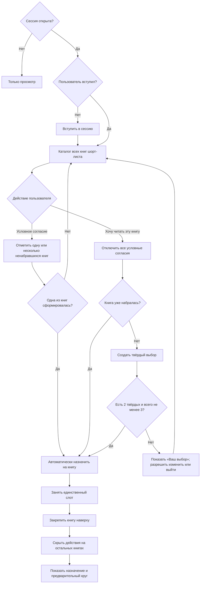
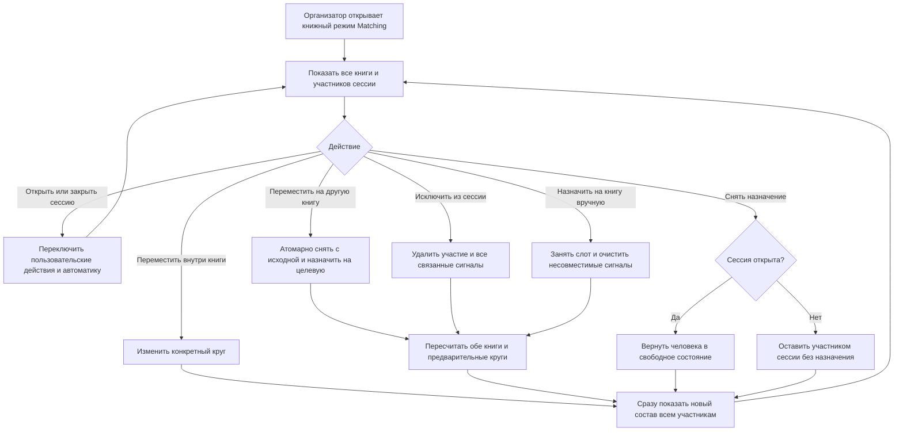

# Brainstorming Session Results

**Facilitator:** Evgenii
**Date:** 2026-07-12 19:50:55 CEST

## Обзор сессии

**Тема:** Механика совместной работы пользователей в режиме матчинга книжного клуба.

**Цели:** Спроектировать понятный процесс совместного выбора книги: какие объекты и состояния видят участники, как выражают и меняют намерение, как понимают готовность круга и как приходят к устойчивому общему решению.

### Контекст

Исходный импульс — перейти от представления данных вокруг рассчитанных сценариев к представлению вокруг книг и людей, заинтересованных в них. При этом задача сессии шире конкретного интерфейсного решения: нужно исследовать механику коллективного принятия решения. Уже реализованные функции и текущая модель сценариев не являются ограничениями; к ним стоит обращаться только тогда, когда они помогают основной цели.

### Рамка сессии

Мы будем рассматривать матчинг как совместный процесс с несколькими возможными стадиями: выражение интереса, наблюдение за интересом других, окончательный выбор, образование круга и изменение решения. Отдельно исследуем прозрачность выбора, пороги набора, конкурирующие книги, эффект поведения других людей и ситуации, когда группа не складывается или складывается неоднозначно.

## Выбор техник

**Подход:** Прогрессивный поток

**Конструкция маршрута:** Систематическое движение от свободного исследования возможных механик к проектированию проверяемого пользовательского процесса.

**Последовательность:**

- **Фаза 1 — расширение:** `What If Scenarios` для снятия ограничений и генерации большого числа альтернатив.
- **Фаза 2 — распознавание закономерностей:** `Ecosystem Thinking` для анализа участников, книг, сигналов, порогов и обратных связей как единой системы.
- **Фаза 3 — разработка:** `Morphological Analysis` для сборки цельных механик из независимых параметров.
- **Фаза 4 — план действий:** `Decision Tree Mapping` для перевода выбранных моделей в состояния, развилки, прототип и критерии проверки.

**Обоснование:** Такой маршрут защищает обсуждение от преждевременной фиксации на уже существующем интерфейсе. Сначала исследуются разные способы совместного принятия решения, затем их социальные эффекты и лишь после этого — конкретное продуктовое представление.

## Выполнение техник

### Фаза 1 — What If Scenarios

#### Раунд 1: что, если убрать отдельный финальный выбор

**[Ограничения #1]: Вместимость не равна предпочтению**
_Концепция_: Пользователь может быть согласен читать несколько разных книг, хотя в текущей сессии способен попасть только в один круг. Ограничение «одна книга» должно применяться к итоговому назначению, а не заставлять человека преждевременно скрывать остальные приемлемые варианты.
_Новизна_: Система разделяет множество допустимых исходов и фактически занятое место, вместо того чтобы считать ранний одиночный выбор полным выражением интереса.

**[Автоматизация #2]: Любая из моих книг**
_Концепция_: Пользователь одним лёгким действием разрешает системе добавить его в первый сложившийся круг среди всех или нескольких ранее выбранных книг. Ранжирование книг не требуется, если они для человека действительно равноценны.
_Новизна_: Один глобальный режим выражает сложное условное согласие без отдельной анкеты, рейтингов и работы с вычисленными сценариями.

**[Управление #3]: Ручной выбор или автопилот**
_Концепция_: Участник может в любой момент зафиксировать конкретную книгу вручную либо позволить системе сделать однократное назначение по заранее данному согласию. Ручные исключения для редких случаев участия в нескольких кругах остаются операционной возможностью владельца клуба.
_Новизна_: Простая механика обслуживает основной случай, не пытаясь сразу превратить редкие исключения в сложный универсальный интерфейс.

**[Время #4]: Первый жизнеспособный круг забирает место**
_Концепция_: Как только одна из допустимых книг достигает необходимого порога, гибкий участник занимает место в этом круге и перестаёт учитываться как доступный для остальных. Матчинг становится событием во времени, а не единовременным голосованием.
_Новизна_: Участник не упускает возможность только потому, что раньше времени угадал не ту книгу, на которую затем собрались остальные.

**[Прозрачность #5]: Два разных статуса человека**
_Концепция_: Возле книги отдельно показываются люди, уже выбравшие её, и люди, условно готовые присоединиться, если круг сложится. Эти сигналы нельзя визуально смешивать, потому что условно готовый человек может одновременно присутствовать у нескольких книг.
_Новизна_: Страница показывает не ложное количество участников, а степень надёжности каждого сигнала.

**[Вычисления #6]: Сценарии под книгами, а не вместо книг**
_Концепция_: Пользовательский интерфейс может полностью оперировать книгами и людьми, тогда как система в фоне продолжает рассчитывать совместимые распределения, чтобы не назначить одного человека сразу в несколько кругов. Сценарий остаётся внутренним вычислительным объектом, а не предметом пользовательского решения.
_Новизна_: Разделяются понятная людям модель взаимодействия и более сложная модель, необходимая машине для корректного распределения.

#### Раунд 2: последовательность вместо статической коллизии

**[Время #7]: Первая жизнеспособная книга забирает место**
_Концепция_: Твёрдые решения появляются последовательно после нажатия «Хочу в этот круг». Как только конкретная книга первой достигает порога с учётом доступных условных согласий, круг формируется, а автоматически назначенные участники перестают быть доступными другим книгам.
_Новизна_: Порядок реальных действий сам разрешает большинство конфликтов без рейтинга книг, дополнительного вопроса пользователю или глобальной оптимизации распределения.

**[Состояние #8]: Матчинг как поток событий**
_Концепция_: Готовность круга пересчитывается после каждого изменения: твёрдого выбора, добавления или снятия условного согласия, выхода участника. Ключевым объектом становится момент перехода книги из «набирается» в «сложилась», а не сравнение двух статических снимков.
_Новизна_: Механика естественно объясняется хронологией совместных действий и может быть понятна пользователю без показа вычислительных сценариев.

**[Интерфейс #9]: Кнопка означает твёрдое обязательство**
_Концепция_: «Хочу в этот круг» — не выражение интереса и не голос за желательный сценарий, а окончательное занятие своего единственного доступного места. Условное согласие на несколько книг должно быть отдельным, явно названным действием.
_Новизна_: Два разных социальных обещания получают разные действия и не смешиваются в одном счётчике или двусмысленной кнопке.

**[Координация #10]: Очередность вместо оптимальности**
_Концепция_: Система не обязана искать теоретически наилучшее распределение всех людей по всем книгам. Она может честно и предсказуемо следовать порядку, в котором книги становились жизнеспособными, даже если более поздний набор позволил бы сложить другую комбинацию кругов.
_Новизна_: Простота и объяснимость становятся осознанным свойством механики, а не недостатком алгоритма.

#### Раунд 3: социальное значение сложившегося круга

**[Обязательство #11]: Порог как точка фиксации**
_Концепция_: Достижение необходимого числа участников не просто меняет индикатор книги, а атомарно фиксирует состав круга. После этого обычные действия входа, выхода и смены книги для его участников прекращаются.
_Новизна_: «Круг сложился» становится необратимым доменным событием, а не живым отражением текущего счётчика.

**[Доверие #12]: Автоматическое согласие равно ручному обещанию**
_Концепция_: Пользователь, разрешивший автоматически добавить себя к одной из книг, заранее принимает те же обязательства, что и нажавший «Хочу в этот круг» вручную. В момент назначения система не запрашивает повторного подтверждения.
_Новизна_: Автоматизация не создаёт более слабый класс участников и не оставляет уже сложившийся круг зависимым от последующего подтверждения.

**[Управление #13]: Исключения вынесены из массового интерфейса**
_Концепция_: Болезнь, ошибка или иная реальная причина выйти из зафиксированного круга решается вручную владельцем клуба, а не универсальной кнопкой «Передумать». Редкое исключение не определяет поведение основного пользовательского потока.
_Новизна_: Продукт сохраняет простоту и одновременно признаёт, что необратимость интерфейса не означает невозможность человеческого вмешательства.

**[Стабильность #14]: Сложившийся круг больше не распадается сам**
_Концепция_: После фиксации книги остальные пользователи могут полагаться на заявленный состав и переходить к следующим действиям чтения. Пересчёт других книг не способен забрать уже назначенного участника или вернуть круг в состояние набора.
_Новизна_: Система оптимизируется не только под нахождение группы, но и под доверие к уже объявленному результату.

#### Раунд 4: книга как контейнер нескольких кругов

**[Размер #15]: Рабочий диапазон от трёх до пяти**
_Концепция_: Полноценный круг должен состоять минимум из трёх и максимум из пяти участников. Три, четыре и пять записавшихся образуют один круг соответствующего размера.
_Новизна_: Вместо одного порога система получает допустимый диапазон, отражающий реальную групповую динамику чтения.

**[Масштабирование #16]: Одна книга порождает несколько кругов**
_Концепция_: Когда число назначенных на книгу превышает пять, люди делятся на несколько жизнеспособных групп: шесть — на `3+3`, семь — на `3+4`, далее на максимально сбалансированные составы размером от трёх до пяти.
_Новизна_: Популярность книги не создаёт один слишком большой круг и не требует отклонять лишних участников.

**[Автоматизация #17]: Черновое, а не идеальное распределение**
_Концепция_: Система обязана разнести людей по допустимым группам определённым воспроизводимым способом, но не должна угадывать идеальную социальную совместимость. После автоматического разбиения владелец клуба может вручную переносить участников между кругами.
_Новизна_: Алгоритм отвечает за валидную отправную точку, а качество конкретного состава достигается человеческой договорённостью.

**[Роль продукта #18]: Реестр договорённостей**
_Концепция_: Продукт помогает участникам видеть и фиксировать достигнутые решения, но не пытается заменить живой разговор или навязать окончательный оптимум. Интерфейс поддерживает координацию, а не превращает правила в непреодолимые ограничения.
_Новизна_: Ручная корректировка рассматривается как нормальная часть процесса, а не как ошибка автоматизации.

**[Условное согласие #19]: Резерв следует за подтверждённым импульсом**
_Концепция_: Несколько условных согласий сами по себе не обязаны создавать круг, поскольку одни и те же люди могут быть готовы к разным книгам. Они подключаются к конкретной книге, когда у неё появляется достаточно твёрдых подтверждений, чтобы с их помощью сформировать жизнеспособный состав.
_Новизна_: Гибкость участников усиливает уже возникшее коллективное намерение, но не заставляет систему произвольно выбирать книгу вместо людей.

**[Порог #20]: Два твёрдых участника как ядро**
_Концепция_: Возникла рабочая гипотеза: после двух твёрдых выборов система проверяет доступные условные согласия. Если вместе получается минимум три человека, книга становится жизнеспособной и условные участники автоматически назначаются на неё.
_Новизна_: Минимальное человеческое ядро разрешает неоднозначность множества пересекающихся условных согласий, не требуя большинства из трёх твёрдых голосов.

#### Раунд 5: обязательство книге и окончательные круги — разные события

**[Жизненный цикл #21]: Двухэтапная фиксация**
_Концепция_: Сначала книга достигает жизнеспособности и фиксирует обязательство назначенных людей читать именно её. Позже, после завершения набора, фиксируются конкретные составы одного или нескольких кругов.
_Новизна_: Необратимость обещания сохраняется без преждевременного закрытия книги для новых участников.

**[Набор #22]: Выход закрыт, вход остаётся открыт**
_Концепция_: Назначенный на набравшуюся книгу участник уже не может уйти или выбрать другую через обычный интерфейс. При этом новые люди могут продолжать присоединяться, увеличивая общий пул книги.
_Новизна_: Фиксация становится однонаправленным накоплением подтверждённых обязательств, а не мгновенным закрытием списка.

**[Группировка #23]: Предварительные круги могут перебалансироваться**
_Концепция_: Пока набор продолжается, система показывает черновое разбиение назначенных участников на группы по 3–5 человек. При появлении новых людей разбиение может измениться, например превратить группу из пяти и нового участника в две группы `3+3`.
_Новизна_: Интерфейс может рано показать жизнеспособность чтения, не выдавая временный состав малой группы за окончательную договорённость.

**[Финализация #24]: Отдельный момент подтверждения кругов**
_Концепция_: Окончательные составы фиксируются отдельным событием завершения матчинга — по решению организатора, по договорённости участников или в установленный момент. Перед этим автоматический черновик можно вручную скорректировать.
_Новизна_: Продукт отделяет автоматическую помощь в распределении от человеческой ответственности за итоговую договорённость.

**[Язык состояний #25]: «Книга набралась» не равно «круги утверждены»**
_Концепция_: Пользователю нужны разные понятные статусы для жизнеспособности книги и готовности окончательных групп. Например, книга может уже набраться и продолжать принимать людей, пока её круги ещё находятся в предварительном состоянии.
_Новизна_: Один зелёный флаг не скрывает два разных вида определённости — выбор чтения и конкретный состав малой группы.

#### Раунд 6: граница между продуктом и живой координацией

**[Пауза #26]: Продуктивный тупик допустим**
_Концепция_: Даже большое число условно согласных людей не формирует книгу без двух твёрдых выборов. Состояние ожидания считается корректным отражением отсутствия коллективного ядра, а не ошибкой, которую алгоритм обязан устранить.
_Новизна_: Система сохраняет неопределённость вместо того, чтобы маскировать её произвольным автоматическим решением.

**[Лидерство #27]: Два добровольца создают направление**
_Концепция_: Первые два твёрдых участника выполняют особую координационную роль: превращают одну из множества абстрактно допустимых книг в реальный кандидат на формирование круга. При этом им не обязательно становиться формальными ведущими чтения.
_Новизна_: Небольшой человеческий импульс используется как разрешение неоднозначности, а не как обычные два голоса в оптимизационной задаче.

**[Канал #28]: Чат — место переговоров**
_Концепция_: Убеждение, обсуждение вариантов, поиск первых добровольцев и разбор неоднозначностей происходят в уже существующем общем чате. Страница матчинга не должна дублировать дискуссию собственными комментариями или переговорами.
_Новизна_: Продукт осознанно не поглощает социальный процесс, который лучше работает в привычной живой среде клуба.

**[Фиксация #29]: Страница — общее состояние договорённости**
_Концепция_: После разговора участники отражают решение твёрдой кнопкой или заранее данным условным согласием. Страница служит единой актуальной записью того, что уже обещано и какие книги способны набраться.
_Новизна_: Разговор и состояние разделяются по разным инструментам, поэтому интерфейсу не нужно объяснять весь ход принятия решения.

**[Нейтральность #30]: Информировать, но не уговаривать**
_Концепция_: Продукт может честно показывать, что книге не хватает твёрдых выборов, но не обязан персонально подталкивать пользователей стать первым или вторым добровольцем. Инициатива остаётся у участников и их общения в чате.
_Новизна_: Отсутствие агрессивных подсказок является частью модели автономной договорённости, а не пропущенной функцией вовлечения.

#### Раунд 7: сессия как граница актуального согласия

**[Актуальность #31]: Вступление обновляет намерение**
_Концепция_: Старые книги в пользовательском списке сами по себе ничего не говорят о готовности участвовать сейчас. Добровольное вступление в очередную сессию подтверждает, что человек снова доступен для текущего матчинга.
_Новизна_: Актуальность согласия обеспечивается уже существующим жизненным циклом сессии без новых настроек на каждой книге.

**[Область расчёта #32]: Только участники текущей сессии**
_Концепция_: Все показатели, пороги, твёрдые выборы, условная доступность и автоматические назначения рассчитываются исключительно внутри множества людей, присоединившихся к открытой сессии. Остальные владельцы книги не влияют на картину.
_Новизна_: Один понятный фильтр одновременно защищает расчёты от неактуальных регистраций и делает страницу отражением конкретного набора.

**[Предпочтения #33]: «Мои книги» как готовый набор вариантов**
_Концепция_: После вступления в сессию существующий список книг пользователя может служить его множеством допустимых вариантов для расчёта. Отдельное повторное подтверждение условной готовности для каждой книги не добавляется.
_Новизна_: Новая механика переиспользует уже сделанный пользователем выбор и не превращает каждую сессию в повторное заполнение анкеты.

**[Время #34]: Дедлайн информирует, но не управляет**
_Концепция_: Организатор указывает ориентир, к которому клуб планирует определиться, однако наступление времени само по себе не обязано блокировать действия или автоматически завершать матчинг. Реальное закрытие остаётся ручным решением.
_Новизна_: Система поддерживает мягкий ритм живого сообщества вместо ложной точности жёсткого таймера.

**[Цикл #35]: Каждая сессия начинает согласие заново**
_Концепция_: После ручного закрытия текущего набора организатор позже открывает новый, а пользователи снова самостоятельно вступают в него. Никакая условная доступность не переносится между сессиями автоматически.
_Новизна_: Повторное вступление становится лёгким периодическим подтверждением участия без накопления устаревших обязательств.

#### Раунд 8: три разных силы пользовательского сигнала

**[Коррекция #36]: Актуальность не означает автоматического согласия**
_Концепция_: Вступление в текущую сессию делает весь существующий список книг пользователя актуальным для поиска пересечений и показа на странице. Однако оно не разрешает автоматически назначить человека на любую из этих книг.
_Новизна_: Один и тот же список предпочтений участвует в матчинге целиком, но необратимое действие всё равно требует отдельного сигнала более высокой силы.

**[Сигналы #37]: Интерес, условность и твёрдость**
_Концепция_: У книги для конкретного участника возможны три последовательных уровня: долгосрочный интерес из каталога, явное условное согласие в текущей сессии и окончательный твёрдый выбор. Эти уровни должны по-разному отображаться и по-разному влиять на формирование круга.
_Новизна_: Вместо бинарной записи система отражает реальную постепенность человеческого обязательства без превращения её в сложный рейтинг.

**[Условный выбор #38]: Явное согласие на несколько книг**
_Концепция_: Из всех актуальных книг пользователь может отдельно отметить одну, несколько или множество: если по какой-либо из них сложится круг с необходимым твёрдым ядром, его можно назначить автоматически. Неотмеченные книги остаются видимыми пересечениями, но не участвуют в автозаписи.
_Новизна_: Гибкость задаётся точным подмножеством книг и не распространяется молча на весь накопленный каталог пользователя.

**[Твёрдый выбор #39]: Окончательное решение по одной книге**
_Концепция_: Пользователь может выбрать одну конкретную книгу действием «Хочу в этот круг». Этот сигнал создаёт твёрдого участника, способного вместе с ещё одним таким выбором активировать условно согласившихся.
_Новизна_: Твёрдый выбор не просто повышает вероятность книги, а создаёт необходимое человеческое ядро будущего чтения.

**[Активация #40]: Два твёрдых выбора подключают условный пул**
_Концепция_: Когда книга получает два окончательных подтверждения, система проверяет явно условно согласившихся именно на неё. Если общий состав достигает минимума трёх человек, участники назначаются на книгу, а при большом количестве разбиваются на несколько кругов по 3–5.
_Новизна_: Все три уровня сигнала получают отдельную функцию: интерес создаёт видимость пересечения, условность — доступный резерв, твёрдость — запускающий импульс.

#### Раунд 9: взаимоисключающие режимы обязательства

**[Режим #41]: Несколько условных или один твёрдый**
_Концепция_: Пока окончательного решения нет, пользователь может дать условное согласие на несколько книг. После твёрдого выбора его единственная активная траектория — выбранная книга.
_Новизна_: Один лимит участия выражается простой взаимоисключающей моделью вместо конфликтующих приоритетов и запасных голосов.

**[Переход #42]: Твёрдая кнопка атомарно очищает условные согласия**
_Концепция_: Нажатие «Хочу в этот круг» одновременно создаёт твёрдое подтверждение по выбранной книге и отключает все условные согласия пользователя. Между этими действиями не существует промежуточного состояния.
_Новизна_: Ни один пересчёт не успевает назначить человека по прежнему условному варианту после того, как он уже сделал окончательный выбор.

**[Надёжность #43]: Твёрдое ядро не теряет людей из-за автоматики**
_Концепция_: Пользователь с твёрдым выбором больше не может быть автоматически забран другой книгой. Поэтому два твёрдых подтверждения остаются надёжной основой, на которую безопасно назначать условных участников.
_Новизна_: Статус книги зависит от сигналов с предсказуемой силой, а не от участников, одновременно обещанных нескольким направлениям.

**[Вместимость #44]: Один слот занят выбранной книгой**
_Концепция_: Твёрдый выбор расходует текущую вместимость пользователя в один круг ещё до окончательного формирования групп. Любое другое назначение требует сначала изменить этот выбор по правилам его допустимой обратимости.
_Новизна_: Ограничение участия становится явным состоянием пользователя, а не поздней проверкой после вычисления нескольких несовместимых групп.

**[Интерфейс #45]: После выбора исчезает многовариантность**
_Концепция_: Страница больше не предлагает активные действия условного согласия по другим книгам после твёрдого выбора. Они могут оставаться видимыми как прежний интерес, но не выглядят доступными путями назначения.
_Новизна_: Визуальное состояние прямо отражает принятую необратимую или ограниченно обратимую продуктовую позицию пользователя.

#### Раунд 10: обратимость до формирования книги

**[Обратимость #46]: Твёрдый выбор можно изменить до порога**
_Концепция_: Пока выбранная книга не набралась, пользователь может отменить своё твёрдое подтверждение. Слово «окончательный» отличает его от условной готовности, но не превращает одиночный несложившийся выбор в бессрочную ловушку.
_Новизна_: Социальное обещание остаётся достаточно сильным для координации, сохраняя свободу договориться о другом направлении до появления зависимой от него группы.

**[Перенос #47]: Смена выбора — единая операция**
_Концепция_: При переходе с книги A на книгу B старое твёрдое подтверждение снимается и новое создаётся согласованно, после чего обе книги пересчитываются. Пользователь ни на мгновение не занимает два слота.
_Новизна_: Изменение решения поддерживается как нормальный переход состояния, а не как последовательность действий с временно противоречивыми обещаниями.

**[Свобода #48]: Возврат в открытое состояние**
_Концепция_: Отмена твёрдого выбора до формирования книги освобождает единственный слот пользователя. После этого он может сделать другой твёрдый выбор или заново отметить несколько условных вариантов.
_Новизна_: Один и тот же простой автомат состояний поддерживает и целенаправленное решение, и возвращение к гибкому ожиданию.

**[Граница #49]: Назначение делает переход необратимым**
_Концепция_: Как только книга достигает условий формирования и пользователь оказывается назначен на неё вручную или автоматически, обычные действия отмены и смены исчезают. Дальнейшие исключения решаются только через организатора.
_Новизна_: Точка необратимости совпадает с моментом, когда на обещание человека уже начали полагаться остальные участники.

**[Динамика #50]: До порога числа могут уменьшаться**
_Концепция_: Счётчик твёрдых подтверждений и степень готовности книги до её формирования являются живыми величинами: люди могут менять решение, и книга может удаляться от порога. После формирования назначенный состав уже не распадается автоматически.
_Новизна_: Интерфейс честно различает исследовательскую фазу с изменчивыми сигналами и фазу устойчивого результата.

#### Раунд 11: одна твёрдая кнопка во всех состояниях книги

**[Последовательность #51]: «Хочу в этот круг» остаётся основным действием**
_Концепция_: Для твёрдого выбора используется одна и та же знакомая кнопка независимо от того, набралась книга или ещё ждёт участников. Пользователю не требуется изучать новый глагол после изменения статуса.
_Новизна_: Стабильное действие связывает все стадии матчинга и уменьшает количество понятий в интерфейсе.

**[Контекст #52]: Одна кнопка, разный немедленный результат**
_Концепция_: До формирования книги кнопка добавляет твёрдое подтверждение и может запустить набор условных участников. После формирования та же кнопка немедленно назначает пользователя на книгу и блокирует остальные варианты.
_Новизна_: Сложность состояния остаётся в системе, а не перекладывается на пользователя через разные названия почти одинакового намерения.

**[Скрытие #53]: Условное действие исчезает после формирования**
_Концепция_: Если книга уже набралась, условие присоединения заведомо выполнено, поэтому отдельное условное согласие больше не предлагается. Остаётся только твёрдое действие.
_Новизна_: Интерфейс не позволяет создавать логически бессмысленные обещания и не объясняет недостижимые ветки.

**[Простота #54]: Не вводить синоним для существующего решения**
_Концепция_: Дополнительная кнопка «Присоединиться к этой книге» не создаёт новой пользовательской возможности и поэтому не нужна. Разница в поведении объясняется статусом книги, а не новым элементом управления.
_Новизна_: Новые состояния продукта не обязаны порождать новые кнопки, если намерение человека остаётся прежним.

**[Раскрытие #55]: Показывать только применимые степени обязательства**
_Концепция_: Ненабравшаяся книга допускает условный и твёрдый выбор, а набравшаяся — только твёрдый. Количество действий сокращается по мере роста определённости.
_Новизна_: Интерфейс становится проще именно тогда, когда система уже знает больше, вместо накопления управляющих элементов на каждом этапе.

#### Раунд 12: действие выбирает книгу, а не конкретный круг

**[Текст #56]: «Хочу читать эту книгу»**
_Концепция_: Единая кнопка твёрдого выбора называется «Хочу читать эту книгу». Формулировка описывает реальное решение пользователя независимо от текущего числа участников и групп.
_Новизна_: Действие остаётся точным даже тогда, когда одной книге соответствуют несколько предварительных читательских кругов.

**[Объект #57]: Пользователь выбирает книгу**
_Концепция_: Нажатие фиксирует обязательство читать конкретную книгу, но не обещает место в заранее выбранной малой группе. Распределение по кругам происходит отдельно и может корректироваться организатором.
_Новизна_: Книжно-центричная ментальная модель сохраняется от первого действия до окончательной фиксации результатов.

**[Стабильность текста #58]: Одна формулировка для всех стадий**
_Концепция_: «Хочу читать эту книгу» одинаково применимо к ненабравшейся, уже набравшейся и продолжающей принимать участников книге. Меняется системный эффект, но не намерение человека.
_Новизна_: Статус книги не заставляет интерфейс переименовывать основное действие и переучивать пользователя.

**[Группировка #59]: Круг остаётся результатом распределения**
_Концепция_: Термин «круг» используется для конкретной группы из 3–5 человек, появившейся после назначения участников на книгу. До этого момента кнопки и основные статусы могут говорить о книге и наборе на неё.
_Новизна_: Язык продукта не смешивает уровень предпочтения с уровнем организационного разбиения.

**[Фокус #60]: Текст поддерживает новую архитектуру страницы**
_Концепция_: Поскольку главным объектом страницы становится книга, основная кнопка также формулируется вокруг книги. Сценарии и предварительные группы не вмешиваются в момент пользовательского решения.
_Новизна_: Информационная архитектура и микротекст начинают говорить на одном языке вместо сохранения терминов старого сценарного интерфейса.

#### Раунд 13: персональный каталог как основа страницы

**[Полнота #61]: Все книги шорт-листа остаются видимыми**
_Концепция_: Страница Matching показывает каждую книгу, которую текущий пользователь выбрал в каталоге, независимо от наличия пересечений. Для каждой явно видно, есть ли среди участников сессии другие заинтересованные люди.
_Новизна_: Отсутствие пересечения становится полезной информацией, а не причиной скрыть часть собственного выбора пользователя.

**[Ранжирование #62]: Сильные пересечения поднимаются выше**
_Концепция_: Книги сортируются так, чтобы варианты с большим числом совпадающих интересов появлялись раньше. Книги без пересечений остаются в том же каталоге, но естественно уходят вниз.
_Новизна_: Один порядок одновременно сохраняет полноту и направляет внимание к наиболее перспективным направлениям без отдельного фильтра.

**[Карточка #63]: Книга — единственный верхнеуровневый объект**
_Концепция_: Каждая единица страницы представляет книгу с обложкой, названием, состоянием набора, действиями текущего пользователя и связанными участниками. Сценарии не конкурируют с ней за уровень навигации или визуальной иерархии.
_Новизна_: Страница становится специальным каталогом совместного выбора, а не интерфейсом чтения вычисленных комбинаций.

**[Люди #64]: Статусы показаны поимённо**
_Концепция_: Внутри карточки перечисляются конкретные участники текущей сессии, у которых эта книга есть в шорт-листе. Рядом с каждым отображается сила его текущего сигнала.
_Новизна_: Общий счётчик раскрывается до реальных людей, благодаря чему страницу можно использовать как основу для разговора в чате.

**[Статус #65]: Пересечение интересов**
_Концепция_: Базовый статус означает только то, что книга присутствует в списках текущего пользователя и другого участника сессии. Он не обещает автоматическое назначение и не приближает книгу к твёрдому ядру сам по себе.
_Новизна_: Слабый сигнал остаётся видимым, но не маскируется под согласие читать книгу именно сейчас.

**[Статус #66]: Условное подтверждение**
_Концепция_: Более сильный статус показывает, что участника разрешено автоматически назначить на книгу после появления двух твёрдых выборов. Один человек может иметь этот статус у нескольких книг до назначения или твёрдого решения.
_Новизна_: Карточка показывает доступный резерв и одновременно объясняет его отличие от уже занятого места.

**[Статус #67]: Окончательное подтверждение**
_Концепция_: Самый сильный статус принадлежит участнику, нажавшему «Хочу читать эту книгу». Два таких человека образуют необходимое ядро и могут активировать условно согласившихся.
_Новизна_: Пользователь видит не только потенциальный размер аудитории, но и наличие реальной инициативы сформировать круг.

**[Близость #68]: Почти набравшиеся книги получают акцент**
_Концепция_: Если книге не хватает малого числа участников или твёрдых подтверждений, карточка может визуально сообщать о близости к жизнеспособному состоянию. Например, два заинтересованных участника при минимуме три — отдельный сигнал потенциальной близости.
_Новизна_: Интерфейс помогает быстро заметить направления, где одно решение способно существенно изменить ситуацию.

**[Цвет #69]: Акцент не должен подменять объяснение**
_Концепция_: Цвет может поддержать состояние книги, но не обязан кодировать все сочетания интереса, условности и твёрдости. Основной смысл сохраняется в текстовом статусе, числах и подписях участников.
_Новизна_: Визуальная выразительность не превращается в легенду из множества цветов, которую нужно запоминать.

**[Метрика #70]: Интерес и готовность — две разные оси**
_Концепция_: Количество пересечений показывает популярность книги среди участников сессии, а структура твёрдых и условных подтверждений — способность сформировать круг. Эти показатели нельзя объединять в одну шкалу, потому что она покажет ложную близость к результату.
_Новизна_: Карточка может быть богата людьми и одновременно честна относительно того, почему книга ещё не набралась.

#### Раунд 14: сортировка и статус отвечают на разные вопросы

**[Ось #71]: Пересечения определяют порядок**
_Концепция_: Основная сортировка каталога строится по числу участников текущей сессии, у которых есть эта книга, включая текущего пользователя. Более сильные пересечения поднимают книгу выше.
_Новизна_: Порядок отвечает на простой вопрос о совместном интересе и не пытается одновременно кодировать готовность группы.

**[Ось #72]: Подтверждения определяют состояние**
_Концепция_: Статус карточки рассчитывается отдельно по твёрдым и условным подтверждениям, числу назначенных участников и этапу формирования. Книга с меньшим интересом может быть организационно готовее более популярной.
_Новизна_: Интерфейс не выдаёт популярность за обязательство и сохраняет обе характеристики без сложной формулы общего рейтинга.

**[Текст #73]: Короткая фраза вместо универсальной шкалы**
_Концепция_: Карточка объясняет актуальное препятствие или результат словами: нет пересечений, нужен ещё один твёрдый выбор, достаточно людей без ядра, книга набралась, формируются два круга.
_Новизна_: Нелинейная механика получает точное человеческое описание вместо визуальной метафоры, предполагающей равнозначные шаги.

**[Акцент #74]: Цвет поддерживает один статус**
_Концепция_: Визуальный акцент используется сдержанно для наиболее важного состояния карточки, а не назначается отдельно каждому сочетанию сигналов. Смысл остаётся доступным без знания цветовой легенды.
_Новизна_: Карточки сохраняют сканируемость даже при большом количестве книг и участников.

**[Прозрачность #75]: Имена объясняют итоговый статус**
_Концепция_: Под общей фразой пользователь видит список людей и различает обычное пересечение, условное согласие и твёрдый выбор. Поэтому агрегированный статус можно проверить по понятным исходным данным.
_Новизна_: Система не просит доверять непрозрачному расчёту и остаётся полезной опорой для разговора в чате.

#### Раунд 15: персональный выбор переопределяет общий порядок

**[Приоритет #76]: Собственная книга всегда наверху**
_Концепция_: Книга с текущим твёрдым выбором или уже состоявшимся назначением закрепляется первой независимо от числа пересечений. Остальной каталог продолжает сортироваться по общему интересу.
_Новизна_: Персональная задача пользователя не теряется внутри объективного рейтинга всей сессии.

**[Пометка #77]: «Ваш выбор» до формирования**
_Концепция_: Пока книга ещё не набралась, закреплённая карточка явно показывает, что пользователь сделал по ней твёрдый, но пока обратимый выбор. Он может отменить его или перенести на другую книгу.
_Новизна_: Персональный статус отличается от общего статуса книги и объясняет, почему именно эта карточка поднята наверх.

**[Перенос #78]: Новая твёрдая кнопка заменяет старый выбор**
_Концепция_: До формирования пользователь может нажать «Хочу читать эту книгу» на другой карточке, тем самым атомарно перенеся своё твёрдое подтверждение. Не требуется сначала возвращаться наверх и отдельно отменять прежнее действие.
_Новизна_: Смена решения остаётся одним содержательным действием и не создаёт промежуточного состояния без выбора.

**[Назначение #79]: «Вы участвуете» переводит каталог в наблюдение**
_Концепция_: После ручного или автоматического назначения закреплённая карточка показывает необратимое участие. Управляющие действия на остальных книгах исчезают, поскольку единственный слот пользователя уже занят.
_Новизна_: Тот же каталог естественно превращается из интерфейса выбора в прозрачное окно состояния всей сессии.

**[Контекст #80]: Остальные книги не скрываются после решения**
_Концепция_: Даже назначенный пользователь продолжает видеть весь свой шорт-лист, пересечения, подтверждения и формирование других книг. Собственное решение меняет доступные действия, но не лишает общей картины.
_Новизна_: Страница остаётся полезной для обсуждения клуба после завершения личного выбора.

#### Раунд 16: административный режим той же книжной вкладки

**[Единая модель #81]: Участник и организатор видят одни книги**
_Концепция_: Административное управление не уходит в отдельную сценарную систему, а использует ту же книжно-центричную вкладку Matching. Различаются доступные данные и действия, но не основная ментальная модель.
_Новизна_: Организатор исправляет именно ту картину, которую видят участники, без перевода между двумя представлениями результата.

**[Обзор #82]: Организатор видит все книги сессии**
_Концепция_: В персональном режиме каталог ограничен шорт-листом текущего пользователя, а в административном режиме охватывает все книги, присутствующие у участников открытой сессии. Сортировка и статусы остаются сопоставимыми.
_Новизна_: Одна вкладка масштабируется от личного выбора до полного операционного обзора за счёт области данных, а не новой архитектуры.

**[Права #83]: Управление появляется только у организатора**
_Концепция_: Участники видят статусы и составы, но не могут менять других людей. Организатор получает дополнительные действия редактирования внутри тех же карточек.
_Новизна_: Прозрачность результата не смешивается с коллективным правом произвольно менять зафиксированные обязательства.

**[Черновик #84]: Предварительные круги редактируются на месте**
_Концепция_: Набравшаяся книга показывает автоматическое разбиение на группы по 3–5 человек. Организатор может переносить участников между этими кругами после живого обсуждения.
_Новизна_: Ручная корректировка становится продолжением автоматического черновика, а не повторной сборкой результата с нуля.

**[Источник правды #85]: Изменения сразу отражаются участникам**
_Концепция_: После административной корректировки все пользователи видят обновлённый состав в том же книжном представлении. Отдельной публикации или синхронизации между административным и пользовательским экраном не требуется.
_Новизна_: Страница одновременно служит рабочим инструментом организатора и общей фиксацией договорённости клуба.

#### Раунд 17: организатор может переопределить назначение

**[Полномочие #86]: Ручной перенос между книгами разрешён**
_Концепция_: После живой договорённости организатор может снять участника с одной книги и назначить на другую, даже если прежнее место возникло из твёрдого выбора или автоматического условного назначения.
_Новизна_: Необратимость защищает массовый пользовательский поток, но не превращается в запрет для человека, ответственного за фиксацию реальной договорённости.

**[Приоритет #87]: Поздняя договорённость сильнее раннего сигнала**
_Концепция_: Административная корректировка становится новым актуальным решением и заменяет прежний пользовательский статус. История происхождения места не мешает обновить итоговое состояние.
_Новизна_: Продукт признаёт, что социальное решение может эволюционировать после автоматического расчёта.

**[Операция #88]: Межкнижный перенос выполняется целиком**
_Концепция_: Один административный перенос освобождает слот участника в исходной книге, занимает его в целевой и очищает несовместимые сигналы в рамках одной согласованной операции. Человек не оказывается одновременно назначенным в две книги.
_Новизна_: Ручная свобода не создаёт технически противоречивого промежуточного результата.

**[Пересчёт #89]: Обе книги реагируют на изменение**
_Концепция_: После переноса система обновляет количество назначенных людей, статусы и предварительное разбиение кругов как у исходной, так и у целевой книги. Организатор сразу видит последствия своего решения.
_Новизна_: Ручное действие остаётся частью общей модели матчинга, а не невидимым исключением вне расчётов.

**[Авторитет #90]: Административное состояние становится текущей правдой**
_Концепция_: Участники видят результат ручной корректировки как актуальный состав сессии. Автоматика не пытается немедленно вернуть человека на прежнее место только потому, что старые условия когда-то привели к другому назначению.
_Новизна_: Человеческое решение устойчиво сосуществует с автоматическим помощником и имеет над ним явный приоритет.

#### Раунд 18: правила автоматизации не ограничивают администратора

**[Свобода #91]: Организатор может разрушить круг**
_Концепция_: Администратор вправе перенести участника так, что ранее жизнеспособная группа уменьшится до двух человек или перестанет существовать как круг. Интерфейс не блокирует это действие.
_Новизна_: Даже уже сложившийся результат остаётся редактируемой фиксацией человеческой договорённости, а не юридически защищённым объектом системы.

**[Диапазон #92]: Размер 3–5 направляет автоматику**
_Концепция_: Минимальный и максимальный размеры используются при первоначальном автоматическом разбиении и вычислении понятных статусов. Они не превращаются в жёсткие ограничения административного редактора.
_Новизна_: Одни и те же числа служат хорошими настройками по умолчанию, не претендуя на универсальную истинность для каждой реальной ситуации.

**[Последствия #93]: Система показывает, но не запрещает**
_Концепция_: После разрушительного переноса книга честно меняет статус и показывает оставшихся людей. Организатор видит результат своего действия без обязательного предупреждения, блокировки или требования немедленно восстановить валидность.
_Новизна_: Обратная связь сохраняется, а право интерпретировать её остаётся у человека.

**[Финализация #94]: Некорректный по автоматическим правилам состав допустим**
_Концепция_: Наличие группы меньше трёх или больше пяти не обязано запрещать закрытие или дальнейшее ведение сессии. Администратор может намеренно оставить такое состояние как отражение фактической ситуации.
_Новизна_: Финальный результат определяется договорённостью клуба, а не успешным прохождением встроенного валидатора.

**[Исключение #95]: Административная мутация сильнее необратимости**
_Концепция_: Пользовательская необратимость после формирования круга остаётся правилом обычного потока, но любое назначение может быть изменено организатором. Это касается и состава книги, и распределения по конкретным кругам.
_Новизна_: Простые гарантии для участников сочетаются с полной операционной свободой ответственного человека.

#### Раунд 19: закрытие останавливает поток, но не редактирование

**[Сессия #96]: Закрытие блокирует действия участников**
_Концепция_: После закрытия сессии обычные пользователи больше не вступают в неё, не меняют твёрдый выбор, не добавляют условные согласия и не присоединяются к набравшимся книгам. Их интерфейс становится наблюдаемым результатом.
_Новизна_: Один операционный переход завершает коллективный ввод без необходимости замораживать всю систему целиком.

**[Автоматика #97]: Закрытие прекращает новые назначения**
_Концепция_: После закрытия пересечения, подтверждения и изменения данных больше не запускают автоматическое подключение условных участников или перераспределение кругов. Автоматический помощник завершает работу вместе с пользовательским набором.
_Новизна_: Организатор получает стабильную отправную точку для ручной доводки без фоновых перестановок.

**[Редактирование #98]: Администратор работает и после закрытия**
_Концепция_: Организатор сохраняет возможность назначать и снимать людей, переносить их между книгами и кругами, а также менять предварительные составы после завершения пользовательской части сессии.
_Новизна_: Закрытие становится границей каналов ввода, а не необратимой блокировкой результата.

**[Отображение #99]: Ручные последствия остаются публичными**
_Концепция_: Любое административное изменение после закрытия немедленно отражается в книжных карточках и статусах участников. Пользователи видят текущую договорённость, даже если она отличается от результата на момент закрытия.
_Новизна_: Закрытая сессия остаётся живым источником правды без возвращения участникам права самостоятельно менять её.

**[Результат #100]: Итог — редактируемая фиксация**
_Концепция_: У сессии есть завершённая пользовательская фаза, но нет обязательного технически неизменяемого финала. Текущий административный состав является результатом до тех пор, пока организатор не обновит его после новой договорённости.
_Новизна_: Продукт отражает реальность клуба, где итог может уточняться после дедлайна, не разрушая простые правила основного матчинга.

#### Завершение фазы 1

Техника `What If Scenarios` дала 100 зафиксированных идей. Главные прорывы: книга стала центральным объектом интерфейса; были разделены интерес, условное согласие и твёрдый выбор; найдено правило двух твёрдых участников; назначение на книгу отделено от разбиения на круги; административная свобода поставлена выше автоматических ограничений; закрытие сессии определено как остановка пользовательского и автоматического потока, а не заморозка данных.

### Фаза 2 — Ecosystem Thinking

**Цель:** Найти устойчивые сущности, связи, переходы и обратные эффекты в книжно-центричной механике матчинга.

#### Паттерн 1: два уровня принадлежности

**[Структура #101]: Назначение на книгу первично**
_Концепция_: Основная долговечная связь соединяет участника с книгой и расходует его текущую вместимость в один выбор. Она не зависит от того, удалось ли прямо сейчас собрать корректный круг.
_Новизна_: Обязательство читать не исчезает из-за временной организационной проблемы с распределением людей.

**[Проекция #102]: Круг — изменяемое размещение**
_Концепция_: Принадлежность к конкретному кругу является вторичной раскладкой назначенных на одну книгу людей. Автоматика и организатор могут создавать, разрушать и перебалансировать такие группы, не отменяя назначение на книгу.
_Новизна_: Система выдерживает временные составы `2+6`, отсутствие круга и другие ручные состояния без потери исходной договорённости.

#### Паттерн 2: страница хранит состояние, чат распространяет знание

**[Источник #103]: Matching показывает текущую правду**
_Концепция_: Автоматическое назначение отражается в персональном книжном каталоге: назначенная книга закрепляется первой, остальные действия исчезают, а актуальные составы становятся видимыми. Отдельное уведомление не требуется.
_Новизна_: Один экран остаётся достаточным источником проверяемого состояния даже для перехода, случившегося без присутствия пользователя.

**[Канал #104]: Чат сообщает о событиях**
_Концепция_: Участники узнают и обсуждают формирование книг в общем чате клуба. Социальный канал берёт на себя распространение новостей, тогда как продукт не дублирует его письмами, пушами или встроенной лентой.
_Новизна_: Разные инструменты сохраняют специализированные роли и не создают конкурирующие источники коммуникации.

**[Минимализм #105]: Нет отдельной подсистемы уведомлений**
_Концепция_: Автоматическое назначение не запускает обязательное персональное сообщение. Достаточность страницы и чата считается осознанным свойством процесса, а не временным отсутствием функции.
_Новизна_: Необратимый переход поддерживается без добавления ещё одного канала, который пришлось бы настраивать и обслуживать.

#### Паттерн 3: свобода выхода заканчивается при назначении

**[Выход #106]: До назначения сессию можно покинуть**
_Концепция_: Участник открытой сессии, ещё не назначенный на книгу, может отказаться от текущего матчинга. Даже имеющийся твёрдый выбор остаётся обратимым, пока книга не сформировалась.
_Новизна_: Участие в процессе остаётся добровольным вплоть до появления группы, которая уже зависит от обещания человека.

**[Очистка #107]: Выход атомарно снимает все сигналы**
_Концепция_: При выходе человек одновременно исчезает из пересечений текущей сессии, теряет условные согласия и снимает твёрдый выбор. Частично оставшихся следов участия не существует.
_Новизна_: Один понятный пользовательский переход заменяет ручное отключение множества книжных состояний.

**[Влияние #108]: Выход пересчитывает связанные книги**
_Концепция_: Все карточки, в которых участвовал вышедший человек, обновляют число пересечений, условный резерв, твёрдое ядро и сортировку. До формирования статусы книг могут становиться слабее.
_Новизна_: Система признаёт, что решение одного участника имеет нелокальные последствия для всего пространства выбора.

**[Блокировка #109]: После назначения выйти может только организатор**
_Концепция_: Ручное или автоматическое назначение на набравшуюся книгу блокирует самостоятельный выход из сессии. Исключение оформляется административным удалением или переносом.
_Новизна_: Граница свободы пользователя совпадает во всех действиях: смене книги, отказе от круга и полном выходе из матчинга.

#### Паттерн 4: открытая сессия следует за живым шорт-листом

**[Синхронизация #110]: Снимок при вступлении не создаётся**
_Концепция_: Набор книг участника открытой сессии всегда соответствует его актуальному шорт-листу в каталоге. Давно и недавно добавленные книги рассматриваются одинаково.
_Новизна_: Matching остаётся живым представлением единого пользовательского выбора, а не копией, способной незаметно устареть.

**[Добавление #111]: Новая книга сразу входит в пересечения**
_Концепция_: Книга, добавленная участником в каталоге во время открытой сессии, появляется на его странице Matching и начинает учитываться в пересечениях с другими участниками. Дополнительного повторного вступления не требуется.
_Новизна_: Исследование каталога и совместный выбор могут естественно продолжаться параллельно.

**[Удаление #112]: Слабые сигналы уходят вместе с книгой**
_Концепция_: Удаление книги без назначения убирает базовое пересечение и существующее условное согласие по ней. Связанные карточки и статусы других пользователей пересчитываются.
_Новизна_: Пользователю не нужно отдельно чистить Matching после изменения собственных предпочтений.

**[Твёрдость #113]: Твёрдый выбор сначала отменяется в Matching**
_Концепция_: Книгу с текущим твёрдым подтверждением нельзя молча удалить из каталога. Пользователь сначала изменяет или отменяет выбор в контексте сессии, где видны его социальные последствия.
_Новизна_: Каталог не становится обходным путём для снятия более сильного обещания.

**[Назначение #114]: Закреплённая книга защищена от пользовательского удаления**
_Концепция_: После формирования книги назначенный участник не может самостоятельно удалить её из шорт-листа так, чтобы исчезнуть из текущего результата. Сначала требуется административное удаление или перенос.
_Новизна_: Единый живой список сохраняется без нарушения уже установленной границы необратимости.

#### Завершение фазы 2

Техника `Ecosystem Thinking` выявила четыре устойчивых паттерна: назначение на книгу первично по отношению к кругу; Matching и чат разделяют хранение состояния и коммуникацию; свобода выхода заканчивается при назначении; открытая сессия следует за живым шорт-листом, не позволяя каталогу обходить более сильные обязательства.

### Фаза 3 — Morphological Analysis

**Цель:** Разложить механику на независимые параметры, зафиксировать выбранные варианты и собрать из них цельную продуктовую модель.

#### Параметр 1: состояние участника

| Состояние | Связь с книгами | Доступные действия |
|---|---|---|
| Не участвует | Книги не учитываются в Matching | Вступить в открытую сессию |
| Свободный участник | Весь шорт-лист даёт пересечения; у нескольких книг может быть условное согласие | Менять условные варианты, сделать твёрдый выбор, выйти из сессии |
| Сделал твёрдый выбор | Одна книга имеет твёрдое подтверждение; условных согласий нет | Отменить или перенести выбор, выйти из сессии — пока книга не набралась |
| Назначен на книгу | Одна книга занимает слот; остальные доступны только для просмотра | Самостоятельных изменений и выхода нет; возможна административная корректировка |

**[Возврат #115]: Административное снятие освобождает участника**
_Концепция_: Если организатор удаляет назначенного человека из книги во время открытой сессии и не переносит сразу в другую, человек возвращается в состояние свободного участника. Полное исключение из сессии является отдельным административным действием.
_Новизна_: Корректировка назначения не стирает более широкое решение человека продолжать участвовать в текущем матчинге.

#### Параметр 2: состояние книги

Используются четыре независимых количества:

- `I` — участники текущей сессии с книгой в шорт-листе;
- `C` — дали условное согласие;
- `H` — сделали твёрдый выбор;
- `A` — уже назначены на книгу после формирования или действия организатора.

| Условие до формирования | Статус или переход |
|---|---|
| `H = 0` | «Нужны два твёрдых выбора» |
| `H = 1` | «Нужен ещё один твёрдый выбор» |
| `H = 2`, `C = 0` | «Нужен ещё один участник» |
| `H ≥ 2`, `H + C ≥ 3` | Немедленное формирование книги |
| `H ≥ 3` | Немедленное формирование книги |

При формировании все твёрдые и условно согласившиеся участники книги переходят в `A`, занимают свой слот и отключаются от остальных книг.

| Условие после формирования | Статус |
|---|---|
| `A ≥ 3` | «Книга набралась» и число предварительных кругов |
| `A < 3` после ручного вмешательства | «Назначены N участников, круг не сформирован» |

Новые пользователи видят у набравшейся книги только твёрдое действие «Хочу читать эту книгу» и сразу переходят в `A`. Количество `I` используется для сортировки и отображения пересечений, но не формирует книгу самостоятельно.

#### Параметр 3: размеры предварительных кругов

Автоматика создаёт минимально возможное число кругов и распределяет размеры максимально равномерно, с разницей не более одного человека.

| Участников | Предварительные круги |
|---:|---|
| 3 | `3` |
| 4 | `4` |
| 5 | `5` |
| 6 | `3+3` |
| 7 | `3+4` |
| 8 | `4+4` |
| 9 | `4+5` |
| 10 | `5+5` |
| 11 | `3+4+4` |
| 12 | `4+4+4` |
| 13 | `4+4+5` |
| 14 | `4+5+5` |
| 15 | `5+5+5` |

Для любого `N ≥ 3` число кругов равно `ceil(N / 5)`, после чего участники делятся между ними максимально равномерно. Например, `16 → 4+4+4+4`. Администратор может свободно изменить автоматический результат и не ограничен диапазоном 3–5.

#### Параметр 4: распределение конкретных людей

После назначения происхождение места — твёрдый выбор, условное согласие или административное действие — не даёт человеку скрытой роли ведущего. Для автоматического черновика все назначенные равны.

1. Упорядочить участников по времени назначения на книгу.
2. Рассчитать размеры кругов по параметру 3.
3. Последовательно заполнить круги в полученном порядке.
4. При изменении общего количества пересчитать предварительную раскладку.
5. Разрешить организатору свободно изменить результат.

Например, семь назначенных по порядку `A–G` дают круги `A, B, C` и `D, E, F, G`. Алгоритм обеспечивает воспроизводимый технический черновик, не пытаясь оценивать социальную совместимость.

#### Параметр 5: жизненный цикл сессии

| Состояние | Участники | Автоматика | Организатор |
|---|---|---|---|
| Открыта | Вступают, выходят до назначения, меняют сигналы и шорт-лист | Формирует книги и пересчитывает предварительные круги | Управляет сессией и корректирует назначения |
| Закрыта | Только просматривают результат | Не создаёт новых назначений и не перераспределяет людей | Продолжает свободно редактировать книги и круги |

Дедлайн является информационным полем и не меняет состояние автоматически. Организатор может повторно открыть закрытую сессию: все назначения и ручные изменения сохраняются, пользовательские действия снова становятся доступны, автоматика возобновляет обработку новых сигналов. Неизменяемого финального состояния нет.

#### Параметр 6: взаимодействие автоматики и ручных изменений

Отдельного автоматического или ручного режима у книги нет. Любое новое изменение назначенных участников в открытой сессии может заново применить стандартное разбиение по времени назначения, даже если организатор ранее корректировал круги вручную. Организатор при необходимости повторяет корректировку.

**[Простота #116]: Ручная раскладка не защищается от последующих изменений**
_Концепция_: Система не хранит специальный флаг, не создаёт пул нераспределённых людей и не просит разрешения на новый автоматический пересчёт. Актуальное изменение просто порождает новый черновик.
_Новизна_: Редкий повтор ручной работы принимается как более дешёвая цена, чем отдельный режим и дополнительные состояния интерфейса.

#### Завершение фазы 3

Техника `Morphological Analysis` собрала шесть параметров: состояние участника, состояние книги, размеры кругов, порядок распределения людей, жизненный цикл сессии и отношение автоматики к ручным изменениям. Получилась одна согласованная конфигурация без рейтингов, скрытой оптимизации, жёсткой финализации и специальных режимов защиты ручной раскладки.

### Фаза 4 — Decision Tree Mapping

**Цель:** Пройти пользовательские и административные развилки, проверить полноту модели и определить минимальный объём экспериментальной книжной вкладки.

#### Дерево 1: обычный участник

Закрытие сессии переводит пользовательский экран в режим просмотра; повторное открытие возвращает действия неназначенным участникам; живой шорт-лист сразу обновляет пересечения; после назначения изменения выполняет только организатор.

#### Дерево 2: организатор

Диапазон 3–5 не блокирует действия организатора. Статусы отражают любой получившийся состав; последующие пользовательские изменения могут снова запустить стандартное разбиение; защищённого ручного режима нет.

#### Решение о поставке

Книжный режим поставляется единым вертикальным срезом рядом с неизменённым сценарным режимом. Разделение на отдельные релизы представления, механики выбора и административного управления отклонено, потому что неполная книжная вкладка проверяла бы другую пользовательскую модель.

В один результат входят:

- переключатель между сценарным и книжным режимами;
- полный персональный каталог книг с пересечениями и статусами людей;
- условные и твёрдые действия;
- автоматическое формирование и блокировка назначений;
- предварительные круги по 3–5;
- книжный административный режим со свободным редактированием;
- интеграция с открытием, закрытием и повторным открытием сессии;
- живая синхронизация с шорт-листом.

Сценарный режим сохраняется для прямого сравнения двух полноценных подходов к одним данным.

## Организация и приоритизация идей

### Тема 1: книжно-центричное представление

Страница Matching становится персональным каталогом всех книг шорт-листа. Каждая карточка содержит обложку, название, текстовый статус и людей с их актуальными сигналами. Книги сортируются по числу пересечений, а собственный твёрдый выбор или назначение закрепляется первым.

### Тема 2: три силы пользовательского сигнала

Базовое пересечение означает наличие книги в шорт-листе участника сессии. Условное согласие явно даётся нескольким книгам. Твёрдый выбор делается по одной книге, отключает все условные варианты и остаётся изменяемым до формирования книги.

### Тема 3: формирование и назначение

Два твёрдых выбора создают ядро. Если вместе с условно согласившимися набирается минимум три человека, книга формируется и все связанные твёрдые и условные участники назначаются на неё. Назначение занимает единственный слот и блокирует самостоятельные изменения.

### Тема 4: книга и круг как разные уровни

Назначение на книгу является основным обязательством. Круг — изменяемое распределение назначенных людей. Автоматика создаёт минимальное число максимально равномерных групп по 3–5 человек и заполняет их по времени назначения; организатор свободно меняет любой результат.

### Тема 5: жизненный цикл сессии и каталога

Открытая сессия вживую следует за актуальным шорт-листом. Дедлайн носит информационный характер. Закрытие останавливает пользовательские действия и автоматику, но не административное редактирование. Закрытую сессию можно повторно открыть.

### Тема 6: административный режим

Организатор использует ту же книжную вкладку, но видит все книги сессии и может назначать, снимать, исключать и переносить людей внутри книги или между книгами. Автоматические правила ничего не запрещают; интерфейс только отражает последствия.

### Тема 7: единая поставка

Книжный режим, механика сигналов, автоматическое формирование, круги и административное управление поставляются одним вертикальным срезом. Сценарный режим остаётся неизменённым рядом для сравнения.

### Приоритеты

1. **Модель состояний и атомарные переходы.** Ошибка здесь способна назначить одного человека на две книги, потерять подтверждение или нарушить границу пользовательской необратимости.
2. **Цельный книжный пользовательский поток.** Представление, статусы и действия должны проверяться как единая механика, а не как отдельная витрина данных.
3. **Автоматическое формирование и административная свобода.** Черновое распределение должно быть воспроизводимым, а ручная корректировка — не ограниченной автоматическими инвариантами.

Приоритеты задают внутренний порядок реализации, но не отдельные пользовательские релизы.

### Прорывные концепции

- Сценарии могут остаться внутренним вычислительным механизмом, не являясь пользовательским объектом.
- Несколько условно приемлемых книг совместимы с ограничением на один итоговый слот.
- Два твёрдых участника разрешают неоднозначность пересекающихся условных согласий.
- Назначение на книгу и размещение в круге являются разными связями.
- Продукт фиксирует договорённости, а не навязывает оптимальное распределение.

## План действий

### 1. Оформить реализационную спецификацию

Зафиксировать словарь состояний, переходы участника и книги, правила сессии, пользовательское и административное деревья, а также единый объём поставки.

### 2. Провести технический аудит текущего Matching

Сопоставить модель с существующей схемой данных, API, сценарными расчётами и компонентами. Определить, какие расчёты можно сохранить как внутренние, а какие состояния требуют новых сущностей.

### 3. Спроектировать хранение и транзакции

Критические атомарные операции: твёрдый выбор с очисткой условных согласий; автоматическое назначение; занятие единственного слота; межкнижный перенос; выход из сессии; закрытие и повторное открытие.

### 4. Реализовать единый книжный режим

В одну пользовательскую поставку входят переключатель режимов, книжные карточки, статусы людей, условные и твёрдые действия, формирование книг, предварительные круги и административное редактирование. Сценарный режим не изменяется.

### 5. Проверить полный жизненный цикл

Нужны unit-тесты переходов и E2E-сценарии с перезагрузкой страницы: вступление, условный выбор, твёрдый выбор, смена решения, автоматическое назначение, блокировка, изменение шорт-листа, административный перенос, закрытие и повторное открытие.

### Ресурсы и риски

- Нужны согласованные доменные сущности для сигналов, назначений и кругов.
- Автоматическое назначение требует транзакционной защиты от двойного занятия слота.
- Новые мутабельные данные должны соответствовать правилам аудита проекта.
- Плотная карточка книги требует проверки сканируемости и адаптивного поведения.
- Единая поставка увеличивает объём проверки, поэтому внутренние части следует разрабатывать последовательно, оставаясь недоступными пользователям до готовности всего режима.

### Критерии успеха

- Пользователь видит весь свой шорт-лист и понимает наличие пересечений.
- Для каждого человека различимы интерес, условное согласие, твёрдый выбор и назначение.
- Один участник не может самостоятельно занять более одной книги.
- Формирование точно следует правилу двух твёрдых подтверждений и минимума трёх человек.
- Предварительные круги воспроизводимо делятся по 3–5 человек.
- Организатор может свободно переопределить любой результат.
- Закрытие и повторное открытие сессии сохраняют согласованное состояние.
- Сценарный режим продолжает работать без изменений.

## Итоги сессии

### Ключевые достижения

- Сформирована цельная книжно-центричная модель совместного выбора.
- Зафиксированы 116 идей и решений с четырьмя последовательными техниками.
- Построены пользовательское и административное деревья.
- Определены состояния, переходы, алгоритм группировки и границы полномочий.
- Принято решение о единой поставке полноценного экспериментального режима.

### Главный вывод

Matching должен помогать людям видеть совместный интерес, превращать гибкую готовность в устойчивое обязательство и фиксировать результат живой договорённости. Пользователь оперирует книгами и людьми; вычислительная сложность остаётся внутри системы, а последнее слово сохраняется за организатором.
