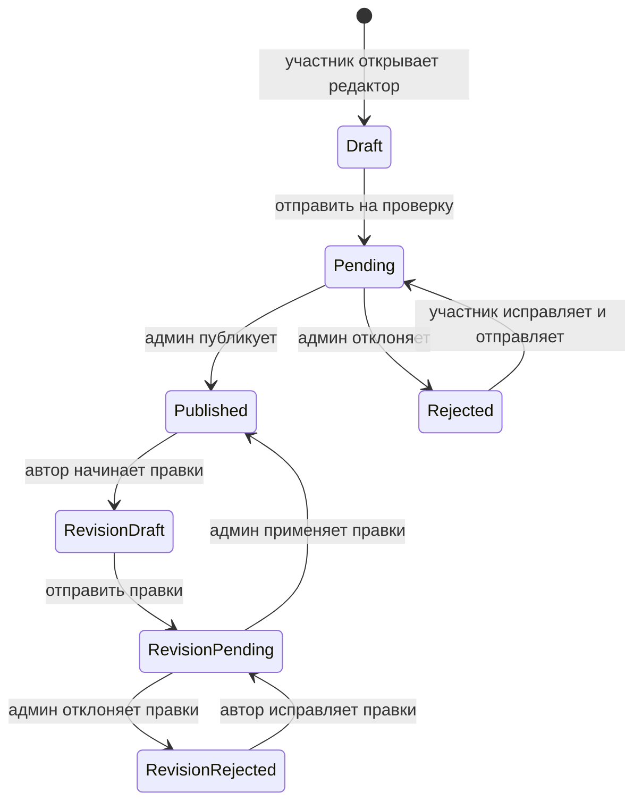

# Саммари книг от участников

## Что делает
Позволяет участникам написать Markdown-саммари по книге, которую они отметили в личном статусе `read`. Администратор модерирует текст: редактирует, публикует или отклоняет. Опубликованные саммари видны на отдельной странице книги и отмечаются в каталоге.

## MVP-границы
- У одной пары `book_id + author_user_id` может быть только одно саммари.
- Писать можно только по книге, которая есть у пользователя в `signup_books` с `personal_status='read'`.
- Автор может редактировать только `draft` и `rejected`.
- После публикации автор редактирует отдельную ревизию; текущий публичный текст не меняется до повторного approve.
- У опубликованного саммари может быть только одна активная ревизия.
- Несколько опубликованных саммари от разных участников показываются на одной странице книги.
- Реакций, комментариев, email-уведомлений и личного раздела “Мои саммари” в MVP нет.

## Модель данных
Таблица `book_summaries` создаётся миграцией `drizzle/0044_book_summaries.sql`. Активные правки опубликованного текста хранятся в `book_summary_revisions`, созданной миграцией `drizzle/0045_book_summary_revisions.sql`.

Ключевые поля:
- `book_id` -> `books.id`
- `author_user_id` -> `user.id`
- `display_name`, `title`, `tldr`, `body_markdown`
- `status`: `draft`, `pending`, `published`, `rejected`
- `rejection_reason`
- `submitted_at`, `published_at`, `rejected_at`, `created_at`, `updated_at`

Уникальность: `unique(book_id, author_user_id)`.

Обе таблицы аудируются: они добавлены в `AUDITED_TABLES`, а миграции создают audit-trigger. При approve поля ревизии копируются в `book_summaries`, после чего ревизия удаляется в той же транзакции. `published_at` сохраняет дату первой публикации.

## Жизненный цикл


## Пользовательский UI
- В профиле и модалке книги действие “Написать саммари” появляется только для книг с личным статусом `read`.
- Редактор находится на `/summaries/{id}/edit`.
- Редактор поддерживает Markdown toolbar, автосейв и preview. Основной Markdown-текст пишется в расширенной рабочей области: контейнер шире коротких полей, toolbar закрепляется при скролле, textarea занимает большую “страницу” минимум на большую часть viewport.
- В тексте саммари явно стилизованы уровни `##`, `###`, `####`. `#` технически рендерится, но не рекомендуется для body: главный заголовок страницы уже занят названием саммари.
- Маркированные (`- пункт`) и нумерованные (`1. пункт`) списки рендерятся с явными маркерами. Toolbar умеет преобразовывать выделенные строки в оба типа списков.
- Для длинных текстов поддерживается переносимый collapsible-блок через HTML-compatible Markdown:
  ```md
  <details>
  <summary>Заголовок раздела</summary>

  Текст раздела
  </details>
  ```
  Вариант `<details open>` открывает блок по умолчанию. Renderer сайта распознаёт только этот безопасный паттерн `details/summary`; произвольный raw HTML не исполняется.
  Текст внутри `<summary>` — свободный авторский заголовок: это может быть “Подробнее”, “Подробный разбор” или название конкретной темы. Закрытый заголовок получает мягкую акцентную заливку при наведении. На сайте подробный слой отмечен акцентной вертикальной линией; в открытом состоянии линия тянется вдоль всего блока и имеет отдельную область клика для сворачивания, поэтому обычный текст тела можно выделять и открывать по ссылкам без случайного закрытия.
- Markdown-цитаты (`>`) оформляются висячей акцентной кавычкой без вертикальной линии, чтобы визуально не смешиваться с раскрываемыми разделами.
- Для `published` редактор сначала показывает текущую версию read-only. Действие `Редактировать` создаёт ревизию, предзаполненную опубликованным текстом.
- Пока ревизия находится на проверке или отклонена, публичная страница продолжает показывать предыдущую опубликованную версию.
- Публичная страница опубликованных саммари: `/books/{bookId}/summaries`.
- Каталог показывает ссылку на саммари, если у книги есть хотя бы одно опубликованное саммари (`summaryCount > 0`).

## Админский UI
Вкладка `/admin?tab=summaries` показывает все саммари с фильтрами:
- все;
- черновики;
- на проверке;
- опубликованные;
- отклонённые.

Администратор может раскрыть строку, поправить `displayName`, `title`, `tldr`, `bodyMarkdown`, указать причину отказа, сохранить изменения, опубликовать или отклонить. Ревизии помечены как `Правки к опубликованному` и показывают текущую публичную версию для сравнения.

## API
Пользовательские:
- `GET /api/summaries/by-book/{bookId}` — вернуть саммари текущего пользователя по книге.
- `POST /api/summaries/by-book/{bookId}` — открыть существующее или создать draft; требует `personal_status='read'`.
- `PATCH /api/summaries/{id}` — автосейв draft/rejected автора.
- `POST /api/summaries/{id}/submit` — отправить на модерацию.
- `POST /api/summaries/{id}/revision` — создать или открыть активную ревизию опубликованного саммари.
- `PATCH /api/summary-revisions/{id}` — автосейв draft/rejected ревизии.
- `POST /api/summary-revisions/{id}/submit` — отправить ревизию на повторную модерацию.

Админские:
- `GET /api/admin/summaries` — список саммари для модерации.
- `PATCH /api/admin/summaries/{id}` — правка текста/метаданных.
- `POST /api/admin/summaries/{id}/publish` — публикация.
- `POST /api/admin/summaries/{id}/reject` — отклонение с причиной.
- `PATCH /api/admin/summary-revisions/{id}` — правка ревизии.
- `POST /api/admin/summary-revisions/{id}/publish` — атомарно применить ревизию к публикации.
- `POST /api/admin/summary-revisions/{id}/reject` — отклонить ревизию, не меняя публичный текст.

## Wikipedia-вставки
Авторы вставляют в саммари портативные блоки со статьёй Wikipedia. Это **не** меняет схему БД и аудит — вставка хранится прямо в Markdown саммари.

**Контракт Markdown.** Блок — обычный blockquote, где последний абзац состоит ровно из одной ссылки с title `wikipedia`:
```
> Авторский текст-тизер
>
> [Wikipedia: Социализм](https://ru.wikipedia.org/wiki/Социализм "wikipedia")
```
`remarkWikipediaEmbeds` (`lib/wikipedia/markdown.ts`) распознаёт этот паттерн, убирает строку-источник из авторского текста и помечает blockquote как `<aside data-wikipedia-embed data-wikipedia-source>`. Любой обычный blockquote и любая невалидная/обманная ссылка остаются обычной цитатой.

**Allowlist ссылок.** `parseWikipediaUrl` (`lib/wikipedia/url.ts`) принимает только `https://<lang>.wikipedia.org/wiki/<Title>` или `/w/index.php?title=` для **любого** языкового раздела (включая `*.m.` мобильные хосты, нормализуются к десктопу). Отклоняются `http`, `www`, поддомены-обманки (`wikipedia.org.evil.com`), commons и прочие хосты.

**Загрузка и кэш.** Клиентский `WikipediaEmbed` при монтировании фоном (preload) дёргает same-origin `GET /api/wikipedia/article?url=<canonical>`; раскрытие виджета не делает второй запрос. Роут отдаёт `Cache-Control: public, s-maxage=3600, stale-while-revalidate=86400`.

**Граница безопасности.** Сервер (`lib/wikipedia/fetch.ts` + `transform.ts`) запрашивает MediaWiki Action API (метаданные, ревизия, imageinfo) и REST `/page/{title}/html`, затем конвертирует HTML в **маленький типизированный AST** (`WikipediaArticleNode`). Клиент рендерит только известные React-узлы — никакого `dangerouslySetInnerHTML`. Удаляются: `script/style/iframe/form/table`, инфобоксы, навбоксы, hatnote, ToC, references, editsection и скрытые узлы. Картинки попадают в вывод только если их хост — `*.wikimedia.org` по `https` **и** есть полная атрибуция.

**Атрибуция.** Текст автора (`Artist`) и подписи очищаются от HTML через Cheerio. Картинка показывается только при наличии artist + license short name + license URL + description URL; иначе фигура опускается. В футере статьи — ссылки на оригинал, историю правок и CC BY-SA 4.0.

**Ограничения и отказы.** Таймаут 8s на запрос, один retry только на `429/503` (с учётом `Retry-After` до 1s), лимит тела 1.5 МБ (по `content-length` и по факту). Коды ошибок (`not_found→404`, `rate_limited→503`, `timeout→504`, `article_too_large→413`, `upstream_error→502`, `invalid_url→400`) маппятся в статусы роута. При любой ошибке виджет сохраняет авторский текст и показывает безопасную ссылку-фолбэк + кнопку «Повторить»; роут логирует только код и язык/заголовок, никогда полный URL или тело.

**Ключевые новые файлы.** `lib/wikipedia/{types,url,markdown,transform,fetch}.ts`, `app/api/wikipedia/article/route.ts`, `components/nd/{WikipediaEmbed,WikipediaArticle,WikipediaInsertDialog}.tsx`.

## Ключевые файлы
- `lib/wikipedia/` — URL-allowlist, remark-распознавание, transform MediaWiki HTML → typed AST, fetch-пайплайн.
- `app/api/wikipedia/article/route.ts` — публичный кэширующий API статьи.
- `components/nd/WikipediaEmbed.tsx` / `WikipediaArticle.tsx` / `WikipediaInsertDialog.tsx` — preload/disclosure, типизированный рендер, диалог вставки.
- `lib/book-summaries.ts` — бизнес-правила, статусы, проверки прав и операции с БД.
- `lib/books.ts` — добавляет `summaryCount` в книги каталога.
- `components/nd/SummaryEditor.tsx` — авторский редактор.
- `components/nd/MarkdownToolbar.tsx` — Markdown toolbar.
- `components/nd/SummaryMarkdown.tsx` — безопасный Markdown render без raw HTML.
- `components/nd/AdminPanel.tsx` — вкладка модерации “Саммари”.
- `app/books/[bookId]/summaries/page.tsx` — публичная страница.
- `app/summaries/[id]/edit/page.tsx` — страница редактирования.
- `app/api/summaries/`, `app/api/summary-revisions/` и соответствующие admin routes — API.
