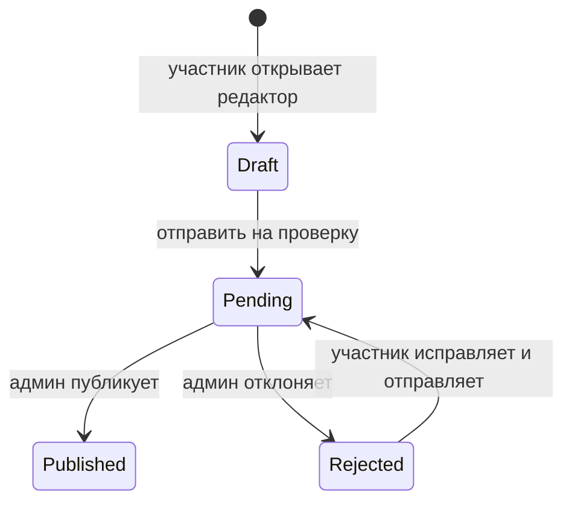

# Саммари книг от участников

## Что делает
Позволяет участникам написать Markdown-саммари по книге, которую они отметили в личном статусе `read`. Администратор модерирует текст: редактирует, публикует или отклоняет. Опубликованные саммари видны на отдельной странице книги и отмечаются в каталоге.

## MVP-границы
- У одной пары `book_id + author_user_id` может быть только одно саммари.
- Писать можно только по книге, которая есть у пользователя в `signup_books` с `personal_status='read'`.
- Автор может редактировать только `draft` и `rejected`.
- После отправки статус становится `pending`; после публикации автор в MVP уже не редактирует текст.
- Несколько опубликованных саммари от разных участников показываются на одной странице книги.
- Реакций, комментариев, email-уведомлений и личного раздела “Мои саммари” в MVP нет.

## Модель данных
Таблица `book_summaries` создаётся миграцией `drizzle/0044_book_summaries.sql`.

Ключевые поля:
- `book_id` -> `books.id`
- `author_user_id` -> `user.id`
- `display_name`, `title`, `tldr`, `body_markdown`
- `status`: `draft`, `pending`, `published`, `rejected`
- `rejection_reason`
- `submitted_at`, `published_at`, `rejected_at`, `created_at`, `updated_at`

Уникальность: `unique(book_id, author_user_id)`.

Таблица аудируется: она добавлена в `AUDITED_TABLES`, а миграция создаёт audit-trigger.

## Жизненный цикл

## Пользовательский UI
- В профиле и модалке книги действие “Написать саммари” появляется только для книг с личным статусом `read`.
- Редактор находится на `/summaries/{id}/edit`.
- Редактор поддерживает Markdown toolbar, автосейв и preview.
- Публичная страница опубликованных саммари: `/books/{bookId}/summaries`.
- Каталог показывает ссылку на саммари, если у книги есть хотя бы одно опубликованное саммари (`summaryCount > 0`).

## Админский UI
Вкладка `/admin?tab=summaries` показывает все саммари с фильтрами:
- все;
- черновики;
- на проверке;
- опубликованные;
- отклонённые.

Администратор может раскрыть строку, поправить `displayName`, `title`, `tldr`, `bodyMarkdown`, указать причину отказа, сохранить изменения, опубликовать или отклонить.

## API
Пользовательские:
- `GET /api/summaries/by-book/{bookId}` — вернуть саммари текущего пользователя по книге.
- `POST /api/summaries/by-book/{bookId}` — открыть существующее или создать draft; требует `personal_status='read'`.
- `PATCH /api/summaries/{id}` — автосейв draft/rejected автора.
- `POST /api/summaries/{id}/submit` — отправить на модерацию.

Админские:
- `GET /api/admin/summaries` — список саммари для модерации.
- `PATCH /api/admin/summaries/{id}` — правка текста/метаданных.
- `POST /api/admin/summaries/{id}/publish` — публикация.
- `POST /api/admin/summaries/{id}/reject` — отклонение с причиной.

## Ключевые файлы
- `lib/book-summaries.ts` — бизнес-правила, статусы, проверки прав и операции с БД.
- `lib/books.ts` — добавляет `summaryCount` в книги каталога.
- `components/nd/SummaryEditor.tsx` — авторский редактор.
- `components/nd/MarkdownToolbar.tsx` — Markdown toolbar.
- `components/nd/SummaryMarkdown.tsx` — безопасный Markdown render без raw HTML.
- `components/nd/AdminPanel.tsx` — вкладка модерации “Саммари”.
- `app/books/[bookId]/summaries/page.tsx` — публичная страница.
- `app/summaries/[id]/edit/page.tsx` — страница редактирования.
- `app/api/summaries/` и `app/api/admin/summaries/` — API.

