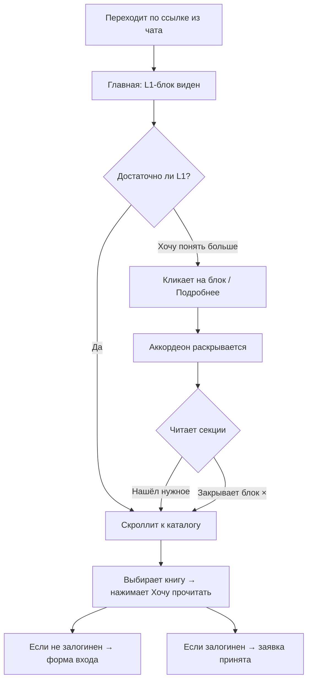
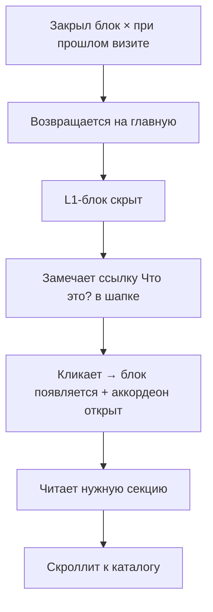

# UX Design Specification — book-club / Positioning About Component

**Author:** Evgenii
**Date:** 2026-03-15

---

<!-- UX design content will be appended sequentially through collaborative workflow steps -->

## Executive Summary

### Project Vision

Превратить однострочный закрываемый банер на главной странице book-club в трёхуровневый компонент позиционирования. L1 — всегда виден, 2–3 предложения с сутью клуба. L2 — аккордеон с 5 Q&A-секциями. L3 — пошаговая механика внутри секции «Как устроено». Компонент не должен нарушать основной поток страницы (каталог книг) и органично продолжать существующую логику банера.

### Target Users

«Михаил», 28–40 лет — интеллектуально любопытный, пришёл по личной ссылке из группового чата (Telegram или другой мессенджер). Может быть на мобильном устройстве. Евгения может знать лично или нет. Задача пользователя: за 30 секунд понять, что это такое, для него ли это, и что сделать прямо сейчас.

### Key Design Challenges

- **Иерархия внимания:** L1 должен работать самостоятельно — если человек не раскроет аккордеон, он всё равно должен понять достаточно для целевого действия (отметить книгу)
- **Тон и голос:** клуб интимный, честный, некорпоративный — UI не должен быть нейтрально-холодным или формальным
- **Мобильный контекст:** пользователь мог перейти прямо из Telegram; аккордеон должен корректно работать на маленьком экране

### Design Opportunities

- **«Чем не является»** — нетипичная секция для About, потенциально становится моментом доверия и приятного сюрприза для правильной аудитории
- **L1 как приглашение, не объявление** — тон первого уровня задаёт всё ощущение клуба ещё до раскрытия аккордеона
- **Органичное расширение существующего банера** — текущий компонент уже закрываемый; новый дизайн может сохранить эту логику и нарастить поверх неё

---

## Core User Experience

### Defining Experience

Компонент работает как воронка внимания: человек решает глубину погружения сам. Три уровня — не обязательная последовательность, а предложение: остановись там, где тебе достаточно. Главное — не заставить читать всё, а дать возможность найти своё.

### Platform Strategy

Web (Next.js, мобильный + десктоп). Приоритет — мобильный: пользователь часто переходит напрямую из Telegram. Аккордеон реализуется без тяжёлых JS-фреймворков, без анимаций которые тормозят на слабых устройствах. Touch targets — достаточно крупные для уверенного нажатия пальцем.

### Effortless Interactions

- L1 читается без действий — пользователь не должен ничего нажимать, чтобы получить суть
- Аккордеон: один клик по заголовку-вопросу раскрывает ответ; предыдущая секция закрывается автоматически
- Кнопка «×» закрывает весь блок — поведение сохраняется от текущего банера
- **Ссылка «Что это?» в шапке** — всегда доступна, открывает/прокручивает к About-блоку даже если он был закрыт через «×»
- После закрытия блок скрыт по умолчанию (localStorage), но легко восстановим через ссылку в шапке

### Critical Success Moments

1. **5 секунд:** L1 достаточно ориентирует — пользователь понимает суть без клика
2. **Секция «Чем не является»:** момент интеллектуальной честности, который строит доверие у правильной аудитории и мягко отсеивает неправильную
3. **Переход к каталогу:** после чтения пользователь скроллит вниз и видит книги — компонент не должен мешать этому движению

### Experience Principles

1. **Минимум трения на каждом уровне** — L1 работает без клика, каждая секция раскрывается одним касанием
2. **Голос клуба = голос текста** — тон компонента живой, некорпоративный, как будто Евгений говорит напрямую
3. **Честность как UX-решение** — «Чем не является» стоит последней: это не отказ, а финальный доверительный жест
4. **Не мешать главному** — компонент существует между шапкой и каталогом; он должен легко скипаться, не занимать весь экран

---

## Desired Emotional Response

### Primary Emotional Goals

Компонент должен создавать ощущение тёплого личного приглашения, а не корпоративного лендинга. Главная цель — чтобы правильный человек почувствовал «это моё» прежде чем нажать на книгу.

### Emotional Journey Mapping

| Момент | Желаемая эмоция |
|---|---|
| Видит L1 впервые | Лёгкое любопытство — «это что-то необычное» |
| Читает Q&A | Узнавание — «эти люди похожи на меня» |
| Читает «Чем не является» | Доверие — «они честные, не вербуют» |
| Нажимает на книгу | Лёгкость — маленький шаг, не обязательство |

### Micro-Emotions

- **Доверие vs. скептицизм** — секция «Чем не является» напрямую работает с этим
- **Узнавание vs. отчуждение** — конкретные детали (камеры, 3–4 человека, демократия) помогают правильным людям узнать себя
- **Лёгкость vs. тревога** — запись на книгу должна ощущаться как выражение интереса, а не договор

### Design Implications

- **Любопытство** → L1 содержит что-то неочевидное или неожиданное, а не стандартное «книжный клуб»
- **Узнавание** → конкретные детали в Q&A (не абстракции), голос живой и человеческий
- **Доверие** → «Чем не является» стоит последней секцией; визуально равноценна остальным, не спрятана
- **Лёгкость** → после аккордеона — прямой путь к каталогу, никакой формы, кнопок «записаться» до выбора книги

### Emotional Design Principles

- Избегать перегруженности: каждый уровень раскрывается по желанию, не всё сразу
- Избегать тревоги: нигде нет слов «обязательно», «нужно», «требуется»
- Избегать растерянности: после L1 понятно что делать — скроллить вниз к книгам

---

## UX Pattern Analysis & Inspiration

### Inspiring Products Analysis

**Медуза — формат карточек**
Главная ценность: дозирование информации. Каждая карточка = одна законченная мысль. Пользователь не чувствует перегруза — в любой момент можно остановиться. Вопрос как заголовок карточки работает как крючок: он интригует, а не просто описывает содержание.

### Transferable UX Patterns

- **Одна мысль — одна единица:** каждая секция аккордеона должна быть самодостаточной. Открыл одну → получил полный ответ, не надо читать другие
- **Заголовок-крючок:** вопрос в шапке секции должен быть достаточно интересным, чтобы захотеть нажать — разница между «Для кого это» и «Это для тебя?»
- **Плотность текста:** внутри секции — не стена текста. Короткие абзацы, максимум 3–4 предложения на мысль

### Anti-Patterns to Avoid

- **Корпоративный FAQ** — рамки, иконки-плюсики, монотонный шрифт; создаёт ощущение HR-политики
- **Все секции открыты по умолчанию** — перегруз с первого взгляда, теряется смысл аккордеона
- **Вопросы-ярлыки** — «О клубе», «Правила» — скучно, не приглашают кликнуть

### Design Inspiration Strategy

- **Взять из Медузы:** принцип дозирования — одна секция = одна законченная мысль
- **Адаптировать:** в Медузе карточки равноправны и сканируются горизонтально; в аккордеоне — вертикальная последовательность, порядок имеет значение
- **Добавить свой голос:** типографика теплее, разделители мягче; не «сетка данных», а «разговор»

---

## Defining Experience

### Defining Experience

«Читаешь одну строчку — и либо сразу идёшь к книгам, либо нажимаешь на вопрос и узнаёшь больше.»

Ключевое взаимодействие: **скан L1 → решение → (опционально) клик на вопрос → ответ → действие**. Компонент не требует ничего от пользователя — он работает как приглашение, а не как инструкция.

### User Mental Model

Пользователь уже знает паттерн аккордеона из FAQ-разделов и email-рассылок. Ничему учить не нужно — кликаешь на вопрос, появляется ответ. Ментальная модель: «разворачиваемый текст».

### Success Criteria

- L1 прочитан без единого клика — пользователь понимает суть
- Открытие секции ощущается мгновенным (transition ≤ 150ms)
- После закрытия последней секции — взгляд естественно уходит вниз к каталогу
- Ссылка «Что это?» в шапке работает как надёжный возврат

### Novel vs. Established Patterns

Паттерн установленный. Инновация — в содержании: заголовки-вопросы как крючки, а не ярлыки. «Чем не является» в конце — нетипично для About-секций, работает как доверительный финальный жест.

### Experience Mechanics

| Этап | Что происходит |
|---|---|
| Инициация | L1 виден сразу; кнопка «Подробнее» или визуальный сигнал аккордеона приглашает раскрыть |
| Взаимодействие | Клик на вопрос → ответ появляется плавно; предыдущий закрывается |
| Обратная связь | Заголовок визуально меняет состояние (цвет/стрелка) — показывает открытость |
| Завершение | «×» закрывает весь блок; скролл вниз — переход к каталогу |

---

## Design System Foundation

### Design System Choice

Кастомные компоненты на inline styles — в соответствии с существующим подходом в `components/nd/`. Никаких внешних компонентных библиотек. TailwindCSS доступен в проекте, но `nd/`-компоненты используют style objects — новый компонент следует той же конвенции.

### Rationale for Selection

- Компонент небольшой и самодостаточный — сторонняя библиотека избыточна
- Полный контроль над визуальным языком без переопределения чужих стилей
- Нет новых зависимостей в бандле
- Соответствие стилю остальных `nd/`-компонентов

### Implementation Approach

Client component (`'use client'`) — нужно состояние (какая секция открыта, закрыт ли блок). Минимальный JS: `useState` для открытой секции + localStorage для состояния закрытия. CSS transitions для плавного открытия/закрытия секций — без анимационных библиотек.

### Customization Strategy

Лёгкий визуальный акцент допускается: чуть отличающийся фон для блока (например `#f9f9f9`), другой оттенок для заголовков-вопросов. Остаётся в рамках общей палитры сайта (нейтральные серые + белый), но с достаточным отличием чтобы блок читался как отдельная смысловая зона.

---

## Visual Design Foundation

### Color System

| Роль | Цвет | Применение |
|---|---|---|
| Фон блока | `#f9f9f9` | Лёгкий акцент — блок читается как отдельная зона |
| Фон страницы | `#fff` | Всё вокруг |
| Основной текст | `#111` | — |
| Тело / L1 | `#555` | Текст описания, ответы в секциях |
| Заголовок вопроса (закрыт) | `#333` | Чуть темнее тела — приглашает нажать |
| Заголовок вопроса (открыт) | `#111` | Активное состояние |
| Разделители | `#E5E5E5` | Между секциями, граница блока снизу |
| Muted / индикатор | `#bbb` | Кнопка «×», стрелка в закрытом состоянии |

### Typography System

- **Вопросы (заголовки секций):** Playfair Display, ~1rem, weight 400 — даёт литературное тепло
- **L1 summary:** Inter, 0.875rem, #555, lineHeight 1.65 — как текущий банер
- **Ответы (тело секций):** Inter, 0.875rem, #555, lineHeight 1.65
- **Ссылка «Что это?» в шапке:** Inter, 0.8rem, #555

### Spacing & Layout Foundation

- Горизонтальный padding: `1.5rem` — как у всех nd/-секций
- Max-width: `1200px` — как у всего сайта
- Вертикальный padding L1: `1.25rem 1.5rem` — как у текущего банера
- Padding каждой accordion-секции: `1rem 0`
- Touch target для заголовков секций: минимум `44px` высоты

### Accessibility Considerations

- Контраст `#555` на `#f9f9f9`: ~5.7:1 — проходит WCAG AA
- Контраст `#333` на `#f9f9f9`: ~8.1:1 — проходит WCAG AAA
- Accordion-кнопки keyboard-navigable: Enter/Space открывают секцию
- `aria-expanded` на каждом заголовке-кнопке

---

## Design Direction Decision

### Design Directions Explored

Три варианта: A (интегрированный — белый фон, текст-ссылка), B (выделенный блок — фон #f9f9f9, кнопка с рамкой, кружок-индикатор), C (редакционный — левый бордер, нумерованные вопросы, eyebrow-метка).

### Chosen Direction

**Вариант C — Редакционный.** Левый акцентный бордер (`border-left: 3px`), нумерованные вопросы, eyebrow-метка «О клубе», Playfair Display для заголовков секций.

**Дополнение по итогам ревью:** весь L1-блок кликабелен — при наведении визуальная реакция (фон темнеет, бордер насыщается), при клике — раскрывается аккордеон. Кнопка «Подробнее» и «×» работают независимо.

### Design Rationale

- Редакционный стиль соответствует литературному духу клуба
- Левый бордер создаёт ощущение цитаты или маргинальной заметки — нетипично для «о нас», но органично для книжного контекста
- Нумерация вопросов добавляет структуру без ощущения формы
- Интерактивность всего блока снижает трение: не нужно искать кнопку

### Implementation Approach

Client component с `useState` для открытой секции и состояния аккордеона. `onClick` на весь L1-контейнер с проверкой `e.target` — не срабатывает внутри раскрытого аккордеона. CSS transition на `border-left-color` и `background` при hover/expanded.

---

## User Journey Flows

### Journey 1: Первый визит → запись на книгу

### Journey 2: Возврат через шапку

### Journey Patterns

- **Progressive disclosure:** L1 → аккордеон → механика. Пользователь никогда не получает больше, чем просил
- **Reversible dismiss:** закрытие блока не финально — «Что это?» всегда возвращает
- **Passthrough:** можно пройти весь путь (L1 → книга) без единого клика на аккордеон

### Flow Optimization Principles

- Минимум шагов от L1 до «Хочу прочитать» — не больше двух скроллов
- Аккордеон не перехватывает фокус — после чтения естественный скролл вниз
- «×» не теряется: всегда в правом углу, как в текущем банере

---

## Component Strategy

### Design System Components

Проект использует кастомные inline-style компоненты — нет design system с готовыми primitives. Всё строится с нуля, но опирается на существующий визуальный язык `components/nd/`.

### Custom Components

**`AboutBlock` (новый)**

| | |
|---|---|
| **Назначение** | Трёхуровневый позиционирующий блок: L1 + аккордеон + механика |
| **Props** | `onClose`, `defaultOpen?` |
| **State** | `isVisible` (localStorage), `openSection: string \| null` |
| **Анатомия** | eyebrow → L1-строка (текст + кнопки) → accordion-список |
| **Состояния** | hidden, collapsed (L1 visible), expanded (accordion open), section-open |
| **Взаимодействие** | Click на L1-area → expand; click на question → toggle section; click × → hide |
| **Accessibility** | `role="region"`, `aria-expanded` на каждой кнопке секции, keyboard: Enter/Space |

**`AccordionSection` (sub-component внутри AboutBlock)**

| | |
|---|---|
| **Назначение** | Одна Q&A-секция аккордеона |
| **Props** | `number`, `question`, `children`, `isOpen`, `onToggle` |
| **Состояния** | open / closed |
| **Accessibility** | `<button>` для заголовка, `aria-expanded`, `id`/`aria-controls` связка |

**Header — модификация существующего**

Добавить prop `onWhatIsThis?: () => void` → рендерит ссылку «Что это?» в навигации. Не новый компонент.

### Component Implementation Strategy

- `AboutBlock` и `AccordionSection` — в `components/nd/AboutBlock.tsx`
- `BooksPage.tsx`: заменить существующий `showAbout`-блок на `<AboutBlock>`
- `Header.tsx`: добавить prop `onWhatIsThis` и соответствующий `<a>` в nav

### Implementation Roadmap

| Этап | Что | Зачем |
|---|---|---|
| 1 | `AboutBlock` + `AccordionSection` | Core компонент — основа всего |
| 2 | Интеграция в `BooksPage.tsx` | Заменяет текущий банер |
| 3 | Модификация `Header.tsx` | Ссылка «Что это?» для возврата |

---

## UX Consistency Patterns

### Interaction Patterns (Accordion)

| Ситуация | Поведение |
|---|---|
| Клик на L1-блок (аккордеон закрыт) | Аккордеон открывается |
| Клик на L1-блок (аккордеон открыт) | Ничего — клик внутри аккордеона не баблится |
| Клик на заголовок-вопрос (закрыт) | Секция открывается, предыдущая закрывается |
| Клик на заголовок-вопрос (открыт) | Секция закрывается |
| Клик «×» | Весь блок скрывается, пишется в localStorage |
| Клик «Что это?» в шапке | Блок показывается + аккордеон открывается |

### State Persistence

- `aboutDismissed: true` в localStorage → блок не рендерится при загрузке
- Состояние открытой секции — не персистируется (сбрасывается при закрытии аккордеона)
- При клике «Что это?» — `aboutDismissed` удаляется из localStorage, блок показывается

### Navigation Patterns

- «Что это?» в шапке: стиль как у остальных nav-ссылок, визуально чуть акцентирован; когда блок уже открыт — скроллит к нему вместо повторного показа

### Mobile Touch Patterns

- Весь заголовок секции — touch target (минимум 44px), не только текст/стрелка
- Весь L1-блок — тоже touch target для раскрытия аккордеона
- Горизонтальный padding одинаков на всех breakpoints (`1.5rem`)

### Feedback Patterns

- Hover на L1-блоке: `background #fafafa`, `border-left-color` насыщается — визуальный сигнал кликабельности
- Hover на заголовке секции: `color #111` — сигнал интерактивности
- CSS transition `150ms ease` на всех интерактивных состояниях

---

## Responsive Design & Accessibility

### Responsive Strategy

Компонент полноширинный на всех устройствах — структурных изменений между десктопом и мобильным нет. На узких экранах (<480px) L1-строка с кнопками переходит в колонку (текст сверху, кнопки снизу), чтобы не сжимать текст.

### Breakpoint Strategy

| Breakpoint | Поведение |
|---|---|
| ≥480px | L1-строка в ряд: текст + кнопки |
| <480px | L1-строка в колонку: текст, затем кнопки |

Других структурных изменений нет. Аккордеон одинаков на всех размерах.

### Accessibility Strategy

Целевой уровень: **WCAG AA** — обеспечен цветовыми контрастами (5.7:1 и 8.1:1). Ключевые требования:

- Все интерактивные элементы — `<button>`, не `
`
- `aria-expanded="true/false"` на каждой кнопке-заголовке аккордеона
- `aria-controls` связывает кнопку с контентом
- `role="region"` + `aria-label="О клубе"` на блоке в целом
- Фокус-индикатор: стандартный браузерный `outline` не убирать

### Testing Strategy

- Проверить на реальном телефоне (Chrome Android / Safari iOS) — Telegram-переход
- Keyboard-only: Tab → фокус на блоке → Enter → аккордеон открывается → Tab по секциям → Enter → секция открывается
- Проверить что «×» доступна с клавиатуры

### Implementation Guidelines

- `max-width: 100%`, `padding: 0 1.5rem` — без фиксированных пиксельных ширин
- Медиа-запрос только один: `@media (max-width: 480px)` для колонки L1
- Не убирать `outline` через `outline: none` без замены на кастомный фокус-стиль
