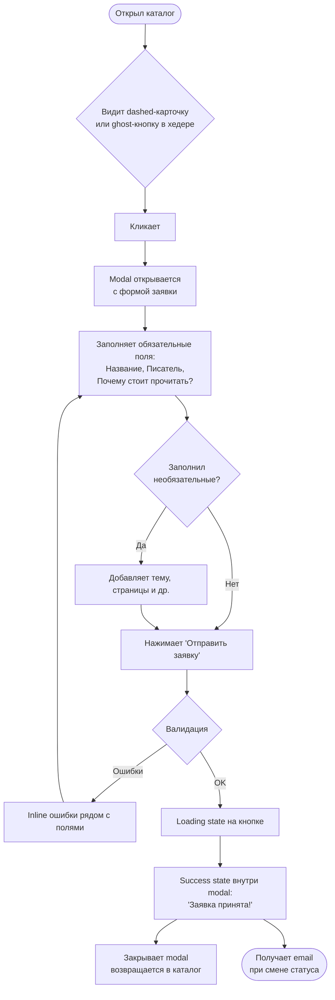
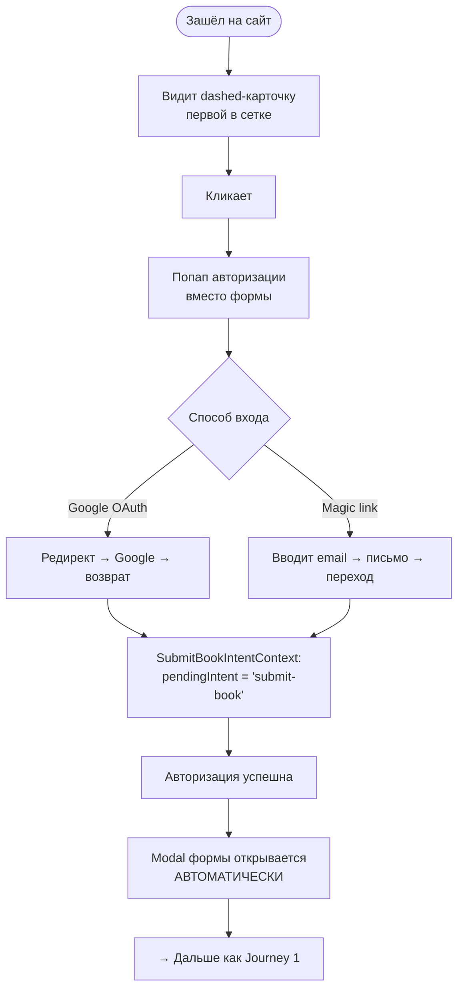
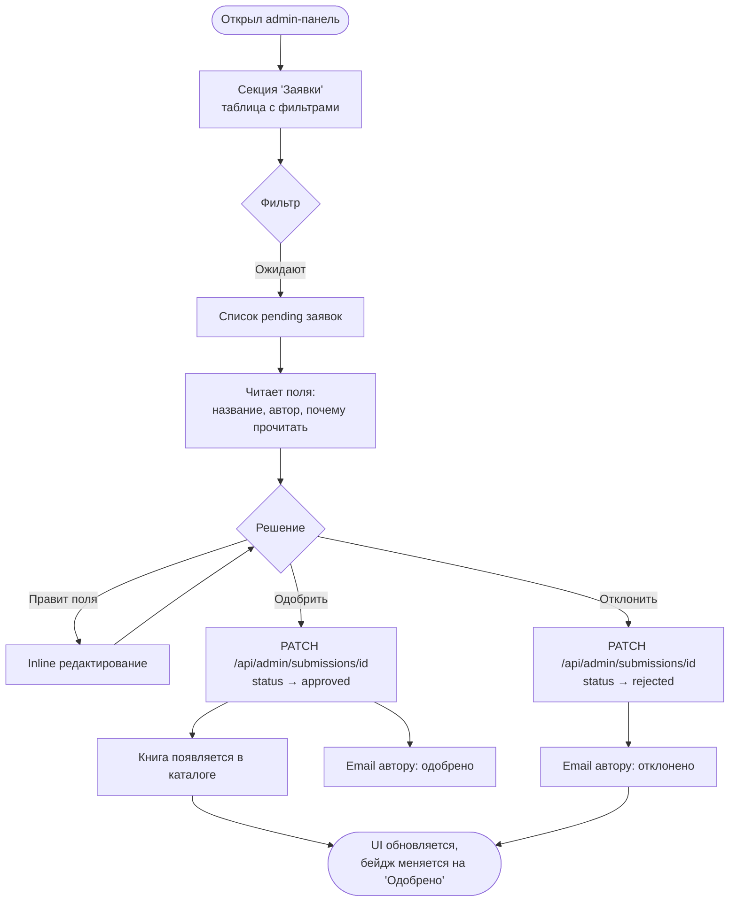

# UX Design Specification — book-club

**Author:** Evgenii
**Date:** 2026-03-15

---

<!-- UX design content will be appended sequentially through collaborative workflow steps -->

## Executive Summary

### Project Vision

Сайт книжного клуба "Долгое наступление" превращается из статичного каталога в живую платформу, где участники становятся соавторами. Любой член клуба может предложить книгу — заявка проходит модерацию, при смене статуса приходит email, одобренная книга появляется в общем каталоге наравне с книгами администратора.

### Target Users

**Участники клуба** — залогиненные пользователи (Google OAuth / magic-link), знакомые с сайтом. Хотят легко предложить книгу из любого места на сайте. Ожидают подтверждения и обратной связи о судьбе заявки.

**Незалогиненный посетитель** — может зайти впервые, увидеть псевдо-карточку и захотеть предложить книгу. Нужен плавный путь: авторизация → форма без потери контекста.

**Администратор** — модерирует поток заявок. Нуждается в удобном списке, возможности редактировать поля перед одобрением и быстрых кнопках approve/reject.

### Key Design Challenges

1. **Обнаруживаемость фичи** — два входа (хедер + псевдо-карточка) должны быть заметны, но не навязчивы для тех, кто просто просматривает каталог
2. **Auth → Form flow** — незалогиненный пользователь не должен потерять намерение после авторизации: форма открывается автоматически
3. **Форма на мобильных** — 9 полей с корректными типами клавиатуры, достаточными touch-целями, без горизонтального скролла

### Design Opportunities

1. **Поле "Почему стоит прочитать?"** — личная рекомендация от участника, которая делает каталог живым и человечным
2. **Ощущение вклада** — после одобрения пользователь видит свою книгу в общем каталоге, что усиливает вовлечённость
3. **Seamless auth flow** — плавный переход авторизация → форма без повторного клика — редкость для клубных сайтов, создаёт приятное первое впечатление

## Core User Experience

### Defining Experience

Ключевое действие — **предложить книгу**. Это единственное новое действие, которое определяет ценность всей фичи. Всё остальное — точки входа, auth flow, email-уведомления — служат этому действию. Если предложить книгу легко и приятно, фича работает.

### Platform Strategy

Веб-приложение (Next.js 14, App Router), адаптивное. Дух — **mobile-first**: участники клуба чаще под рукой с телефоном, чем с ноутбуком. Поддержка современных браузеров (Chrome, Firefox, Safari, Edge). Офлайн-функциональность не нужна. Touch + mouse/keyboard — оба сценария должны работать без компромиссов.

### Effortless Interactions

- **Обнаружение точки входа** — псевдо-карточка первой в сетке каталога: нельзя пропустить, не нужно искать
- **Auth → Form** — незалогиненный авторизовался → форма открывается сама, без повторного клика
- **Форма на мобильном** — каждое поле вызывает правильный тип клавиатуры (text, number, url, date), touch-цели достаточного размера, никакого горизонтального скролла

### Critical Success Moments

1. **Клик без залогина → форма после входа** — пользователь не теряет намерение; форма открывается автоматически
2. **Отправка → подтверждение** — после нажатия "Отправить" мгновенно появляется сообщение "Заявка принята! Мы рассмотрим её в ближайшее время." — не тишина, не редирект
3. **Email об одобрении → книга в каталоге** — пользователь получает письмо, открывает сайт, видит свою книгу среди остальных

### Experience Principles

1. **Намерение не теряется** — если пользователь хотел предложить книгу, ни авторизация, ни другие шаги не должны сбивать его с пути
2. **Обратная связь на каждом шаге** — отправил форму → подтверждение; статус изменился → email; нет тишины
3. **Мобильный как приоритет** — форма и все точки входа проектируются под телефон, затем адаптируются к десктопу
4. **Минимум шагов до цели** — от желания предложить книгу до "заявка принята" — не более 3 шагов для залогиненного

## Desired Emotional Response

### Primary Emotional Goals

**Участник клуба** должен чувствовать **причастность и лёгкость** — "я только что сделал что-то полезное для всего клуба, и это было просто". Форма предложения книги должна восприниматься не как бюрократический процесс, а как естественный акт участия в жизни клуба.

**Администратор** должен чувствовать **контроль и эффективность** — всё необходимое для принятия решения под рукой, никаких лишних переключений контекста.

### Emotional Journey Mapping

| Момент | Желаемая эмоция |
|---|---|
| Увидел псевдо-карточку / кнопку в хедере | Любопытство и приглашение |
| Открыл форму (залогинен) | Лёгкость, "это просто" |
| Заполнил и отправил | Причастность, удовлетворение |
| Увидел подтверждение | Спокойная уверенность: заявка точно принята |
| Получил email об одобрении | Гордость и радость |
| Увидел свою книгу в каталоге | Принадлежность, соавторство |
| Получил email об отклонении | Нейтральность: понятно, без обиды |

### Micro-Emotions

- **Уверенность** (не тревога) — пользователь знает что происходит с его заявкой на каждом шаге
- **Принадлежность** (не изоляция) — участник становится соавтором каталога, а не просто потребителем
- **Лёгкость** (не растерянность) — точки входа очевидны, форма понятна без инструкций
- **Непрерывность** (не потеря контекста) — auth flow не сбивает с намерения, форма открывается сама после входа

### Design Implications

- **Причастность → подтверждение с тёплым тоном** — не просто "успешно", а "Заявка принята! Мы рассмотрим её в ближайшее время."
- **Уверенность → email при каждом изменении статуса** — пользователь никогда не гадает о судьбе заявки
- **Принадлежность → одобренная книга в общем каталоге** — визуальный результат вклада участника
- **Непрерывность → SubmitBookIntentContext** — сохранение намерения через auth flow
- **Нейтральность при отклонении → формулировка без осуждения** — "не была одобрена", без объяснений причин в MVP

### Emotional Design Principles

1. **Тишина — враг доверия**: на каждое действие пользователя — видимая реакция системы
2. **Намерение священно**: авторизация не прерывает путь к форме, а дополняет его
3. **Результат виден**: одобренная книга в каталоге — лучшая награда, не нужны баллы и бейджи
4. **Тон — тёплый, но ненавязчивый**: клубная атмосфера, не корпоративный интерфейс

## UX Pattern Analysis & Inspiration

### Inspiring Products Analysis

Специфические источники вдохновения от пользователей не названы. Анализ построен на устоявшихся паттернах из форм подачи заявок и community-платформ (Typeform, Google Forms, GitHub Issues, Notion, Linear, Figma OAuth flows).

### Transferable UX Patterns

**Форма:**
- **Progressive disclosure** (GitHub Issues, Notion forms) — обязательные поля крупно и первыми, необязательные ниже или свёрнуты. Снижает тревогу перед длинной формой с 9 полями
- **Inline validation** — ошибка появляется при потере фокуса поля, не после нажатия "Отправить". Меньше фрустрации, быстрее исправление
- **Sticky submit button** — кнопка "Отправить" фиксирована внизу экрана при прокрутке длинной формы на мобильном

**Post-submit:**
- **Success state с объяснением следующего шага** (Typeform, Google Forms) — после отправки не просто "спасибо", а: "Заявка принята! Мы рассмотрим её в ближайшее время." Убирает тревогу "а дошло ли?"

**Auth flow:**
- **Intent preservation** (Figma, Linear OAuth) — после авторизации пользователь попадает ровно туда, откуда пришёл. В нашем случае: форма открывается автоматически через `SubmitBookIntentContext`

### Anti-Patterns to Avoid

- **Форма на отдельной странице** — теряется контекст каталога; используем modal/drawer
- **Глухое "успешно отправлено"** — всегда говорим что произойдёт дальше
- **Универсальная клавиатура для всех полей** — теряем удобство на мобильном; каждое поле должно вызывать правильный тип (`text`, `number`, `url`, `date`)
- **Авторизация без сохранения намерения** — классическая потеря пользователя; решено через context

### Design Inspiration Strategy

**Принять:**
- Progressive disclosure для 9-польной формы
- Inline validation для быстрой обратной связи
- Sticky submit на мобильном
- Тёплый, информативный success state

**Адаптировать:**
- Intent preservation после OAuth — упрощённая версия через React Context (без URL-параметров)

**Избежать:**
- Отдельная страница для формы
- Молчание после отправки
- Единый тип клавиатуры для всех полей

## Design System Foundation

### Design System Choice

TailwindCSS 3.4 + кастомные компоненты — продолжение текущего подхода проекта. Все новые компоненты размещаются в `components/nd/` по существующему паттерну.

### Rationale for Selection

- Brownfield проект: ломать существующий стиль ради внешней библиотеки нецелесообразно
- Все существующие компоненты построены на Tailwind-утилитах напрямую в JSX
- Новые компоненты (`SubmitBookForm`, `SubmitBookCard`, `SubmitBookButton`) органично вписываются в сложившийся паттерн без дополнительных зависимостей

### Implementation Approach

- Tailwind-утилиты напрямую в JSX — без CSS modules, styled-components
- PascalCase для компонентов, kebab-case для утилит (по project-context.md)
- `'use client'` только там где нужна интерактивность

### Customization Strategy

- Для отдельных элементов с требованиями доступности (Modal, Select, Combobox) — можно точечно использовать Radix UI / headlessui без принятия полной библиотеки
- Форма заявки реализуется как modal/drawer поверх существующего layout

## Core User Experience

### 2.1 Defining Experience

**"Предложить книгу клубу — за 3 касания."**

Это единственное взаимодействие, которое определяет ценность новой фичи. Если оно работает без трения — всё остальное следует автоматически.

### 2.2 User Mental Model

Пользователь воспринимает форму как привычную анкету для чего-то важного лично ему. Паттерн устоявшийся (modal-форма с полями), без неожиданностей. Уникальность — в контексте клуба и поле "Почему стоит прочитать?", которое придаёт личный смысл действию.

Пользователь ожидает:
- Форму с понятными полями
- Подтверждение что заявка принята
- Обратную связь о результате модерации

### 2.3 Success Criteria

- Залогиненный пользователь открывает форму и отправляет заявку за ≤3 действия
- Незалогиненный проходит авторизацию и попадает в форму без повторного клика
- После отправки пользователь точно знает что произошло и что будет дальше
- На мобильном форма заполняется без горизонтального скролла и с правильными типами клавиатуры

### 2.4 Novel UX Patterns

Паттерн **устоявшийся** — modal-форма хорошо знакома пользователям. Инновация точечная:
- **Auth intent preservation** — форма открывается автоматически после авторизации (не стандартное поведение для большинства сайтов, но ожидаемое пользователем)
- Поле "Почему стоит прочитать?" — необычное для каталогов, но интуитивно понятное

### 2.5 Experience Mechanics

**1. Initiation:**
- Псевдо-карточка "Предложить книгу" — первая в сетке каталога, видна без прокрутки
- Кнопка в хедере — доступна с любой точки сайта
- Залогинен → форма открывается сразу; не залогинен → попап авторизации → форма автоматически

**2. Interaction:**
- 9 полей: 3 обязательных (Название, Писатель, Почему стоит прочитать?) крупно и первыми
- Необязательные поля — ниже, без давления
- Каждое поле вызывает правильный тип клавиатуры (`text`, `number`, `url`, `date`)
- Кнопка "Отправить" — sticky внизу на мобильном

**3. Feedback:**
- Inline валидация при потере фокуса поля
- Ошибки — конкретные, рядом с полем
- Loading state на кнопке во время отправки

**4. Completion:**
- Success state: "Заявка принята! Мы рассмотрим её в ближайшее время."
- Email при каждом изменении статуса (approved / rejected)
- После одобрения — книга появляется в общем каталоге

## Visual Design Foundation

### Color System

Существующая двойная тема через CSS-переменные — light (пергамент) и dark (строгий тёмный). Переключение через `data-theme` на `<html>`.

| Токен | Light | Dark | Назначение |
|---|---|---|---|
| `--bg` | `#F9F5EE` | `#111111` | Основной фон |
| `--bg-elevated` | `#EDE5D8` | `#1A1A1A` | Карточки, модальные окна |
| `--bg-input` | `#FDFAF5` | `#1C1C1C` | Поля формы |
| `--bg-input-focus` | `#FFFFFF` | `#252525` | Поля в фокусе |
| `--bg-tag-green` | `#EBF3EE` | `#1A2E24` | Success-состояния |
| `--text` | `#1A1714` | `#F0EBE3` | Основной текст |
| `--text-secondary` | `#5C4A3A` | `#C9B8A8` | Вторичный текст |
| `--text-muted` | `#8C7B6B` | `#9E8E80` | Подсказки, placeholder |
| `--accent` | `#B5451B` | `#E05A2B` | CTA, ссылки, акценты |
| `--success` | `#2D6A4F` | `#3D8A68` | Подтверждение, одобрение |
| `--border` | `#D4C4B0` | `#3A3028` | Границы элементов |

**Применение в новых компонентах:**
- Модальное окно формы → `var(--bg-elevated)` + `var(--shadow-card)`
- Поля формы → `var(--bg-input)` / `var(--bg-input-focus)` при фокусе
- Кнопка "Отправить" → `var(--accent)` / `var(--accent-hover)`
- Success state → `var(--success)` + `var(--bg-tag-green)`

### Typography System

**Шрифты:** Geist Sans (основной) + Geist Mono (моноширинный) — local fonts от Vercel, переменная насыщенность 100–900.

**Характер:** современный, читаемый, нейтральный — хорошо сочетается с тёплой пергаментной палитрой.

**Принципы для формы:**
- Лейблы полей — достаточный размер для мобильного (≥14px)
- Placeholder — `var(--text-muted)`
- Ошибки валидации — `var(--accent)`, рядом с полем
- Success message — `var(--success)`

### Spacing & Layout Foundation

**База:** 8px grid (стандарт Tailwind: `p-2` = 8px, `p-4` = 16px, `p-6` = 24px)

**Модальная форма:**
- Внутренние отступы: `p-6` на десктопе, `p-4` на мобильном
- Расстояние между полями: `gap-4` (16px)
- Touch-цели: минимум 44×44px (кнопки, чекбоксы, иконки закрытия)

**Breakpoint мобильного:** `max-width: 540px` (уже используется в хедере)

### Accessibility Considerations

- Контраст: существующая палитра выдержана — `--accent` на `--bg` проходит WCAG AA
- Семантический HTML: `<form>`, `<label>`, `<input>`, `<button>` — без дивов вместо кнопок
- ARIA: модальное окно — `role="dialog"`, `aria-modal="true"`, `aria-labelledby`
- Клавиатурная навигация: Tab через поля, Escape закрывает модальное окно
- Тёмная тема: автоматически работает для всех новых компонентов при использовании CSS-переменных

## Design Direction Decision

### Design Directions Explored

7 направлений исследовались: псевдо-карточка (3 варианта), форма modal vs drawer, success state (2 варианта), валидация, хедер (3 варианта), admin UI. Визуальная витрина: `docs/planning-artifacts/ux-design-directions.html`

### Chosen Direction

| Компонент | Выбор |
|---|---|
| Псевдо-карточка | Dashed border — нейтральная, книги остаются главными |
| Форма заявки | Modal — фокус на форме, контекст каталога уходит на второй план |
| Success state | Inline в модальном окне — финальная точка, пользователь понимает что всё завершено |
| Валидация | Inline при потере фокуса, конкретные ошибки рядом с полем |
| Кнопка в хедере | Ghost / текстовая ссылка — минималистично, атмосфера клуба |
| Admin UI | Таблица с inline approve/reject, фильтры по статусу |

### Design Rationale

- Dashed border + ghost кнопка создают единый тон: фича приглашает, не навязывается
- Modal для формы — стандартный паттерн, нет когнитивной нагрузки
- Inline success в модальном окне — чёткая финальная точка без редиректа
- Ghost ссылка в хедере вписывается в существующую типографику сайта

### Implementation Approach

- `SubmitBookCard.tsx` — dashed border (`border: 2px dashed var(--border)`), hover: `border-color: var(--accent)`, фон `#FEF8F5`
- `SubmitBookForm.tsx` — modal с overlay `rgba(26,23,20,.45)`, фон `var(--bg-elevated)`, обязательные поля вверху + `
` разделитель + необязательные поля
- Success state — заменяет содержимое формы внутри того же модального окна, не закрывает его
- `SubmitBookButton.tsx` в хедере — `color: var(--accent)`, без border и background, только текст со значком
- Admin секция — таблица с колонками статуса, фильтры `pending / approved / rejected`, inline кнопки одобрить/отклонить

## User Journey Flows

### Journey 1 — Залогиненный участник предлагает книгу (happy path)

### Journey 2 — Незалогиненный посетитель хочет предложить книгу

### Journey 3 — Администратор модерирует заявки

### Journey Patterns

- **Entry points → modal**: любая точка входа (карточка или хедер) открывает один и тот же modal
- **Intent preservation**: незалогиненный путь прозрачно подключает авторизацию и возвращает пользователя в форму
- **Inline feedback**: ошибки и loading state — всегда в контексте действия, без перехода на другую страницу

### Flow Optimization Principles

1. Залогиненный пользователь достигает success state за 3 действия: клик → форма → отправить
2. Незалогиненный — за 4: клик → войти → форма открылась автоматически → отправить
3. Администратор не покидает admin-страницу для модерации — все действия inline

## Component Strategy

### Design System Components

TailwindCSS + CSS-переменные — полностью кастомный подход. Готовой библиотеки компонентов нет. Базовые примитивы (кнопка, инпут, select, textarea) реализуются вручную по существующим паттернам. Для Modal — точечное использование `@radix-ui/react-dialog` ради доступности из коробки (focus trap, Escape, ARIA `role="dialog"`).

### Custom Components

| Компонент | Файл | Назначение | Состояния |
|---|---|---|---|
| Submit Book Card | `components/nd/SubmitBookCard.tsx` | Псевдо-карточка #1 в сетке каталога | default, hover |
| Submit Book Button | `components/nd/SubmitBookButton.tsx` | Ghost-ссылка в хедере | default, hover |
| Submit Book Form | `components/nd/SubmitBookForm.tsx` | Modal с формой заявки | idle, submitting, success, error |
| Submit Book Intent Context | `components/nd/SubmitBookIntentContext.tsx` | React Context для auth intent | pendingIntent: null \| 'submit-book' |

**`SubmitBookCard.tsx`:**
- `border: 2px dashed var(--border)`, `border-radius: 10px`
- hover: `border-color: var(--accent)`, `background: #FEF8F5`
- Содержимое: иконка, текст "Предложить книгу", подпись
- onClick: если залогинен → открыть форму; если нет → setPendingIntent + открыть auth попап

**`SubmitBookButton.tsx`:**
- Ghost: `color: var(--accent)`, без border и background
- hover: underline или лёгкое затемнение
- Та же логика onClick что у Card

**`SubmitBookForm.tsx`:**
- Внутреннее состояние: `'idle' | 'submitting' | 'success' | 'error'`
- `'submitting'` → кнопка disabled + loading индикатор
- `'success'` → заменяет тело формы на success state (modal остаётся открытым)
- Поля: controlled inputs через `useState`, валидация onBlur
- Структура: обязательные поля → `
` разделитель → необязательные → sticky кнопка на мобильном
- Темы (Select): передаются пропсом из родительского компонента (кэш Google Sheets)

### Component Implementation Strategy

- Все компоненты — `'use client'` (интерактивность)
- CSS-переменные только — тёмная тема работает автоматически
- Named exports — нет `export default` (по project-context.md)
- Тесты рядом с компонентом: `SubmitBookForm.test.tsx`

### Implementation Roadmap

**Phase 1 — Фундамент:**
1. `SubmitBookIntentContext.tsx` + интеграция в `app/layout.tsx`
2. `SubmitBookCard.tsx` — псевдо-карточка в сетке

**Phase 2 — Основной flow:**
3. `SubmitBookForm.tsx` — modal со всеми состояниями
4. `SubmitBookButton.tsx` — кнопка в хедере

**Phase 3 — Admin:**
5. Секция "Заявки" в `app/admin/page.tsx`

## UX Consistency Patterns

### Button Hierarchy

| Уровень | Стиль | Пример использования |
|---|---|---|
| Primary CTA | `background: var(--accent)`, filled, `font-weight: 600` | "Отправить заявку" |
| Secondary | outline `var(--accent)`, без заливки | "Отмена" |
| Ghost | только `color: var(--accent)`, без border | "Предложить книгу" в хедере |
| Destructive | нейтральный серый (`var(--bg-elevated)`) | "Отклонить" в admin |
| Disabled | `opacity: 0.5`, `cursor: not-allowed` | кнопка во время loading |

Destructive action (отклонить) — намеренно нейтральный, не красный: соответствует спокойному тону клуба, не создаёт тревогу у администратора.

### Feedback Patterns

- **Success** — `color: var(--success)`, фон `var(--bg-tag-green)`, inline в контексте действия (не toast)
- **Error** — `color: var(--accent)`, текст рядом с источником ошибки, иконка `⚠`
- **Loading** — локальный в компоненте (кнопка disabled + "Отправка…"), не глобальный оверлей
- **Info / нейтральное** — `var(--text-muted)`, мелким шрифтом под элементом

### Form Patterns

- **Валидация** — onBlur (при потере фокуса), не onSubmit и не onChange
- **Фокус** — `border-color: var(--accent)`, `background: var(--bg-input-focus)`
- **Ошибка поля** — красный (`var(--accent)`) border + текст ошибки под полем
- **Обязательные поля** — отмечены `*`, подсказка "* — обязательные поля" в начале формы
- **Структура** — обязательные поля вверху → `
` разделитель → необязательные
- **Мобильный** — кнопка submit sticky внизу при прокрутке длинной формы

### Navigation Patterns

- Две точки входа (псевдо-карточка + хедер) ведут к одному и тому же modal
- После успешной отправки — modal закрывается, пользователь остаётся на той же странице
- Навигация не перебивается: форма открывается поверх каталога, каталог не перезагружается

### Modal / Overlay Patterns

- **Overlay** — `rgba(26,23,20,.45)`, закрытие по клику
- **Закрытие** — кнопка `×` в углу + клик по overlay + клавиша Escape
- **Фон modal** — `var(--bg-elevated)`, `border-radius: 12px`, тень `0 8px 32px var(--shadow)`
- **Focus trap** — при открытии фокус переходит на первое поле; Tab остаётся внутри modal
- **Success state** — заменяет тело формы внутри того же modal (не закрывает и не открывает новый)

## Responsive Design & Accessibility

### Responsive Strategy

Mobile-first подход. Проект уже использует breakpoint `540px` — закрепляем его как единственный ключевой.

| Зона | Breakpoint | Поведение |
|---|---|---|
| Mobile | `< 540px` | Modal занимает 90–95% экрана по высоте, прокрутка внутри; sticky кнопка submit; аватар вместо имени в хедере |
| Tablet / Desktop | `≥ 540px` | Modal по центру, `max-width: 480px`; полный хедер с кнопкой |

### Breakpoint Strategy

Один breakpoint `540px` (уже установлен в `globals.css`). Дополнительные breakpoints не вводятся — избыточны для текущего объёма фичи.

### Mobile Input Types

Каждое поле формы вызывает подходящую мобильную клавиатуру:

| Поле | HTML `type` | Клавиатура |
|---|---|---|
| Название, Писатель, Описание | `text` / `textarea` | Стандартная текстовая |
| Почему стоит прочитать? | `textarea` | Стандартная текстовая |
| Число страниц | `number` | Цифровая |
| Ссылка на текст, обложку | `url` | URL с `.com` |
| Год / дата издания | `text` | Текстовая (гибкость формата) |

### Accessibility Strategy

Базовый уровень — **WCAG AA**. Требования из PRD: семантический HTML, клавиатурная навигация, ARIA для попапа формы.

- `<form>`, `<label for="...">`, `<input id="...">` — обязательная связка
- Modal: `role="dialog"`, `aria-modal="true"`, `aria-labelledby="modal-title"`
- Focus trap внутри modal при открытии; возврат фокуса на trigger-элемент при закрытии
- Touch-цели ≥ 44×44px — особенно кнопки approve/reject в admin и кнопка закрытия modal
- Контраст: существующая палитра проходит WCAG AA (акцент `#B5451B` на `#F9F5EE` ≈ 5.4:1)

### Testing Strategy

- Ручное тестирование на реальном мобильном устройстве (форма, modal, touch-цели)
- Playwright e2e: открытие формы, отправка, success state, admin approve/reject
- Клавиатурная навигация: Tab по полям формы, Escape закрывает modal, Enter отправляет

### Implementation Guidelines

- Tailwind mobile-first: базовые стили для мобильного, `sm:` модификаторы для десктопа
- `max-h-[90vh] overflow-y-auto` для modal на мобильном
- `inputmode="numeric"` для поля страниц (дополнительно к `type="number"`)
- Не использовать `placeholder` как единственную метку — всегда `<label>`
