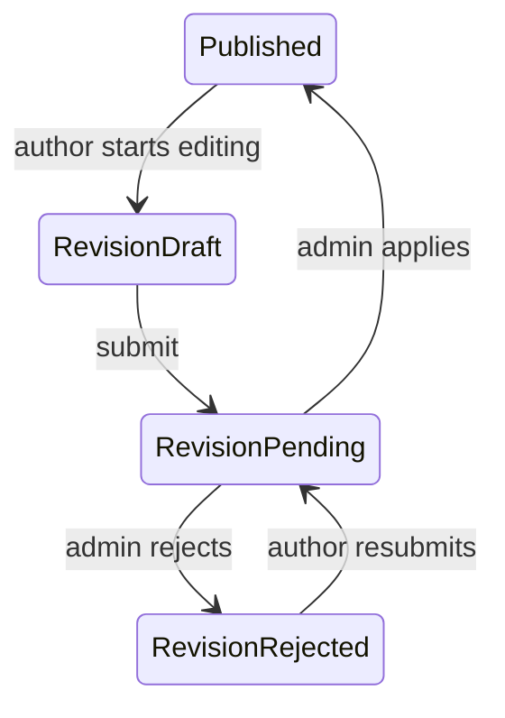

# Summary Revisions Implementation Plan

> **For agentic workers:** REQUIRED SUB-SKILL: Use superpowers:subagent-driven-development (recommended) or superpowers:executing-plans to implement this plan task-by-task. Steps use checkbox (`- [ ]`) syntax for tracking.

**Goal:** Allow authors to edit published book summaries through a moderated revision while the current published version remains public.

**Architecture:** Keep `book_summaries` as the sole public source and add one audited `book_summary_revisions` row per published summary. Author and admin revision APIs operate on the child row; admin approval copies revision fields into the published summary and deletes the revision in one audit transaction.

**Tech Stack:** Next.js 14 App Router, React 18, TypeScript, Drizzle ORM, Neon Postgres, Jest/Testing Library, Playwright.

---

## File Structure

**Create**

- `drizzle/0045_book_summary_revisions.sql` — table, indexes, FK, audit trigger.
- `drizzle/0045_book_summary_revisions.test.ts` — migration contract.
- `app/api/summaries/[id]/revision/route.ts` — create/get author revision.
- `app/api/summaries/[id]/revision/route.test.ts` — author route guards.
- `app/api/summary-revisions/[id]/route.ts` — author autosave.
- `app/api/summary-revisions/[id]/route.test.ts` — autosave validation mapping.
- `app/api/summary-revisions/[id]/submit/route.ts` — author submit.
- `app/api/summary-revisions/[id]/submit/route.test.ts` — submit route guards.
- `app/api/admin/summary-revisions/[id]/route.ts` — admin edit.
- `app/api/admin/summary-revisions/[id]/publish/route.ts` — apply revision.
- `app/api/admin/summary-revisions/[id]/publish/route.test.ts` — publish auth/validation.
- `app/api/admin/summary-revisions/[id]/reject/route.ts` — reject revision.
- `app/api/admin/summary-revisions/[id]/reject/route.test.ts` — reject auth/validation.

**Modify**

- `lib/db/schema.ts` — Drizzle revision table.
- `lib/audit/audited-tables.ts` — audit registry.
- `drizzle/0040_audit_triggers.test.ts` — include migration 0045.
- `lib/book-summaries.ts` — revision DTO and domain operations.
- `lib/book-summaries.test.ts` — revision state machine and atomic apply.
- `app/summaries/[id]/edit/page.tsx` — load active revision.
- `components/nd/SummaryEditor.tsx` — revision-aware editor and truthful statuses.
- `components/nd/SummaryEditor.test.tsx` — CTA, autosave, submit, read-only states.
- `components/nd/MatchingBookDetailModal.tsx` — separate read/edit actions.
- `components/nd/MatchingBookDetailModal.test.tsx` — published actions.
- `components/nd/AdminPanel.tsx` — render and moderate revision rows.
- `components/nd/AdminPanel.test.tsx` — revision label/actions.
- `e2e/book-summaries.spec.ts` — persisted revision happy path and rejection path.
- `public/openapi.json` — revision endpoints and schemas.
- `docs/features/book-summaries.md` — technical workflow.
- `docs/wiki/Book-Summaries.md` — owner-facing workflow.
- `docs/wiki/Data-and-Database.md` — revision relation.
- `docs/wiki/API-and-Swagger.md` — API list.

### Task 1: Revision Schema And Audit

**Files:**
- Create: `drizzle/0045_book_summary_revisions.sql`
- Create: `drizzle/0045_book_summary_revisions.test.ts`
- Modify: `lib/db/schema.ts`
- Modify: `lib/audit/audited-tables.ts`
- Modify: `drizzle/0040_audit_triggers.test.ts`

- [ ] **Step 1: Write failing migration tests**

Add tests asserting:

```ts
expect(sql).toContain('CREATE TABLE IF NOT EXISTS "book_summary_revisions"')
expect(sql).toContain('"summary_id" text NOT NULL')
expect(sql).toContain('CREATE UNIQUE INDEX IF NOT EXISTS "book_summary_revisions_summary_unique"')
expect(sql).toContain('CREATE TRIGGER audit_book_summary_revisions')
```

Add `book_summary_revisions` to `AUDITED_TABLES` first only in the test branch and append `0045_book_summary_revisions.sql` to the reconciliation migration list.

- [ ] **Step 2: Run tests and verify RED**

Run:

```bash
npm test -- drizzle/0045_book_summary_revisions.test.ts drizzle/0040_audit_triggers.test.ts --runInBand
```

Expected: FAIL because migration/schema/trigger are absent.

- [ ] **Step 3: Implement schema and migration**

Define:

```ts
export const bookSummaryRevisions = pgTable('book_summary_revisions', {
  id: text('id').primaryKey().$defaultFn(() => crypto.randomUUID()),
  summaryId: text('summary_id').notNull().references(() => bookSummaries.id, { onDelete: 'cascade' }),
  displayName: text('display_name').notNull(),
  title: text('title').notNull(),
  tldr: text('tldr').notNull(),
  bodyMarkdown: text('body_markdown').notNull(),
  status: text('status').notNull().default('draft'),
  rejectionReason: text('rejection_reason'),
  submittedAt: timestamp('submitted_at', { mode: 'date' }),
  createdAt: timestamp('created_at', { mode: 'date' }).notNull().defaultNow(),
  updatedAt: timestamp('updated_at', { mode: 'date' }).notNull().defaultNow(),
}, (t) => ({
  summaryUnique: uniqueIndex('book_summary_revisions_summary_unique').on(t.summaryId),
  statusIdx: index('book_summary_revisions_status_idx').on(t.status),
}))
```

The SQL migration mirrors the schema and adds:

```sql
CREATE TRIGGER audit_book_summary_revisions
AFTER INSERT OR UPDATE OR DELETE ON "book_summary_revisions"
FOR EACH ROW EXECUTE FUNCTION audit_capture();
```

- [ ] **Step 4: Run tests and verify GREEN**

Run the same focused Jest command. Expected: both suites PASS.

- [ ] **Step 5: Commit**

Before commit report:

- `E2E: не нужен — schema contract covered by migration/unit tests; user flow comes later.`
- `Wiki: нужна — DB relation changes; update is deferred to the final docs task in this same PR.`

Commit:

```bash
git add lib/db/schema.ts lib/audit/audited-tables.ts drizzle/0040_audit_triggers.test.ts drizzle/0045_book_summary_revisions.sql drizzle/0045_book_summary_revisions.test.ts
git commit -m "feat: добавить модель ревизий саммари"
```

### Task 2: Revision Domain Logic

**Files:**
- Modify: `lib/book-summaries.ts`
- Modify: `lib/book-summaries.test.ts`

- [ ] **Step 1: Write failing tests for creation and author rules**

Cover:

```ts
it('creates a draft revision copied from a published summary')
it('returns the existing active revision')
it('rejects revision creation for a non-published summary')
it('rejects revision creation and submit when the book is not read')
it('allows author save only for draft and rejected revisions')
it('submits a complete revision as pending')
```

Mock the Drizzle select/insert/update chain using the existing test harness in `lib/book-summaries.test.ts`. Assert copied fields and audit source `summary`.

- [ ] **Step 2: Run focused tests and verify RED**

```bash
npm test -- lib/book-summaries.test.ts --runInBand
```

Expected: FAIL because revision functions and types do not exist.

- [ ] **Step 3: Implement revision DTO and author operations**

Add:

```ts
export const SUMMARY_REVISION_STATUSES = ['draft', 'pending', 'rejected'] as const
export type SummaryRevisionStatus = (typeof SUMMARY_REVISION_STATUSES)[number]

export interface BookSummaryRevision {
  id: string
  summaryId: string
  displayName: string
  title: string
  tldr: string
  bodyMarkdown: string
  status: SummaryRevisionStatus
  rejectionReason: string | null
  submittedAt: Date | null
  createdAt: Date
  updatedAt: Date
}
```

Implement:

```ts
getActiveSummaryRevision(summaryId)
openOrCreateSummaryRevision({ summaryId, userId, actorLabel })
saveAuthorSummaryRevision({ id, userId, actorLabel, patch })
submitAuthorSummaryRevision({ id, userId, actorLabel })
```

Reuse `normalizeSummaryPatch`, `ensureCompleteForSubmit`, author checks, and `hasReadSignup`. Creation copies the published summary fields.

- [ ] **Step 4: Write failing tests for admin apply/reject**

Cover:

```ts
it('lists revisions with summary, book, and author metadata')
it('admin edits revision without changing public summary')
it('admin rejects revision and preserves published summary')
it('admin applies revision by updating summary and deleting revision in one audit transaction')
it('preserves original publishedAt when applying a revision')
```

- [ ] **Step 5: Implement admin operations**

Add:

```ts
listAdminSummaryRevisions()
adminUpdateSummaryRevision(...)
adminRejectSummaryRevision(...)
adminPublishSummaryRevision(...)
```

`adminPublishSummaryRevision` reads the revision joined to its summary, validates completeness, then calls one `withAuditContext` callback:

```ts
await tx.update(bookSummaries).set({
  displayName: revision.displayName,
  title: revision.title,
  tldr: revision.tldr,
  bodyMarkdown: revision.bodyMarkdown,
  updatedAt: now,
}).where(eq(bookSummaries.id, revision.summaryId))

await tx.delete(bookSummaryRevisions)
  .where(eq(bookSummaryRevisions.id, revision.id))
```

Do not update `publishedAt`.

- [ ] **Step 6: Run tests and verify GREEN**

Run focused suite. Expected: PASS with all existing summary tests.

- [ ] **Step 7: Commit**

Before commit report:

- `E2E: нужен — domain behavior will be covered end-to-end after API/UI integration.`
- `Wiki: нужна — moderation lifecycle changes; update is deferred to final docs task.`

Run `npm run lint && npm run typecheck && npm test -- lib/book-summaries.test.ts --runInBand`, then commit:

```bash
git add lib/book-summaries.ts lib/book-summaries.test.ts
git commit -m "feat: реализовать жизненный цикл ревизий саммари"
```

### Task 3: Author And Admin APIs

**Files:**
- Create all revision route and route test files listed in File Structure.
- Modify: `app/api/admin/summaries/route.ts`

- [ ] **Step 1: Write failing author route tests**

For each route assert:

```ts
expect(unauthenticated.status).toBe(401)
expect(validationFailure.status).toBe(400)
expect(domainFunction).toHaveBeenCalledWith(expect.objectContaining({
  userId: 'u1',
  actorLabel: 'Алина',
}))
```

- [ ] **Step 2: Run author route tests and verify RED**

```bash
npm test -- app/api/summaries/[id]/revision/route.test.ts app/api/summary-revisions/[id]/route.test.ts app/api/summary-revisions/[id]/submit/route.test.ts --runInBand
```

Expected: FAIL because routes do not exist.

- [ ] **Step 3: Implement author routes**

Follow existing summary route patterns:

```ts
const session = await auth()
if (!session?.user?.id) return NextResponse.json({ error: 'Unauthorized' }, { status: 401 })
```

Map `SummaryValidationError` to 400. POST create returns `{ revision }`; PATCH and submit return `{ revision }`.

- [ ] **Step 4: Write failing admin route tests**

Assert 403 for non-admin, 400 for domain validation, and correct calls for admin actors.

- [ ] **Step 5: Implement admin routes and combined list**

`GET /api/admin/summaries` loads originals and revisions in parallel and returns:

```ts
{
  summaries: [
    ...summaries.map(item => ({ ...item, kind: 'summary', summaryId: item.id })),
    ...revisions.map(item => ({ ...item, kind: 'revision' })),
  ]
}
```

Preserve existing response compatibility for original rows.

- [ ] **Step 6: Run route tests and verify GREEN**

Run all summary API suites. Expected: PASS.

- [ ] **Step 7: Commit**

Before commit report:

- `E2E: нужен — new persistent API flow is not complete until UI test.`
- `Wiki: нужна — endpoints change; update is deferred to final docs task.`

Run lint/typecheck/focused tests, then commit:

```bash
git add app/api/summaries app/api/summary-revisions app/api/admin/summaries app/api/admin/summary-revisions
git commit -m "feat: добавить API ревизий саммари"
```

### Task 4: Revision-Aware Author Editor

**Files:**
- Modify: `app/summaries/[id]/edit/page.tsx`
- Modify: `components/nd/SummaryEditor.tsx`
- Modify: `components/nd/SummaryEditor.test.tsx`

- [ ] **Step 1: Write failing component tests**

Add tests:

```ts
it('labels pending and published summaries truthfully')
it('creates a revision from published state')
it('autosaves a revision through the revision endpoint')
it('submits a revision through the revision endpoint')
it('keeps pending revision fields disabled')
it('shows revision rejection reason')
```

For CTA creation, mock:

```ts
global.fetch = jest.fn().mockResolvedValue({
  ok: true,
  json: async () => ({ revision: { ...revision, status: 'draft' } }),
})
```

- [ ] **Step 2: Run component tests and verify RED**

```bash
npm test -- components/nd/SummaryEditor.test.tsx --runInBand
```

Expected: new tests FAIL on missing revision behavior and wrong status label.

- [ ] **Step 3: Extend page data**

Load:

```ts
const revision = summary.status === 'published'
  ? await getActiveSummaryRevision(summary.id)
  : null
```

Pass it as `initialRevision` without changing the URL contract.

- [ ] **Step 4: Implement editor state machine**

Add local `revision` state and derive:

```ts
const editingRevision = revision !== null
const effectiveStatus = editingRevision ? revision.status : initialSummary.status
const canEdit = editingRevision
  ? revision.status === 'draft' || revision.status === 'rejected'
  : initialSummary.status === 'draft' || initialSummary.status === 'rejected'
```

Use:

```ts
const saveUrl = editingRevision
  ? `/api/summary-revisions/${revision.id}`
  : `/api/summaries/${initialSummary.id}`
```

The `Редактировать` CTA posts to `/api/summaries/${initialSummary.id}/revision`, installs returned fields into state, and enables editing.

Map status labels explicitly:

```ts
draft: 'Черновик'
pending: 'На проверке'
published: 'Опубликовано'
revisionDraft: 'Правки: черновик'
revisionPending: 'Правки на проверке'
revisionRejected: 'Правки отклонены'
```

- [ ] **Step 5: Run tests and verify GREEN**

Run component and author API tests. Expected: PASS.

- [ ] **Step 6: Commit**

Before commit report:

- `E2E: нужен — editor changes persistent state and must survive reload.`
- `Wiki: нужна — author workflow changes; update is deferred to final docs task.`

Run lint/typecheck/component tests, then commit.

### Task 5: Entry Points And Admin Moderation UI

**Files:**
- Modify: `components/nd/MatchingBookDetailModal.tsx`
- Modify: `components/nd/MatchingBookDetailModal.test.tsx`
- Modify: `components/nd/AdminPanel.tsx`
- Modify: `components/nd/AdminPanel.test.tsx`

- [ ] **Step 1: Write failing modal and admin tests**

Modal:

```ts
expect(screen.getByRole('link', { name: 'Читать саммари' })).toHaveAttribute('href', '/books/b1/summaries')
expect(screen.getByRole('link', { name: 'Редактировать' })).toHaveAttribute('href', '/summaries/s1/edit')
```

Admin:

```ts
expect(await screen.findByText('Правки к опубликованному')).toBeInTheDocument()
fireEvent.click(screen.getByRole('button', { name: 'Опубликовать правки' }))
expect(global.fetch).toHaveBeenCalledWith('/api/admin/summary-revisions/r1/publish', { method: 'POST' })
```

- [ ] **Step 2: Run tests and verify RED**

Run both component suites. Expected: FAIL on missing actions/labels.

- [ ] **Step 3: Implement modal actions**

For published summary, render public link plus secondary edit link using existing token styles and no new layout behavior.

- [ ] **Step 4: Implement admin item union**

Extend `AdminSummary`:

```ts
kind: 'summary' | 'revision'
summaryId: string
publishedVersion?: {
  displayName: string
  title: string
  tldr: string
  bodyMarkdown: string
}
```

Select API paths by `kind`. Revision rows use labels `Правки: ...`, action text `Опубликовать правки` / `Отклонить правки`, and show the published reference above editable fields.

- [ ] **Step 5: Run tests and verify GREEN**

Run both suites. Expected: PASS.

- [ ] **Step 6: Commit**

Before commit report:

- `E2E: нужен — new author/admin navigation and moderation flow.`
- `Wiki: нужна — admin workflow changes; update is deferred to final docs task.`

Run `npm run lint && npm run typecheck && npm test -- components/nd/MatchingBookDetailModal.test.tsx components/nd/AdminPanel.test.tsx --runInBand`, then commit.

### Task 6: OpenAPI And Documentation

**Files:**
- Modify: `public/openapi.json`
- Modify: `docs/features/book-summaries.md`
- Modify: `docs/wiki/Book-Summaries.md`
- Modify: `docs/wiki/Data-and-Database.md`
- Modify: `docs/wiki/API-and-Swagger.md`

- [ ] **Step 1: Update OpenAPI**

Add `BookSummaryRevision` schema and all six author/admin paths. Document 400/401/403 responses and the invariant that public summary content stays unchanged until admin publish.

- [ ] **Step 2: Update technical and owner docs**

Replace the old limitation “published summaries cannot be edited by authors” with the revision lifecycle. Add a Mermaid diagram:



- [ ] **Step 3: Validate JSON and docs**

```bash
node -e "JSON.parse(require('fs').readFileSync('public/openapi.json', 'utf8')); console.log('openapi ok')"
git diff --check
```

Expected: `openapi ok`, no whitespace errors.

- [ ] **Step 4: Commit**

Before commit report:

- `E2E: нужен — documentation does not replace flow verification; test is next.`
- `Wiki: нужна и обновлена — user/admin workflow, DB relation, and API changed.`

Commit docs and OpenAPI.

### Task 7: End-To-End Revision Flow

**Files:**
- Modify: `e2e/book-summaries.spec.ts`
- Modify test fixtures only if cleanup cannot rely on existing book cascade.

- [ ] **Step 1: Extend happy-path E2E**

After initial publication:

```ts
await page.goto(`/summaries/${draft.summary.id}/edit`)
await page.getByRole('button', { name: 'Редактировать' }).click()
await page.getByLabel('Заголовок саммари').fill('Обновлённый заголовок')
await expect(page.getByRole('status')).toHaveText('Сохранено')
await page.reload()
await expect(page.getByLabel('Заголовок саммари')).toHaveValue('Обновлённый заголовок')
await page.getByRole('button', { name: 'Отправить на проверку' }).click()
```

Before admin approval, open the public page and assert the old title remains. After admin approval, reload and assert the new title appears.

- [ ] **Step 2: Add rejection path**

Create revision, submit, reject as admin with `Нужно уточнить вывод`, return as author, assert reason visible, edit/resubmit, and confirm old public title remains until approval.

- [ ] **Step 3: Run E2E**

```bash
npm run test:e2e e2e/book-summaries.spec.ts
```

Expected: PASS. If `.env.test.local` is unavailable, record the exact environment blocker and rely on CI/manual nightly only after all local non-E2E checks pass.

- [ ] **Step 4: Commit**

Before commit report:

- `E2E: нужен и добавлен — persistent author/admin/public flow with reload is covered.`
- `Wiki: нужна и уже обновлена в предыдущем commit.`

Commit E2E changes.

### Task 8: Full Verification, PR, Merge, And Production Check

**Files:** all changed files.

- [ ] **Step 1: Run full local verification**

```bash
npm run lint
npm run typecheck
npm test -- --runInBand
npm run build
git diff --check origin/main...HEAD
```

Expected: all commands exit 0.

- [ ] **Step 2: Review migration rollout**

Confirm production migration mechanism/credentials. Apply `drizzle/0045_book_summary_revisions.sql` before enabling the production CTA when credentials are available. Never expose credentials in shell history or commit them.

- [ ] **Step 3: Push and create PR**

```bash
git push -u origin codex/summary-revisions
gh pr create --fill
gh pr merge --auto --squash --delete-branch
gh pr view <number> --json mergeStateStatus,mergeable
```

If `BEHIND`, run `gh pr update-branch <number>`. If CI fails, fix in the same branch.

- [ ] **Step 4: Wait without blocking the user**

Poll CI and PR state in a background PTY/session until merged. Do not finish while the PR is open unless the user explicitly asks to stop.

- [ ] **Step 5: Verify production**

After merge and Vercel deployment:

- public summaries page returns 200;
- editor page renders truthful published state;
- revision create endpoint no longer fails because the migration exists;
- existing catalog and summary count remain healthy.

- [ ] **Step 6: Close issue**

Comment on #409 with PR and squash commit, remove `status:in-progress`, and close the issue if merge did not auto-close it.

## Plan Self-Review

- Spec coverage: schema, audit, author flow, admin flow, public isolation, API, OpenAPI, Wiki, E2E, migration rollout, PR/production verification are each mapped to a task.
- Placeholder scan: no TBD/TODO or unspecified “handle errors” steps remain.
- Type consistency: `BookSummaryRevision`, `kind`, `summaryId`, and revision endpoint paths are consistent across domain, API, editor, admin, docs, and tests.
