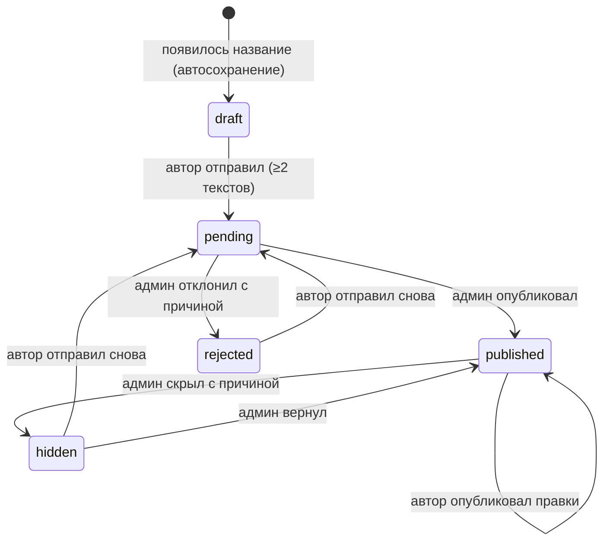

# Подборки книг

**Дата:** 2026-09-12 (обновлена 2026-09-13: решения по дизайн-пакету)
**Статус:** функциональный дизайн и макеты согласованы с владельцем (пакет `design_handoff_collections`, карточка — вариант B); ждёт макета ссылки «Подборки» в шапке; план реализации не написан

Спека самодостаточна: всё нужное из дизайн-пакета перенесено сюда и переведено на реальные токены сайта. **Где спека расходится с пакетом — права спека.** Расхождения перечислены в разделе «Отличия от дизайн-пакета».

## Потребность

Участники хотят прочитать несколько книг по одной теме примерно тем же составом. «Тот же состав» — понятие гибкое: один из пяти может отвалиться, и люди сами между собой решают, что круг тот же. Набор книг тоже меняется по ходу: во время чтения первой книги группа может передумать, что читать дальше.

Подборка — это видимый план «что мы собираемся читать по этой теме», которым делятся ссылкой в чате и обсуждают на созвонах. Она ни к чему не обязывает.

## Ключевые решения

| Решение | Почему |
|---|---|
| Связь «группа людей ↔ подборка» на сайте не хранится | Люди договариваются в чате и на созвонах; сайту достаточно дать ссылку, которую можно обсудить. |
| Матчинг не меняется: выбирают по-прежнему **книгу**, а не подборку | Читают всегда одну конкретную книгу; группы могут разойтись по другим кругам. |
| У подборки один автор и редактор; админ тоже может править и удалять | Простая модель ответственности. |
| Создание — **предмодерация**, правки — **постмодерация** | Спам не попадает на сайт, но группа, решившая сменить следующую книгу, не ждёт админа. |
| При плохой правке админ **скрывает подборку с причиной**, отката версий нет | Не нужна история версий; автор исправляет и отправляет заново. |
| Админ видит, что изменилось с последней проверки | При проверке сохраняется снимок подборки; экран проверки сравнивает с ним текущее состояние. |
| **Перестановка книг не отправляет подборку на проверку и не поднимает её в списках** | В живой подборке порядок меняют постоянно; если каждая перестановка попадает в очередь, очередь перестанут читать. Перестановку модератор видит в разнице, когда проверяет другую правку. |
| Неопубликованная подборка сохраняется автоматически; правки опубликованной уходят на сайт кнопкой «Опубликовать правки» | Черновик не теряется; читатели не видят недописанный текст. |
| Адрес подборки не меняется после первой публикации | Ссылки, разосланные в чаты, не ломаются при смене названия. |
| Опубликованную подборку удаляет только владелец; автор удаляет только неопубликованные | Удаление ломает ссылки в чатах. |
| Блок подборок на главной владелец включает и выключает в админке; по умолчанию выключен | Владелец сам решает, когда подборок достаточно, чтобы выделять их на главной. |
| Ссылка «Подборки» в шапке сайта есть всегда | Раздел должен быть доступен, даже когда блок на главной выключен. |
| В подборку можно добавить только книги, опубликованные в каталоге | Всё содержимое подборки уже прошло модерацию админа; новую книгу сначала предлагают обычным путём. |
| Статусы клуба («Сейчас читаем», «Прочитано») в подборке не показываются | В подборке все тексты равноправны — это план, а не история клуба. |
| У ссылки на подборку есть своя картинка превью из обложек | Подборками делятся в Telegram; превью с обложками сразу показывает, о чём речь. |

## Не входит в первую версию

- Подписка на подборку, «Слежу», уведомления об изменениях.
- Пометка «входит в подборку» на карточках книг в каталоге и в матчинге, фильтр каталога по подборке.
- Фильтры и темы на странице «Все подборки».
- Уведомления админу о новой подборке и автору о решении (как у саммари).
- Заметки к отдельным книгам внутри подборки.
- Откат к прошлой версии.
- Добавление в подборку книг, которые ещё не опубликованы в каталоге (в том числе заявок на проверке).
- Счётчики на существующих вкладках профиля («Мои книги», «Предложил:а»).

## Роли и сценарии

### Автор (любой вошедший пользователь)

1. Нажимает «Собрать свою» / «Собрать подборку». Входы: страница `/collections` (ссылка «Подборки» в шапке), блок на главной, если он включён, вкладка «Подборки» в профиле. Гость, нажавший эту кнопку, видит окно входа; после входа открывается редактор.
2. Заполняет **название**, **описание** (Markdown) и **подпись** — имя, которым будет подписан. Подпись **не предзаполняется**.
3. Добавляет тексты **поиском по названию и автору** — только книги и статьи, опубликованные в каталоге, включая те, что клуб уже читал или читает. В редакторе у таких книг скромная приписка «клуб уже читал» / «клуб читает сейчас» — её видит только автор. Если книга не нашлась — подсказка предложить её в каталоге и дождаться публикации.
4. Меняет порядок **стрелками ▲▼**, убирает тексты.
5. **Неопубликованная подборка сохраняется автоматически.** Черновик создаётся, как только появилось название.
6. Нажимает «Отправить на проверку» — доступно при непустых названии, описании и подписи и минимум двух текстах, опубликованных в каталоге (скрытые админом не считаются).
7. **Правит опубликованную подборку** когда угодно: правки копятся в редакторе и уходят на сайт кнопкой «Опубликовать правки» — без проверки. Уйти со страницы с неопубликованными правками — предупреждение.
8. Во вкладке «Подборки» в профиле видит свои подборки со статусами и причиной отказа или скрытия; оттуда открывает, правит, отправляет.
9. Удаляет свою подборку, пока она не опубликована: черновик, на проверке, отклонённую, скрытую. Опубликованную — только через владельца.

### Читатель (включая гостя)

- Открывает ссылку `/collections/<адрес>`. На странице: название, описание, подпись автора, дата изменения, тексты в порядке автора.
- У каждого текста — карточка книги из каталога с обычной кнопкой: «Хочу читать» или «✓ В вашем списке» (повторное нажатие убирает книгу из списка, как в каталоге). Личные отметки «Читаю» / «Прочитал:а» показываются как в каталоге.
- **Гость** нажимает «Хочу читать» → окно входа «Чтобы записаться на книгу, войдите» → после входа возвращается на ту же подборку, и книга **сразу попадает в его список**. Если у пользователя нет контактов — сначала `ContactsForm`, как на главной. Запись **добавляет одну книгу** и не трогает остальные.
- **Статусы клуба в подборке не учитываются.** Книга со статусом «Сейчас читаем» или «Прочитано» (`books.reading_status`) выглядит и ведёт себя как обычная: без меток, без бледной обложки, серого фона и акцентной рамки, с обычной меткой «Новинка» и блоком «почему стоит прочитать». Прочитанные книги в подборке видны всегда (в каталоге они по умолчанию скрыты).
- Клик по обложке открывает существующее окно подробностей книги.
- «Скопировать ссылку». В превью ссылки в Telegram — картинка из обложек, название и начало описания.
- `/collections` — все опубликованные подборки, свежие первыми. Сюда ведёт ссылка «Подборки» в шапке — всем, на любой странице, независимо от блока на главной.
- Если владелец включил блок, он показывается на главной. Если выключил — блока нет совсем, для всех, включая админа.

### Админ (вкладка «Подборки» в `/admin`)

- Вверху — переключатель «Блок подборок на главной: включён / выключен». Применяется сразу, без деплоя; по умолчанию выключен; на ссылку в шапке и страницы подборок не влияет.
- Очередь слева, разбор справа (см. «Дизайн → Модерация»):
  - **Ждут проверки** — новая подборка целиком; при необходимости правит название, описание, подпись, состав и порядок; «Опубликовать» или «Отклонить с причиной».
  - **Изменились после проверки** — только разница с последней проверкой; «Правка проверена» или «Скрыть с причиной».
  - **Опубликованные** — открыть, править, удалить.
  - **Отклонённые и скрытые** — открыть, править, удалить; у скрытой — «Вернуть в публикацию».
- Причина отказа и скрытия обязательна.

## Статусы и правила

| Статус | Кто видит страницу | В списках `/collections` и на главной |
|---|---|---|
| `draft` | автор, админ | нет |
| `pending` | автор, админ | нет |
| `published` | все | да, если есть хотя бы одна публично видимая книга |
| `rejected` | автор, админ (с причиной) | нет |
| `hidden` | автор, админ (с причиной) | нет |

Правила:

1. **Правка автором неопубликованной подборки** сохраняется автоматически и не меняет статус: черновик остаётся черновиком, подборка на проверке — на проверке (админ видит текущее состояние), отклонённая и скрытая — в своём статусе до «Отправить на проверку».
2. **Правка автором опубликованной подборки** применяется кнопкой «Опубликовать правки». Если изменились название, описание, подпись или **состав** (добавлены или убраны тексты) — подборка попадает в «Изменились после проверки» и поднимается в списках. Если изменился **только порядок** — подборка не попадает в очередь и не поднимается.
3. **Правка админом** не отправляет подборку в очередь. Правка админом опубликованной подборки считается проверкой: обновляются время проверки и снимок.
4. **Публикация** очищает причину модерации, обновляет время публикации, время проверки и снимок. При первой публикации присваивается адрес.
5. **«Правка проверена»** обновляет время проверки и снимок, статус не меняет.
6. **Адрес** строится из названия при первой публикации (транслитерация, при занятости — суффикс `-2`, `-3`…). Дальше не меняется ни при смене названия, ни при скрытии и повторной публикации. Адрес `new` зарезервирован.
7. **Доступ до публикации.** Автор и админ открывают неопубликованную подборку по `/collections/<id>`; если адрес уже есть, `/collections/<id>` перенаправляет на `/collections/<адрес>`. Всем остальным неопубликованная подборка отвечает «Подборка не найдена».
8. **Порядок «свежие первыми»** — по последнему из двух моментов: публикация или правка автором текста или состава.
9. **Удаление** окончательно удаляет подборку и её состав; книги и записи на книги не затрагиваются; запись остаётся в журнале аудита. Автор удаляет только `draft`, `pending`, `rejected`, `hidden`; админ — любую.

### Состав подборки: что кому видно

| Элемент | Автор и админ | Публика |
|---|---|---|
| Опубликованная книга или статья | да | да |
| Книга со статусом клуба «Сейчас читаем» или «Прочитано» | да; в редакторе — приписка «клуб читает сейчас» / «клуб уже читал» | да, как обычная книга, без меток статуса |
| Книга, скрытая из каталога после добавления | да, с пометкой «скрыта из каталога» | нет |

Ограничения: один текст не может стоять в подборке дважды; максимум 50 текстов; название до 120 символов; подпись до 60; описание до 5000. Для черновика обязательно только название.

## Дизайн

Пакет: `design_handoff_collections` (прототип HTML/JSX — референс, не код). Реализация — существующими компонентами и паттернами `components/nd/*`, inline-стили с `var(--…)`.

### Токены: пакет → сайт

Прототип собран на токенах другого концепта (белый фон, Source Serif Pro, JetBrains Mono). Реализуем **на реальных токенах `app/globals.css`**; экраны будут теплее прототипа — это ожидаемо.

| В пакете | На сайте |
|---|---|
| `--bg` `#FFFFFF` | `--bg` (пергамент) |
| `--bg-tint` `#FDF6F3` | `--bg-tint` |
| `--bg-elevated` `#FAFAFA` | `--bg-elevated` |
| `--strong` `#111` | `--border-strong` |
| `--serif` Source Serif Pro | `--nd-serif` |
| `--mono` JetBrains Mono | `--nd-mono` |
| `--sans` | `--nd-sans` |
| красный «отклонена» / «убрана» / «Удалить» `#A03A2E` | `--accent` |
| фон вставки в разнице `#E6F0E9` | `--bg-tag-green` |
| фон удаления в разнице `#F5E6E3` | `--accent-soft` |
| граница корешка `rgba(0,0,0,.08)` | `--border` |

Остальные токены (`--text*`, `--accent`, `--success`, `--border`, `--border-subtle`, `--bg-input`) совпадают по имени. Размеры шрифтов и отступы — из пакета, перечислены ниже. Углы прямые, теней нет. Кнопки, инпуты, метки — примитивы со `/styleguide`; «dark» = заполненная кнопка `var(--text)`, «ghost» = кнопка с рамкой `--border`. Аватар-инициалы — существующий `AuthorAvatar`.

Везде вместо «книги» в счётчиках — «тексты» (книги и статьи): «1 текст / 2 текста / 5 текстов».

### Главная — блок подборок

- **Место:** в `BooksPage` между `AboutBlock` и панелью фильтров каталога. Выше остаётся полоса матчинга.
- **Показ:** только если включён переключатель. Если включён, а подборок нет — пустое состояние.
- **Полоса:** во всю ширину контента, `padding: 26px` (моб. `20px 14px`), фон `--bg-tint`, линии сверху и снизу `1px solid var(--border-strong)`.
- **Шапка блока:** flex, `align-items: flex-end`, `space-between`, `gap: 16px`, `margin-bottom: 18px`; на мобильном колонка, `gap: 10px`.
  - Заголовок «Подборки» — `--nd-serif` 700, 24px / 1.15 / −0.01em (моб. 20px).
  - Подзаголовок «Книги, объединённые одной темой» — 12px, `--text-secondary`, `max-width: 460px`, `line-height: 1.5`.
  - Кнопки справа, `gap: 8px`: «Все подборки» (ghost), «Собрать свою» (dark; гостю — окно входа).
- **Карусель:** горизонтальная лента, `gap: 14px`, `scroll-snap-type: x proximity`, скроллбар скрыт, свайп.
  - Ширина карточки `calc((100% - 60px) / 3.35)` — три карточки и край четвёртой; на мобильном `82%`.
  - Края затухают CSS-маской: слева 22px, справа 78px; у крайнего положения соответствующая сторона маски снимается.
  - Стрелки `←` / `→`: 36×36 (моб. 30×30), поверх ленты по центру высоты, `left/right: 10px` (моб. 6px), без рамки и фона, 17px `--text-secondary`, hover `--text`; скрыта у своего края; клик — прокрутка на одну карточку (`scrollBy` ширина карточки + 14, smooth).
- **Карточка подборки (вариант B, «стопка корешков»):** без рамки, фона и отступов.
  1. Стопка до 5 обложек по 56px, 2:3, область высотой 104px, выравнивание по низу; каждая следующая наезжает на предыдущую на 18px; правая граница обложки `1px solid var(--border)`. Нет обложки — инициалы автора (`CoverImage`).
  2. Счётчик «5 текстов» — `--nd-mono` 11px, `--accent`.
  3. Название — `--nd-serif` 700, 21px / 1.16 / −0.01em; при наведении на карточку подчёркивание `1px solid var(--border-strong)`.
  4. Тело: `padding-top: 13px`, `gap: 8px`.
  - Автора и дату в блоке не показываем.
- **Пустое состояние:** рамка `1px dashed var(--border)`, `padding: 30px 22px`, текст по центру 13px `--text-secondary`, `max-width: 420px`: «Пока ни одной подборки. Если вы дочитали книгу с кругом и знаете, что читать дальше, — соберите первую: название, пара абзацев и две-три книги из каталога.» + кнопка «Собрать первую подборку» (dark).

### Все подборки — `/collections`

- Ссылка «← На главную» 11px.
- Метка «Подборки» (`--accent`), заголовок «Все подборки» (как заголовок блока), подзаголовок «Собраны участниками клуба. Первыми — те, что недавно создали или изменили.», кнопка «Собрать свою» (dark).
- Ниже линия `1px solid var(--border)`, справа счётчик «4 подборки» 11px `--text-muted`.
- Сетка `repeat(auto-fill, minmax(300px, 1fr))`, `gap: 14px`; мобильный — одна колонка. Карточки — те же, вариант B.
- Сортировка только «свежие первыми», фильтров нет.
- Пусто: «Подборок пока нет. Первую может собрать любой вошедший: название, пара абзацев о том, зачем это читать, и хотя бы две книги.» + «Собрать первую».

### Страница подборки — `/collections/<адрес>`

- Колонка `max-width: 760px` по центру, `padding: 0 26px` (моб. `0 14px`).
- **Плашка статуса** (только автору и админу, если подборка не опубликована): рамка `1px solid var(--border)`, левая граница `2px solid var(--accent)`, фон `--bg-tint`, метка статуса («ЧЕРНОВИК», «НА ПРОВЕРКЕ», «ОТКЛОНЕНА», «СКРЫТА») и текст «Подборка не опубликована. Её видите вы как автор и модератор — по ссылке другим она недоступна.»; у отклонённой и скрытой — ещё причина.
- **Хиро:** `padding: 34px 0 20px`, снизу `1px solid var(--border-strong)`.
  - Метки «Подборка» (`--accent`) и «5 текстов», 9.6px, uppercase, `letter-spacing: 0.15em`, `gap: 10px`, `margin-bottom: 14px`.
  - Заголовок — `--nd-serif` 700, 34px / 1.1 / −0.02em, `text-wrap: pretty` (моб. 25px).
  - Описание — `--nd-serif` 16px / 1.65, `--text-body`, `margin-top: 16px`; абзацы `margin-bottom: 11px`; списки с тире цвета `--accent`, `padding-left: 18px`; ссылки `--accent` с подчёркиванием `1px solid currentColor`; курсив.
  - Байлайн, `margin-top: 22px`, `space-between`, перенос: аватар-инициалы 28px + «Собрал:а **Подпись**» 13px + «изменена 3 дня назад · 10 сентября» 11px `--text-muted`. Справа — «Скопировать ссылку» (ghost, всем; после клика «Ссылка скопирована» на ~2 с) и «Править» (ghost, автору и админу).
- **Список текстов:** сетка `repeat(auto-fill, minmax(206px, 1fr))`, `gap: 20px`, `padding-top: 22px`; мобильный — одна колонка, `gap: 16px`.
  - Над каждой карточкой строка порядка: линия `1px solid var(--border-strong)`, под ней `--nd-mono` 11px `--text-muted` «№ 01», `padding: 6px 0 9px`. Это нумерация, а не шаги: никакого прогресса.
  - Карточка — **существующая карточка книги каталога** (`BookCard` / `BookCardMobile` по тем же правилам, что на главной) с тремя отличиями: не показывает статус клуба; кнопка записи работает аддитивно; при гостевом нажатии запускает вход с возвратом.
- **Окно входа для гостя:** существующий `AuthModal`; заголовок «Чтобы записаться на книгу, войдите», текст «После входа вернём вас на эту же подборку, и книга сразу попадёт в ваш список.» (если `AuthModal` не принимает свой текст — добавить такую возможность).

### Редактор — `/collections/new`, `/collections/<id>/edit`

- Колонка `max-width: 880px`, `padding: 24px 26px 60px` (моб. `16px 14px 40px`).
- **Верхняя полоса** (снизу `1px solid var(--border)`, `padding-bottom: 16px`, `margin-bottom: 22px`):
  - слева метка «Новая подборка» / «Правка подборки» (`--accent`) и строка состояния;
  - неопубликованная: «Черновик · сохраняется автоматически» (или статус) + индикатор «Сохранено»; кнопки «Посмотреть» (ghost) и «Отправить на проверку» (dark; неактивна `opacity: .35`, пока не выполнены условия);
  - опубликованная: «Опубликована — правки уходят на сайт без проверки»; кнопки «Посмотреть», «Отменить правки» (ghost), «Опубликовать правки» (dark; неактивна, пока нет изменений).
- **Поля** (`margin-bottom: 20px`; метка поля 10px uppercase `letter-spacing: 0.1em`, подсказка 11px `--text-muted`):
  1. **Название** — инпут без рамки, только нижняя линия `--border` (в фокусе `--border-strong`), `--nd-serif` 700 26px (моб. 21px); в метке счётчик «12 / 120».
  2. **Описание** — `MarkdownToolbar` (жирный, курсив, список, нумерованный список, ссылка) и поле `--nd-serif` 15px / 1.6, рамка `--border`, низ `2px solid var(--border-strong)`, `min-height: 110px`. Подсказка: «Зачем вы это собрали и как это читать. Можно списками, выделением и ссылками. Начало описания попадёт в превью ссылки в Telegram.»
  3. **Подпись** — обычный инпут, `max-width: 320px`, пустой. Подсказка: «Как вас подписать на странице подборки».
  4. **Тексты** — метка «Тексты · 2», справа подсказка «нужно минимум два», пока их меньше двух.
     - Поиск с выпадающим списком (рамка `--border-strong`, фон `--bg-input`, до 6 результатов): обложка 24px + название 13px + «автор, год · статья» 11px `--text-muted`. Клик добавляет текст в конец. Уже добавленные в результатах не показываются.
     - Ничего не найдено: «В каталоге такой книги нет. В подборку можно добавить только книги из каталога — сначала предложите её в каталоге и дождитесь, пока её опубликуют.»
     - Пустой состав: пустое состояние «Пока пусто. Найдите книги, которые уже выбрали в каталоге.»
     - Строка текста: сетка `26px 44px 1fr auto`, `gap: 12px`, снизу `1px solid var(--border)`, `padding: 11px 0`: стрелки ▲▼ (22×18, рамка `--border`, неактивны на краях) → обложка 44px → название `--nd-serif` 700 15px и под ним «автор, год» 11px `--text-muted` с припиской «· клуб уже читал» / «· клуб читает сейчас» / «· скрыта из каталога» (последняя — `--accent`) → ссылка «Убрать».
- **Низ:** «Удалить подборку» 11px `--accent`, с подтверждением; только у неопубликованной.

### Профиль — вкладка «Подборки»

- Существующий `ProfileDrawer`. Вкладки: «Мои книги» · «Предложил:а» · **«Подборки»** · «Профиль»; ряд вкладок прокручивается по горизонтали, если не помещается. Счётчиков на вкладках нет.
- Сверху пояснение 12px `--text-secondary` «Опубликованные подборки правятся без проверки» и кнопка «Собрать подборку» во всю ширину (dark).
- Пусто: «Вы ещё не собирали подборок. Если дочитали книгу с кругом и знаете, что читать дальше, — соберите набросок.» + «Собрать подборку».
- **Строка подборки** — одна колонка, `border-top: 1px solid var(--border)` (у первой `--border-strong`), `padding: 14px 0`:
  1. Статус + дата в одну строку: метка 9.6px uppercase с подчёркиванием `1px solid currentColor` — «ЧЕРНОВИК» `--text-muted`, «НА ПРОВЕРКЕ» `--text`, «ОПУБЛИКОВАНА» `--success`, «ОТКЛОНЕНА» `--accent`, «СКРЫТА» `--text-secondary`; рядом 10.4px `--text-muted` «изменена сегодня» / «отправлена 11 сентября».
  2. Название `--nd-serif` 700 15px / 1.24.
  3. Счётчик текстов 10.4px.
  4. Полоска обложек по 20px, `gap: 3px`, до восьми.
  5. Причина (если есть): левая граница `2px solid var(--accent)`, `padding-left: 10px`, 11.5px / 1.5, с префиксом «Почему не опубликовали:» / «Почему скрыли:».
  6. Кнопки с переносом, `gap: 7px`: «Править»; «Открыть» (у опубликованной); «Отправить» (у черновика); «Отправить снова» (у отклонённой и скрытой).

### Модерация — вкладка «Подборки» в админке

- Таб «Подборки» в `AdminPanel` со счётчиком: ждут проверки + изменились после проверки.
- Над раскладкой — переключатель блока на главной.
- Раскладка `grid-template-columns: 330px 1fr`; мобильный — одна колонка.
- **Очередь слева.** Заголовки секций на фоне `--bg-elevated`, `padding: 11px 16px`, со счётчиками: «Ждут проверки» (счётчик `--accent`), «Изменились после проверки», «Опубликованные», «Отклонённые и скрытые».
  - Элемент: название `--nd-serif` 700 15px; под ним 11px `--text-muted` «Подпись · 11 сентября, 14:02 · 4 текста». У изменённых вместо числа текстов — сводка цветом `--accent`: «+1 · −1 · текст» (и «· порядок», если порядок менялся вместе с остальным). Полоска обложек 20px у новых.
  - Выбранный: фон `--bg-tint`, левая граница `2px solid var(--accent)`.
- **Разбор справа**, `padding: 22px 24px`:
  - Метка статуса («НОВАЯ — ЖДЁТ ПРОВЕРКИ» / «ИЗМЕНЕНА ПОСЛЕ ПРОВЕРКИ» / статус), название `--nd-serif` 700 24px, аватар 24px + «Подпись · дата», справа «Открыть как читатель» (ghost).
  - **Новая:** блоки «Описание» и «Состав · N текстов» (рамка `--border`, шапка блока на `--bg-elevated`, кнопка «Править»); строки состава — номер, обложка 22px, название, автор справа. Кнопки: «Опубликовать» (dark), «Отклонить с причиной» (ghost); рядом «После публикации подборка появится на главной и в списке».
  - **Изменённая** — только разница со снимком:
    - состав: добавленные «+» `--success`, убранные «−» `--accent` с зачёркнутым названием и притушенной обложкой, переставленные «↕» `--text-secondary` с «5 → 6»;
    - название, подпись, описание: `del` на фоне `--accent-soft`, `ins` на фоне `--bg-tag-green`, `--nd-serif` 14px / 1.6; без изменений — строка «Описание — без изменений»;
    - кнопки: «Правка проверена» (dark), «Скрыть с причиной» (ghost); рядом «Правка уже видна читателям».
  - **Опубликованные, отклонённые и скрытые** (без макета, по тем же приёмам): просмотр как у новой; кнопки «Править», «Удалить» (с подтверждением, 11px `--accent`); у скрытой — «Вернуть в публикацию»; у отклонённой и скрытой — причина.
  - **Правка админом** — те же поля, что в редакторе, с явной кнопкой «Сохранить».
  - **Причина отказа / скрытия:** панель с рамкой `1px solid var(--border-strong)`, `padding: 16px`; метка «Причина отказа» / «Почему скрываем»; текст «Автор увидит этот текст в профиле рядом с подборкой. Пишите, что поправить, чтобы её опубликовали»; поле; «Отправить и отклонить» / «Отправить и скрыть» (dark, неактивна при пустом тексте) и «Отмена».

### Картинка превью ссылки

- 1200×630, по образцу существующего `app/api/og/route.tsx`: фон и цвета — значения токенов `--bg`, `--accent`, `--text`, `--text-muted` (в `ImageResponse` CSS-переменные не работают, значения копируются константами с комментарием-ссылкой на токен).
- Содержимое: метка «Подборка · 5 текстов», название подборки (serif, 2–3 строки с обрезкой), полоса из обложек первых пяти текстов в том же приёме «стопки корешков», внизу «Долгое наступление».
- Обложка не загрузилась, грузится дольше ~2,5 с или в неподдерживаемом формате — прямоугольник с инициалами автора.
- Только для опубликованных подборок; для остальных — общая картинка сайта.

### Ссылка «Подборки» в шапке — ждёт макета

Единственное, что осталось у дизайнера: где стоит ссылка и как выглядит на десктопе и телефоне. Сейчас в шапке: слева «Читательские круги» и «Что это?», по центру название сайта, справа «Админ» (для админа), кнопка предложения книги, имя пользователя или «Войти».

### Отличия от дизайн-пакета

| В пакете | В спеке | Причина |
|---|---|---|
| Шапка не меняется | Ссылка «Подборки» в шапке всегда; переключатель блока в админке | Решение владельца; раздел доступен при выключенном блоке |
| Подпись предзаполнена именем из профиля | Пустая | Решение владельца |
| На карточках статусы клуба | Не показываются; автору в редакторе — приписка | Решение владельца |
| Личная отметка «в списке» не показывается | «✓ В вашем списке», как в каталоге | Кнопка-переключатель иначе незаметно отписывает от книги |
| Автосохранение и «Сохранить» одновременно; у опубликованной «Опубликовать правки» | Неопубликованная — только автосохранение; опубликованная — только «Опубликовать правки» / «Отменить правки» | Одна понятная модель на статус |
| Удаление доступно автору всегда | Автор — только неопубликованные | Удаление ломает ссылки в чатах |
| Гость «Собрать свою» → список подборок | Окно входа, затем редактор | Короче путь |
| В очереди модерации нет отклонённых и скрытых, удаления, возврата, правки названия | Есть | Нужно для полного цикла модерации |
| «НА ПРОВЕРКЕ» цветом `--accent`, «ОТКЛОНЕНА» красным | «НА ПРОВЕРКЕ» `--text`, «ОТКЛОНЕНА» `--accent` | Красного токена нет; `--accent` на сайте означает ошибки |
| Токены белого концепта | Токены сайта | См. «Токены: пакет → сайт» |
| Счётчики на всех вкладках профиля | Нет | Вне рамок фичи |
| Наложение корешков: README −30px, CSS −18px | −18px, проверить глазами | Расхождение внутри пакета |

## Техническое устройство

### Данные

Миграция `drizzle/0066_book_collections.sql`.

**`book_collections`**

| Колонка | Тип | Смысл |
|---|---|---|
| `id` | text PK | UUID |
| `slug` | text, unique, nullable | адрес; присваивается при первой публикации |
| `author_user_id` | text → `user.id`, on delete cascade | автор |
| `display_name` | text not null default `''` | подпись |
| `title` | text not null | название |
| `description_markdown` | text not null default `''` | описание |
| `status` | text, CHECK `draft\|pending\|published\|rejected\|hidden` | статус |
| `moderation_reason` | text | причина отказа или скрытия |
| `edited_at` | timestamp | последняя правка автором **текста или состава** (перестановка не обновляет) |
| `published_at` | timestamp | последняя публикация |
| `reviewed_at` | timestamp | последняя проверка админом |
| `reviewed_snapshot` | jsonb | снимок на момент проверки: название, описание, подпись, упорядоченный список `book_id` |
| `created_at`, `updated_at` | timestamp | служебные |

«Изменились после проверки» = `status = 'published' AND edited_at > reviewed_at`.
Сортировка списков = `greatest(published_at, coalesce(edited_at, published_at)) DESC`.
Разница для модератора считается сравнением текущего состояния со `reviewed_snapshot`: добавленные, убранные, переставленные, изменения полей.

**`book_collection_items`**

| Колонка | Тип | Смысл |
|---|---|---|
| `id` | text PK | UUID |
| `collection_id` | text → `book_collections.id`, on delete cascade | подборка |
| `position` | integer, CHECK `>= 1` | порядок |
| `book_id` | text → `books.id`, on delete cascade, not null | текст каталога |

Уникальный индекс `(collection_id, book_id)`. При сохранении (автором и админом) сервер принимает только книги с `visibility='published'`; уже стоящая в подборке книга, которую админ позже скрыл, при сохранении может остаться.

**`site_settings`** — настройки, которые владелец меняет без деплоя (механизма настроек в проекте нет).

| Колонка | Тип | Смысл |
|---|---|---|
| `key` | text PK | имя настройки |
| `value` | jsonb not null | значение |
| `updated_at` | timestamp | служебное |

Настройка `collections_home_block_enabled` (`true` / `false`); строки нет = выключено; миграция строку не создаёт. Доступ — через `lib/site-settings.ts` с типизированными ключами и значениями по умолчанию.

**Аудит.** Все три таблицы — в `AUDITED_TABLES` (`lib/audit/audited-tables.ts`) и с триггерами в той же миграции по шаблону `drizzle/0040_audit_triggers.sql`. Мутации — через `withAuditContext`. Чувствительных колонок нет.

**Выкатка.** Миграция применяется на прод вручную (`node --env-file=.env.local scripts/apply-migration.mjs drizzle/0066_book_collections.sql`). До прогона: чтение отдаёт пустые списки и «Подборка не найдена», блок на главной не показывается, мутации — `409`, как у календаря. Миграцию применить сразу после деплоя первого PR.

### API

Все роуты, читающие БД, — `export const dynamic = 'force-dynamic'`. Все описываются в `public/openapi.json`.

| Метод | Путь | Кто | Что делает |
|---|---|---|---|
| GET | `/api/collections` | все | опубликованные подборки для `/collections` и главной |
| GET | `/api/collections/[slugOrId]` | все / автор / админ | одна подборка с учётом прав и видимости элементов |
| GET | `/api/collections/book-search?q=` | вошедший | поиск по названию и автору среди опубликованных книг |
| GET | `/api/me/collections` | вошедший | мои подборки со статусами и причинами |
| POST | `/api/me/collections` | вошедший | создать черновик (нужно название) |
| PATCH | `/api/me/collections/[id]` | автор | сохранить поля и упорядоченный состав целиком; для неопубликованной — автосохранение, для опубликованной — «Опубликовать правки» |
| DELETE | `/api/me/collections/[id]` | автор | удалить; для `published` — `403` |
| POST | `/api/me/collections/[id]/submit` | автор | отправить на проверку (обязательные поля, ≥2 опубликованных текстов) |
| GET | `/api/admin/collections` | админ | четыре секции очереди со счётчиками |
| GET | `/api/admin/collections/[id]` | админ | подборка + разница со снимком |
| PATCH | `/api/admin/collections/[id]` | админ | правка админом |
| DELETE | `/api/admin/collections/[id]` | админ | удалить любую |
| POST | `/api/admin/collections/[id]/actions` | админ | `publish`, `reject` (причина обязательна), `mark_reviewed`, `hide` (причина обязательна), `unhide` |
| GET | `/api/admin/collections/settings` | админ | состояние переключателя |
| PATCH | `/api/admin/collections/settings` | админ | включить или выключить блок |
| GET | `/api/og/collections/[slug]` | все | картинка превью опубликованной подборки |

**Запись на книгу со страницы подборки.** Сейчас `POST /api/signup` принимает **весь** список книг и удаляет отсутствующие (`upsertResolvedSignup` в `lib/signup-books.ts`). Со страницы подборки нужны аддитивное добавление и снятие одной книги. Способ (аддитивный режим или отдельный роут) — решает план; инвариант «у каждой не отложенной записи есть строка в `book_priorities`» сохраняется.

**Действия после входа.** Намерения гостя («записаться на книгу X в подборке Y», «собрать подборку») сохраняются в `localStorage` до входа и выполняются после возврата — по образцу существующего `submitIntent` в `BooksPage.tsx`. План проверяет, что намерение переживает вход через Telegram-бота и Google (перенаправления).

### Код

- Страницы: `app/collections/page.tsx`, `app/collections/[slugOrId]/page.tsx` (`generateMetadata`: название, текстовая выжимка описания, `openGraph.images` → `/api/og/collections/<slug>?v=<edited_at|published_at>` для сброса кеша), `app/collections/new/page.tsx`, `app/collections/[slugOrId]/edit/page.tsx` (сегмент называется как у страницы подборки — Next.js не допускает разные имена динамического сегмента на одном уровне; редактор принимает только id).
- Картинка превью: `app/api/og/collections/[slug]/route.tsx` на `ImageResponse` из `next/og`, `runtime = 'nodejs'`, с таймаутом загрузки обложек.
- Логика без БД — `lib/collections/`: переходы статусов и права, видимость элементов, снимок и разница (с отделением перестановок), правило «перестановка не отправляет в очередь», сортировка.
- Адрес: `slugifyTitle` выносится из `lib/calendar/slug.ts` в `lib/slug.ts`.
- Markdown описания: рендер — `SummaryMarkdown`, редактор — `MarkdownToolbar`.
- Порядок — стрелки ▲▼, без библиотеки перетаскивания.
- Карточки книг: `BookCard` / `BookCardMobile` получают режим «без статуса клуба» (оформление и метки считаются из `isRead` / `isReading`); кнопка — через тот же `isSelected` / `onToggle`.
- Аватар — `AuthorAvatar`; обложки — `CoverImage`.
- Главная: `app/page.tsx` читает настройку в общем `Promise.all`; подборки запрашиваются, только если блок включён; блок — новый компонент между `AboutBlock` и фильтрами в `BooksPage`.
- Шапка: ссылка «Подборки» в `components/nd/Header.tsx` по макету (есть `Header.test.tsx`).
- Админка: `View = 'collections'` в `AdminPanel.tsx`. Профиль: `Tab = 'collections'` в `ProfileDrawer.tsx`.
- Автосохранение: отложенный `PATCH` (debounce) с индикатором «Сохранено»; для опубликованной — предупреждение `beforeunload` при неопубликованных правках.

### Аналитика (PostHog)

`collection_created`, `collection_submitted`, `collection_edits_published`, `collection_viewed` (автор / гость / участник), `collection_book_signup` (в том числе после входа), `collection_link_copied`, `collections_opened` (откуда: шапка / блок на главной), `collections_carousel_scrolled`.

## Проверено по коду перед написанием

- Каталог — таблица `books`, поля `type` (`book | article`), `visibility`, `reading_status`. Опубликованная книга — `visibility='published'` (путь админа и путь одобрения заявки через `lib/book-publish.ts`).
- Каталог прячет прочитанные книги фильтром `b.status !== 'read'` (`BooksPage.tsx`), пока не включён чип «Прочитанные».
- Статус клуба влияет только на оформление карточки (`BookCard.tsx`, `BookCardMobile.tsx` через `isRead` / `isReading`); кнопку записи не отключает; матчинг его не учитывает.
- Кнопка карточки — переключатель: `isSelected` → «✓ В вашем списке», повторный клик вызывает `onToggle` и убирает книгу.
- `POST /api/signup` заменяет список книг целиком.
- Намерение «после входа» уже реализовано для предложения книги: `localStorage` `submitIntent` в `BooksPage.tsx`; есть `pendingBook` для записи после `ContactsForm`.
- `app/api/og/route.tsx` — `ImageResponse` из `next/og`, `runtime = 'nodejs'`, цвета литералами.
- Реальные токены (`app/globals.css`): `--bg #F9F5EE`, `--bg-tint #F6EAE2`, `--bg-elevated #EDE5D8`, `--border-strong #111111`, `--bg-tag-green #EFF5F1`, `--accent-soft #F4E7DD`, `--nd-serif` Georgia, `--nd-mono` системный; `--bg-read`, красного токена и Source Serif Pro / JetBrains Mono нет.
- `slugifyTitle` — `lib/calendar/slug.ts`; `SummaryMarkdown` рендерит инструкцию матчинга; `AuthorAvatar`, `CoverImage`, `MarkdownToolbar` существуют в `components/nd/`.
- Вкладки админки — union `View` в `AdminPanel.tsx`; вкладки профиля — union `Tab` в `ProfileDrawer.tsx` (`signup | submitted | profile`).
- В шапке нет ссылок на разделы. Механизма настроек сайта нет. Последняя миграция — `0065_matching_instructions.sql`.

## Тесты

**Unit (Jest):**
- переходы статусов и запрет недопустимых (отправка с одним текстом, `publish` из `draft`, `reject`/`hide` без причины);
- права: гость, автор, чужой пользователь, админ — для чтения и каждой мутации; автор не удаляет `published`;
- видимость элементов по таблице «Состав подборки»; статус клуба не влияет на видимость;
- снимок и разница: добавление, удаление, перестановка, смена полей;
- правка текста или состава опубликованной → «изменились после проверки» и подъём в сортировке; **только перестановка → ни того, ни другого**; правка админом → не в очереди, снимок обновлён;
- сортировка и исключение подборок без видимых книг;
- генерация адреса, суффиксы, резерв `new`;
- поиск и сохранение: только опубликованные книги;
- настройка блока: нет строки — выключено; менять может только админ;
- картинка превью: отдаёт изображение для опубликованной, заменяет сломанную обложку инициалами, для неопубликованной — общая картинка;
- компоненты: блок на главной (скрыт при выключенной настройке, пустое состояние), карточка книги в режиме «без статуса клуба», строка подборки в профиле (кнопки по статусам), кнопки редактора по статусу.

**E2E (Playwright, с `page.reload()` после каждой мутации):**
1. Автор набирает название → после перезагрузки черновик на месте (автосохранение) → добавляет тексты поиском, переставляет стрелками → отправляет → админ публикует → гость видит подборку по адресу и в `/collections`.
2. Автор меняет описание опубликованной, не нажимая «Опубликовать правки» → перезагрузка → на сайте старое описание → «Опубликовать правки» → у админа «Изменились после проверки» с разницей → «Правка проверена» → пометка исчезает.
3. Автор только переставляет тексты и публикует правки → подборка не в очереди, порядок на странице новый.
4. Админ скрывает с причиной → гость получает «не найдена» → автор видит причину в профиле → «Отправить снова» → подборка ждёт проверки.
5. Вошедший нажимает «Хочу читать» на странице подборки → после перезагрузки «✓ В вашем списке», прежние книги в списке на месте.
6. Гость нажимает «Хочу читать» → входит → оказывается на той же подборке, книга в списке.
7. Книги со статусами «Прочитано» и «Сейчас читаем» — в подборке без меток; скрытая из каталога — не видна.
8. Админ выключает блок → на главной блока нет, ссылка «Подборки» в шапке ведёт на `/collections` → включает → блок появился.
9. Автор не видит «Удалить» у опубликованной подборки; админ удаляет её → адрес отвечает «не найдена».
10. Layout (`boundingBox`): карусель на главной (≈3,35 карточки на десктопе, 82% на мобильном, стрелка скрыта у края), одна колонка текстов на мобильном, ссылка в шапке — по правилам `docs/features/testing.md`.

## Документация

- `docs/features/collections.md` — техническое описание.
- `docs/wiki/Book-Collections.md` — для владельца.
- Правки: `docs/wiki/Data-and-Database.md`, `docs/wiki/Admin-Panel.md`, `docs/wiki/API-and-Swagger.md`, `docs/wiki/Project-Map.md`, `docs/wiki/Home.md`.

## Порядок работ

1. Параллельно: дизайнер рисует ссылку «Подборки» в шапке (десктоп и телефон); остальная разработка этим не блокируется.
2. План реализации (`superpowers:writing-plans`), разбитый на PR:
   1. данные, миграция, логика статусов и API (включая аддитивную запись на книгу);
   2. редактор, страница подборки, `/collections`, вкладка в профиле, картинка превью, действия после входа;
   3. модерация в админке с переключателем блока;
   4. блок на главной;
   5. ссылка в шапке — после макета.
