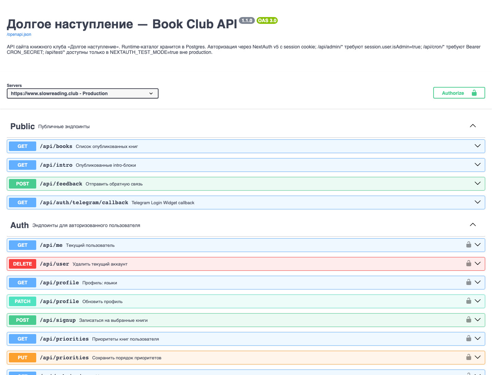

# API и Swagger

API проекта описан в OpenAPI-файле и доступен через Swagger UI.

## Где открыть

- Production Swagger UI: [www.slowreading.club/api-docs](https://www.slowreading.club/api-docs)
- OpenAPI JSON: [www.slowreading.club/openapi.json](https://www.slowreading.club/openapi.json)
- Файл в репозитории: `public/openapi.json`

## Группы API

| Группа | Назначение |
| --- | --- |
| Public | Публичные данные: книги, intro, feedback, Telegram callback. |
| Auth | Действия авторизованного пользователя: профиль, запись, приоритеты, заявки. |
| Admin | Панель администратора и управление данными. |
| Cron | Внутренние cron-эндпоинты. |
| Testing | Эндпоинты только для `NEXTAUTH_TEST_MODE=true` вне production. |
| Media | Генерируемые медиа-ответы, например Open Graph image. |

## Основные публичные endpoints

| Метод | Путь | Зачем |
| --- | --- | --- |
| GET | `/api/books` | Список опубликованных книг. |
| GET | `/api/intro` | Опубликованные intro-блоки. |
| POST | `/api/feedback` | Отправить обратную связь. |
| GET | `/api/auth/telegram/callback` | Telegram Login Widget callback. |
| GET/PUT/DELETE | `/api/summaries/{id}/helpful` | Состояние, добавление и снятие реакции «Полезно» для опубликованного саммари. |

## Основные пользовательские endpoints

| Метод | Путь | Зачем |
| --- | --- | --- |
| GET | `/api/me` | Текущий пользователь. |
| GET/PATCH | `/api/profile` | Чтение и обновление профиля. |
| POST | `/api/signup` | Записаться на выбранные книги. |
| GET/PUT | `/api/priorities` | Читать и сохранять приоритеты. |
| GET/POST | `/api/submissions` | Читать и создавать свои заявки. |
| DELETE | `/api/submissions/{id}` | Удалить свою заявку. |
| GET/POST | `/api/summaries/by-book/{bookId}` | Читать своё саммари по книге или создать draft для прочитанной книги. |
| PATCH | `/api/summaries/{id}` | Автосохранить своё draft/rejected саммари. |
| POST | `/api/summaries/{id}/submit` | Отправить саммари на модерацию. |
| POST | `/api/summaries/{id}/revision` | Создать или открыть правки опубликованного саммари. |
| PATCH | `/api/summary-revisions/{id}` | Автосохранить правки опубликованного саммари. |
| POST | `/api/summary-revisions/{id}/submit` | Отправить правки на повторную модерацию. |
| POST | `/api/summaries/helpful/reconcile` | После входа перенести реакции гостевой cookie к аккаунту и схлопнуть дубли. |
| GET | `/api/matching/state?session={id}` | Public state с реальными display names, сценариями, подтверждениями, закреплёнными кругами и notices; без raw `userId`. |
| GET | `/api/matching/version?session={id}` | Лёгкий polling версии, статуса и online refs. |
| POST | `/api/matching/sessions/{id}/join` | Сохранить глобальное имя и вступить в сессию после disclosure. |
| PUT/DELETE | `/api/matching/sessions/{id}/confirmation` | Подтвердить/переключить либо отменить выбранный круг. |
| POST | `/api/matching/notices/{id}/ack` | Пометить персональное matching-уведомление прочитанным. |

## Основные admin endpoints

| Метод | Путь | Зачем |
| --- | --- | --- |
| GET | `/api/admin/status` | CI и Vercel deploy status. |
| GET | `/api/admin/users` | Сводка пользователей. |
| GET | `/api/admin/users/{id}` | Детали пользователя. |
| GET/POST | `/api/admin/books` | Каталог книг. |
| PATCH | `/api/admin/books/{id}` | Обновить книгу. |
| PUT | `/api/admin/books/reorder` | Обновить порядок книг. |
| GET | `/api/admin/matching/preference-events` | Аналитика matching из смыслового журнала `matching_events`. |
| POST | `/api/admin/matching/sessions/{id}/circles/{circleId}/dissolve` | Аварийно распустить закреплённый круг целиком; требуется причина. |
| GET | `/api/admin/feedback` | Фидбек-сообщения. |
| GET/PATCH/DELETE | `/api/admin/submissions` | Модерация заявок. |
| GET/PATCH/POST | `/api/admin/summaries` | Модерация саммари участников: список, правка, публикация, отклонение. |
| PATCH | `/api/admin/summary-revisions/{id}` | Правка ревизии опубликованного саммари. |
| POST | `/api/admin/summary-revisions/{id}/publish` | Применить ревизию к публичному саммари. |
| POST | `/api/admin/summary-revisions/{id}/reject` | Отклонить ревизию, сохранив текущую публикацию. |

Админские PATCH-запросы саммари и ревизий принимают `bookSlug`. При первой модерации это обязательное поле бизнес-процесса: без сохранённого slug publish и reject вернут ошибку валидации. API-маршруты по-прежнему используют неизменяемые UUID, а пользовательские страницы — красивые адреса `/books/{bookSlug}/summaries` и `/books/{bookSlug}/my-summary/edit`.

## Безопасность API

| Тип API | Требование |
| --- | --- |
| Public | Без сессии. |
| Auth | Нужна session cookie NextAuth. |
| Admin | Нужна session cookie и `session.user.isAdmin=true`. |
| Cron | Нужен Bearer `CRON_SECRET`. |
| Testing | Работает только в test mode и не должен быть доступен в production. |

## Что важно владельцу

Swagger полезен не только разработчику. Через него можно быстро увидеть:

- какие возможности уже есть на уровне API;
- какие действия защищены админскими правами;
- какие endpoint-ы существуют для cron и тестов;
- не забылась ли документация при добавлении новой функции.
