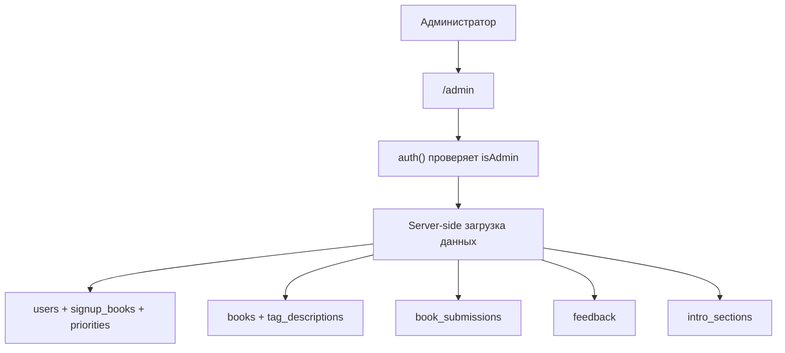

# Панель администратора

Админка находится на `/admin` и доступна только пользователю с `session.user.isAdmin=true`.

## Что можно делать

| Вкладка | Назначение |
| --- | --- |
| Участники | Видеть пользователей, контакты, выбранные книги, языки, активность, искать по имени/Telegram, удалять пользователя или сливать дубль в основной аккаунт. |
| Каталог | Создавать и редактировать книги, менять видимость, статус чтения, обложки, порядок. |
| Теги | Редактировать описания тем. |
| Заявки | Модерировать книги, предложенные участниками. |
| Фидбеки | Читать сообщения обратной связи. |
| Интро | Редактировать объяснительные блоки на главной. |

## Как админка получает данные

## Виджеты внизу админки

В подвале админки есть операционные виджеты:

- текущий деплой и commit;
- статус CI и Vercel;
- состояние очереди digest-писем;
- Allure-виджет;
- месячное использование PostHog.

Эти виджеты нужны, чтобы быстро понять: “сайт сейчас живой, свежий и проверенный?”.

## Контроль доступа

Все `/api/admin/*` эндпоинты должны возвращать 403 для не-администраторов. Это важно: скрыть кнопку в UI недостаточно, проверка идет на сервере.

## Удаление пользователя

Удаление пользователя в админке удаляет связанные с ним записи по каскаду. Фидбек сохраняется, но отвязывается от пользователя.

Перед удалением стоит помнить:

- записи на книги исчезнут;
- приоритеты исчезнут;
- заявки пользователя исчезнут;
- activity events исчезнут;
- PostHog cleanup выполняется best-effort, если настроены ключи.

## Слияние дублей

Если один человек случайно получил два профиля из-за разных способов входа, администратор открывает карточку основного аккаунта и кликает по его ID, чтобы скопировать его. Затем администратор открывает карточку дубля, вставляет ID в поле «ID аккаунта, который оставить» и проверяет найденный аккаунт под полем. Если ID не найден или слияние вернуло ошибку, сообщение показывается прямо в карточке. После проверки администратор при необходимости пишет причину и нажимает `Merge to user`. Система переносит способы входа, записи на книги, приоритеты, заявки, feedback, activity и matching-связи, затем удаляет source-профиль.

Слияние не переписывает старый `audit_log`: история остаётся append-only. Для расследования создаётся отдельная запись `user_merge_events` с причиной, снимками source/target и счётчиками перенесённых данных.

## Что проверять при проблемах

| Симптом | Что проверить |
| --- | --- |
| `/admin` редиректит на главную | Флаг `isAdmin`, session, `ADMIN_EMAIL`. |
| Виджет CI пустой | `GH_TOKEN` в окружении. |
| Виджет Vercel пустой | `VERCEL_TOKEN` и project id. |
| PostHog widget говорит not configured | `POSTHOG_PERSONAL_API_KEY`, `POSTHOG_PROJECT_ID`. |
| Очередь писем не уходит | `CRON_SECRET`, GitHub Actions digest workflow, Resend. |
