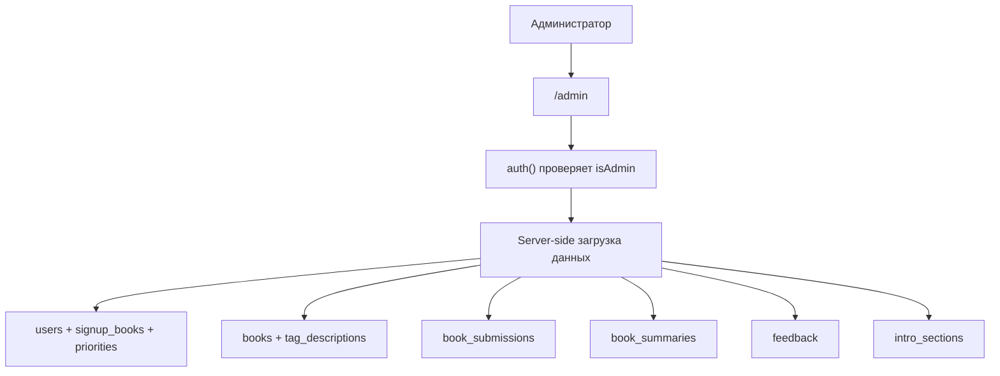

# Панель администратора

## Книжный режим Matching

Администратор работает с теми же карточками книг, что и участники, но видит блок **«Управлять составом»** и верхнюю панель lifecycle. Доступны:

- однократное включение книжного режима в уже идущей legacy-сессии;
- назначение и снятие участника, перенос между книгами;
- размещение в круге или «без круга», создание и удаление круга;
- исключение участника из сессии;
- закрытие и повторное открытие сессии.

Административные действия намеренно могут разрушить сформированный круг и не требуют дополнительного подтверждения на сервере: договорённость обсуждается в общем чате, а администратор может выполнить следующую корректировку. Все действия проходят с `source=admin`, увеличивают `state_version` и видны в matching events и глобальном audit log.

Админка находится на `/admin` и доступна только пользователю с `session.user.isAdmin=true`.

## Что можно делать

| Вкладка | Назначение |
| --- | --- |
| Участники | Видеть пользователей, контакты, выбранные книги, языки, активность, сразу видеть мягкую подсветку тех, кто сейчас читает хотя бы одну книгу, искать по имени/Telegram, удалять пользователя или сливать дубль в основной аккаунт. Бейдж «Читает» появляется при наведении на строку. |
| Каталог | Создавать и редактировать книги, менять видимость, статус чтения, обложки, порядок. Тег выбирается из выпадающего списка существующих тегов (не вводится вручную) — это исключает дубли из-за разного регистра или опечаток. |
| Теги | Редактировать описания тем. |
| Заявки | Модерировать книги, предложенные участниками. |
| Саммари | Модерировать саммари участников по прочитанным книгам: править текст, публиковать или отклонять с причиной. |
| Фидбеки | Читать сообщения обратной связи. |
| Интро | Редактировать объяснительные блоки на главной. |
| Матчинг | Смотреть спрос по книгам в текущей сессии, создавать, закрывать и повторно открывать сессии, управлять участниками, смотреть журнал событий. |

## Матчинг

Вкладка устроена сверху вниз так:

1. **Строка сессии** — название, статус («открыта»/«закрыта»), дата создания, дедлайн и число активных участников. Справа — «Страница матчинга →», «Закрыть сессию» / «Открыть снова» и меню «Сессии (N)» со списком всех сессий. Создание новой сессии — пункт «+ Новая сессия» в этом меню; пока есть открытая сессия, форма заблокирована.
2. **Сводка** — шесть чисел по активным участникам выбранной сессии: активных, записались, в кругах, читают, книг в спросе, кругов сформировано.
3. **Подвкладки** «Спрос по книгам» (открывается по умолчанию), «Участники», «Журнал». Выбранная подвкладка хранится в адресе (`/admin?tab=matching&sub=demand|people|log`), поэтому ссылка ведёт в нужный раздел, а перезагрузка страницы выбор не сбрасывает.

**Спрос по книгам** — read-only радар для координатора. Показывает книги, которые держат в «Хочу читать» минимум трое активных участников сессии (кто ещё не отправлен читать). Для каждой книги — список заинтересованных с их рангом книги и статусом по ней: «в круге», «записался», «авто-запись» или «в списке»; если человек сейчас что-то читает, под именем тихой строкой — «читает «…»». Рядом с названием — сколько кругов по книге уже сформировано (их может быть несколько). Средний и худший ранг, число без ранга, записей, авто-записей и людей в круге — во всплывающей подсказке на названии книги (по наведению или фокусу с клавиатуры). Книги упорядочены по числу заинтересованных, затем по числу рангов 1–3, среднему и худшему рангу, затем по записям. Сформированные круги и статус «читает» на порядок не влияют. Экран ничего не рекомендует и не предлагает действий — решение и переписка с участниками остаются за администратором.

**Участники** — таблица «Имя · Роль · Источник · Вступил». Имя — ссылка на вход в матчинг от имени участника (`/matching?as=<userId>`); зелёная точка — участник онлайн. Роль: «активный», «наблюдатель» или «читает» (с датой отправки в подсказке). Источник: «сам» или «админ». Кнопка «книги ▾» раскрывает полный выбор человека: весь ранжированный список «Хочу читать» (включая книги без пересечений), окончательные записи, авто-записи, книги в круге и то, что он читает сейчас. «убрать» появляется при наведении на строку или фокусе с клавиатуры и спрашивает подтверждение. Ручное добавление свёрнуто в «+ Добавить участника вручную»; предупреждение о том, что оно обходит экран раскрытия имени, показывается внутри раскрытого блока. Добавлять и убирать можно только в открытой сессии.

**Журнал** читает `matching_events`: действия с книгами и рангами, вступление/выход, намерения, назначения, круги и lifecycle — все типы выводятся человеческими названиями. Пять фильтров (когда, событие, источник, актор, участник) стоят в одну строку, «Сбросить» появляется при активном фильтре; сводка по типам событий свёрнута под ссылку «сводка по типам событий». Загружаются последние 100 событий, показываются по 10. Исторические сценарные события остаются читаемыми. В глобальной «Истории изменений» операции видны как технические before/after записи audit log. Heartbeat/online не показывается.

## Как админка получает данные

```mermaid
flowchart TD
    Admin["Администратор"] --> Page["/admin"]
    Page --> Auth["auth() проверяет isAdmin"]
    Auth --> Data["Server-side загрузка данных"]
    Data --> Users["users + signup_books + priorities"]
    Data --> Books["books + tag_descriptions"]
    Data --> Submissions["book_submissions"]
    Data --> Summaries["book_summaries"]
    Data --> Feedback["feedback"]
    Data --> Intro["intro_sections"]
```

## Виджеты внизу админки

В подвале админки есть операционные виджеты:

- текущий деплой и commit;
- статус CI и Vercel;
- состояние очереди digest-писем;
- Allure-виджет;
- месячное использование PostHog;
- **расход Neon** (CU-часы и оценка $ за текущий биллинг-период, полоской «использовано / лимит») + ссылка на Vercel Usage.

Эти виджеты нужны, чтобы быстро понять: “сайт сейчас живой, свежий и проверенный?”.

**Виджет расхода Neon** (`NeonUsageWidget`) ходит в Neon Consumption API (внешний management-API, **не** в наш Postgres — поэтому сам ничего не жжёт) и требует env `NEON_API_KEY`. Порог полоски задаётся `NEON_SPEND_LIMIT_USD` (по умолчанию $10). Vercel Fluid-метрики на Hobby через API недоступны, поэтому по Vercel — только ссылка на дашборд. Опрашивает раз в 5 минут и только при активной вкладке (данные Neon и так отстают на ~час).

## Контроль доступа

Все `/api/admin/*` эндпоинты должны возвращать 403 для не-администраторов. Это важно: скрыть кнопку в UI недостаточно, проверка идет на сервере.

## Удаление пользователя

Удаление пользователя в админке удаляет связанные с ним записи по каскаду. Фидбек сохраняется, но отвязывается от пользователя.

Перед удалением стоит помнить:

- записи на книги исчезнут;
- приоритеты исчезнут;
- заявки пользователя исчезнут;
- activity events исчезнут;
- PostHog cleanup выполняется best-effort, если настроены ключи.

## Слияние дублей

Если один человек случайно получил два профиля из-за разных способов входа, администратор открывает карточку основного аккаунта и кликает по его ID, чтобы скопировать его. Затем администратор открывает карточку дубля, вставляет ID в поле «ID аккаунта, который оставить» и проверяет найденный аккаунт под полем. Если ID не найден или слияние вернуло ошибку, сообщение показывается прямо в карточке. После проверки администратор при необходимости пишет причину и нажимает `Merge to user`. Система переносит способы входа, записи на книги, приоритеты, заявки, feedback, activity и matching-связи, затем удаляет source-профиль.

Слияние не переписывает старый `audit_log`: история остаётся append-only. Для расследования создаётся отдельная запись `user_merge_events` с причиной, снимками source/target и счётчиками перенесённых данных.

## Что проверять при проблемах

| Симптом | Что проверить |
| --- | --- |
| `/admin` редиректит на главную | Флаг `isAdmin`, session, `ADMIN_EMAIL`. |
| Виджет CI пустой | `GH_TOKEN` в окружении. |
| Виджет Vercel пустой | `VERCEL_TOKEN` и project id. |
| Виджет расхода Neon пустой | `NEON_API_KEY` (в `.env.local` и Vercel env), валидность ключа, доступ к орг. |
| PostHog widget говорит not configured | `POSTHOG_PERSONAL_API_KEY`, `POSTHOG_PROJECT_ID`. |
| Очередь писем не уходит | `CRON_SECRET`, GitHub Actions digest workflow, Resend. |
