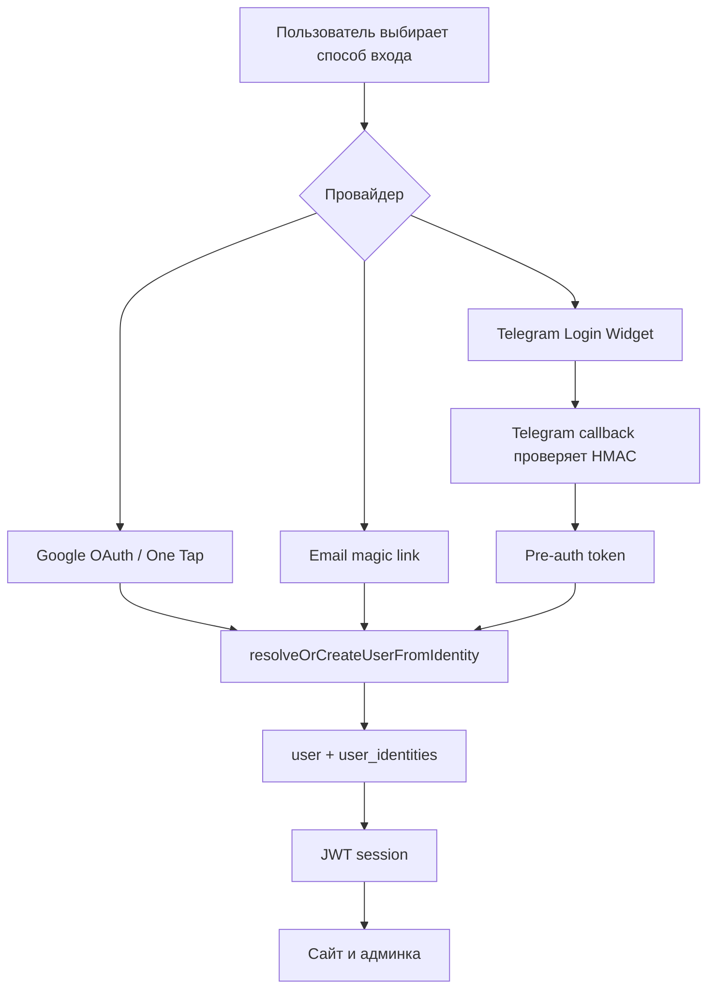
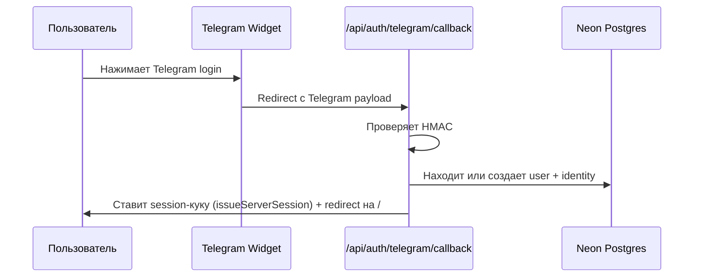

# Авторизация и пользователи

Авторизация построена на NextAuth v5. Пользователь может войти несколькими способами, а система приводит их к одному внутреннему пользователю.

## Способы входа

| Способ | Где используется | Что важно |
| --- | --- | --- |
| Google OAuth | Кнопка входа | Стандартный redirect-flow Google. |
| Google One Tap | Главная страница | Быстрый вход через всплывающий Google prompt. |
| Email magic link | Модал входа | Ссылка приходит через Resend на email. |
| Telegram Login Widget | Модал входа | Использует redirect через `/api/auth/telegram/callback`, не JS callback. |

Для удобства входа сайт помнит только последний способ входа в `localStorage` браузера. Это не серверное состояние и не пользовательский профиль, а лишь подсказка для модалки: если последний способ был Google или email, вторичные способы раскрываются сразу, под заголовком появляется напоминание «В прошлый раз вы входили через …», а у соответствующего способа показывается бейдж «Последний вход». В памяти хранится только нормализованный provider (`google`, `telegram` или `email`), без имени, email, Telegram username или user id.

## Привязка нескольких способов входа

На вкладке «Профиль» пользователь видит три способа входа: Telegram, Google и почту. Привязанные способы отмечены статусом, последний использованный способ получает метку «последний вход». Если Telegram привязан, но у аккаунта нет публичного username, профиль показывает «Telegram ID привязан», не раскрывая numeric Telegram id. Пользователь может добавить Google, Telegram или почту к текущему профилю; отвязки способов входа нет.

Это главный способ предотвратить новые дубли: человек сначала входит привычным способом, затем явно подтверждает второй provider.

Что важно:

- Google привязывается только после серверной проверки Google credential.
- Telegram привязывается отдельным callback-режимом Telegram Widget, требует активную сессию сайта и короткоживущий signed state, выданный именно для текущего профиля.
- Почта привязывается через отдельное письмо подтверждения из профиля. Это не общий email-вход: ссылка содержит одноразовый token, созданный для текущего профиля, и срабатывает только при активной сессии того же пользователя.
- Если выбранный Google или Telegram уже принадлежит другому профилю, сайт не объединяет пользователей автоматически.
- Автоматического объединения по имени, Telegram username или похожему email нет: это опасно для приватности и может склеить разных людей.
- Уже существующие дубли исправляются администратором через «Слить дубль» в карточке пользователя. Source-профиль переносится в target-профиль по явно указанному ID; причина опциональна, audit summary создаётся всегда.

## Общий поток входа

## Почему есть `user_identities`

Раньше внешний идентификатор мог смешиваться с внутренним пользователем. Сейчас модель разделена:

- `user` — человек внутри сайта.
- `user_identities` — способы, которыми этот человек входит.

Пример:

- один пользователь может войти через Google;
- потом через email;
- потом через Telegram;
- система должна понимать, что это один человек, если identity связаны корректно.

## Администратор

Админский доступ определяется флагом `isAdmin` в таблице `user` и попадает в `session.user.isAdmin`.

При первом входе пользователя с email из `ADMIN_EMAIL` система может выставить ему admin-флаг, если в базе еще нет администратора.

## Telegram: важные уроки

Telegram Login Widget должен использовать `data-auth-url`, а не `data-onauth`. Callback-режим через JavaScript ненадежен из-за браузерных ограничений.

Поток Telegram:

Вход через Telegram занимает **один шаг** — промежуточная страница `/auth/telegram` и провайдер `telegram-preauth` удалены (spec 2026-06-15). Ранее использовалась двухпрыжковая схема с preauth-токеном и клиентским `signIn`, которая ненадёжно работала на iOS из-за CSRF/cookie-ограничений при переходе с `oauth.telegram.org`. Теперь callback сам выдаёт session-куку на сервере (`lib/auth-session.ts → issueServerSession`) и сразу редиректит пользователя на главную. PostHog pageview дополнительно вычищает чувствительные query-параметры перед отправкой.

## Пользовательский профиль

Профиль хранит:

- имя;
- контактный email;
- контакт для связи, например Telegram;
- языки чтения;
- флаг, расставлены ли приоритеты;
- последнюю активность.

Технический Telegram username из `user_identities` не равен пользовательскому контакту. Пользователь может изменить отображаемый контакт в профиле.

## Журнал провалов Telegram-входа

Каждый неудачный вход через Telegram записывается в таблицу `telegram_login_failures`. Журнал покрывает **стадию верификации** — провалы HMAC-проверки (причины: неверная HMAC, истёкший `auth_date`, отсутствующий hash, нет токена бота). Журнал хранит причину отказа, разницу времени, Telegram ID/username (если переданы) и IP. Записи не аудируются (actor неизвестен до успешного входа) и автоматически удаляются через 30 дней cron-джобой `telegram-preauth-cleanup`. Провайдер `telegram-preauth` и его stадия `preauth_*` удалены (spec 2026-06-15). Таблица `telegram_preauth_tokens` оставлена в БД deprecated.

## Где смотреть проблемы

| Симптом | Что проверить |
| --- | --- |
| Пользователь не входит | Provider credentials, NextAuth secret, callback URL, cookies. |
| Telegram не работает | BotFather domain, фото бота, `TELEGRAM_BOT_TOKEN`, HMAC callback. |
| Google One Tap не появляется | `NEXT_PUBLIC_GOOGLE_CLIENT_ID`, Google OAuth настройки, браузерные ограничения. |
| Пользователь видит дубль профиля | Попросить войти в основной профиль и привязать второй способ входа; если identity уже занята другим user, нужен админский merge. |
| Админ не видит `/admin` | `user.is_admin`, `ADMIN_EMAIL`, session callback. |
| Профиль открывается пустым | `user.name`, `user.contacts`, `contact_email`, session refresh. |
