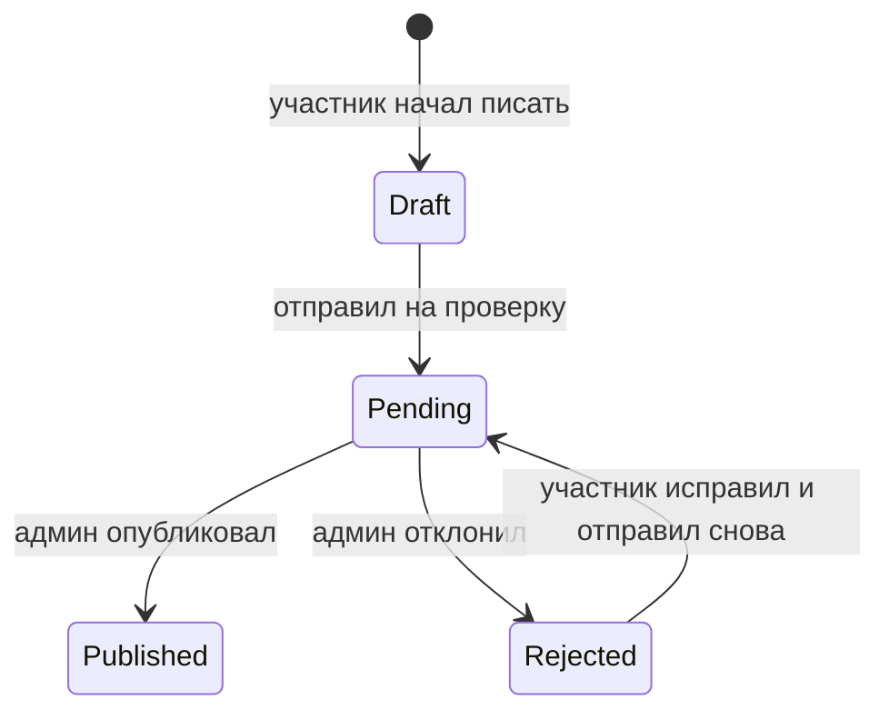

# Саммари книг от участников

Саммари — это короткие тексты участников по уже прочитанным книгам. Фича помогает показывать в каталоге не только описание книги, но и живую клубную оптику: что в книге оказалось важным для разных людей.

## Что видит участник

Участник может написать саммари только для книги, которую отметил как “Прочитал:а”.

Путь:

1. Участник открывает книгу в профиле или модалке.
2. Нажимает “Написать саммари”.
3. Пишет текст в Markdown-редакторе с toolbar, автосейвом и предпросмотром.
4. Отправляет на проверку.

После отправки текст ждёт решения администратора. Если администратор отклонит саммари, участник увидит причину и сможет исправить текст.

## Что делает администратор

В админке есть вкладка “Саммари”. Там видны черновики, тексты на проверке, опубликованные и отклонённые.

Администратор может:

- открыть саммари;
- поправить заголовок, короткое описание, имя автора для публикации и Markdown-текст;
- опубликовать;
- отклонить с причиной.

## Где видны опубликованные саммари

Если у книги есть опубликованные саммари, каталог показывает ссылку на страницу саммари. На странице книги может быть несколько опубликованных текстов от разных участников.

У одного участника может быть только одно саммари на одну книгу.

## Жизненный цикл

## Что хранится в базе

Данные живут в таблице `book_summaries`.

Важные связи:

- саммари привязано к книге;
- саммари привязано к автору-участнику;
- пара “книга + автор” уникальна;
- изменения аудируются в общем audit log.

## Ограничения MVP

- Нет комментариев и реакций.
- Нет email-уведомлений о публикации или отказе.
- Нет отдельной страницы “Мои саммари”.
- После публикации автор не редактирует текст сам; правки делает администратор.

