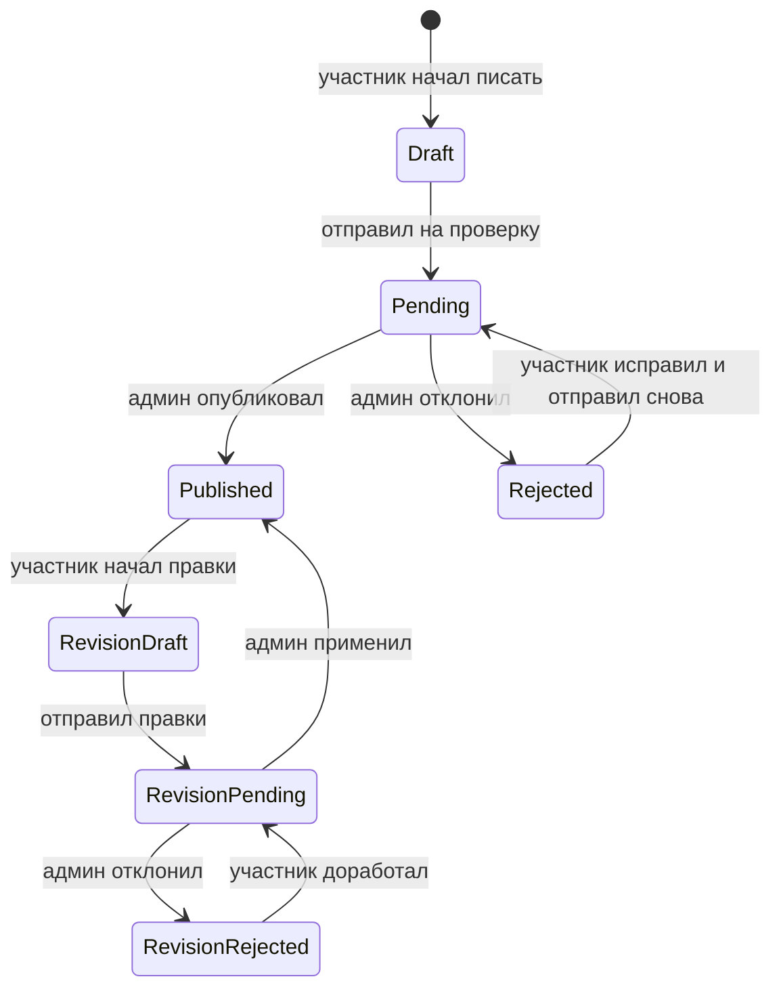

# Саммари книг от участников

Саммари — это короткие тексты участников по уже прочитанным книгам. Фича помогает показывать в каталоге не только описание книги, но и живую клубную оптику: что в книге оказалось важным для разных людей.

## Что видит участник

Участник может написать саммари только для книги, которую отметил как “Прочитал:а”.

Путь:

1. Участник открывает книгу в профиле или модалке.
2. Нажимает “Написать саммари”.
3. Пишет текст в Markdown-редакторе с toolbar, автосейвом и предпросмотром. Основное поле сделано как большая страница для длинного текста, а toolbar остаётся рядом при скролле.
4. Отправляет на проверку.

До первой проверки редактор открывается по техническому адресу с ID саммари. После того как администратор назначит книге красивый URL, постоянный адрес редактора будет выглядеть как `/books/dolgoe-nastuplenie/my-summary/edit`; старая ссылка сама перенаправит туда.

После отправки текст ждёт решения администратора. Если администратор отклонит саммари, участник увидит причину и сможет исправить текст.

После публикации участник может предложить правки. Для этого создаётся отдельный черновик изменений. Уже опубликованный текст остаётся видимым читателям, пока администратор не одобрит новую версию.

## Формат текста

Редактор использует Markdown. Для структуры длинного текста поддерживаются заголовки второго, третьего и четвёртого уровня: `##`, `###`, `####`. Одинарный `#` лучше не использовать внутри саммари, потому что главный заголовок уже занят названием текста.

Поддерживаются маркированные и нумерованные списки. В Markdown это пишется так:

```md
- Первый пункт
- Второй пункт

1. Первый шаг
2. Второй шаг
```

Для сворачиваемых разделов используется переносимый HTML-compatible формат, который адекватно выглядит во многих Markdown-редакторах:

```md
<details>
<summary>Заголовок раздела</summary>

Текст раздела
</details>
```

Если блок должен быть открыт сразу, можно написать `<details open>`. Сайт разрешает только этот безопасный формат `details/summary`; произвольный HTML в саммари не исполняется.

Текст в `<summary>` полностью задаёт автор: можно написать нейтральное “Подробнее”, “Подробный разбор” или заголовок, отражающий тему скрытого текста. У свёрнутого заголовка при наведении появляется мягкий акцентный фон. На опубликованной странице подробный слой выделяется терракотовой вертикальной линией. Когда блок открыт, линия продолжается вдоль всего подробного текста; наведение и клик по ней позволяют быстро свернуть раздел, а сам текст остаётся обычным текстом, который можно спокойно выделять и открывать по ссылкам.

Markdown-цитаты, начинающиеся с `>`, показываются отдельно от таких разделов: вместо второй вертикальной линии используется крупная открывающая кавычка.

## Вставка статьи из Wikipedia

Внутрь саммари можно встроить статью из Wikipedia — например, чтобы читатель мог быстро освежить контекст, не уходя со страницы.

Как автору добавить вставку:

1. Выделите в тексте саммари фразу-подводку (или поставьте курсор, если хотите подводку по умолчанию).
2. Нажмите на панели кнопку **W** («Вставка из Wikipedia»).
3. Вставьте ссылку на нужную статью, например `https://ru.wikipedia.org/wiki/Социализм`, и нажмите «Вставить».

Авторский текст остаётся вашим: его можно свободно править, он живёт отдельно от статьи. Поддерживаются статьи **на любом языке** Wikipedia (мобильные ссылки `*.m.wikipedia.org` тоже подходят). Принимаются только настоящие ссылки на статьи Wikipedia — ссылки-обманки и сторонние сайты отклоняются с подсказкой.

Как это видит читатель:

- под авторским текстом появляется компактный блок Wikipedia с кнопкой «Читать статью»; в правом верхнем углу блока приглушённым шрифтом показано название статьи;
- по клику прямо на странице открывается актуальная версия статьи в режиме чтения с внутренней прокруткой;
- ссылки внутри статьи и кнопка «Открыть оригинал» ведут в Wikipedia в новой вкладке;
- если статья временно недоступна, авторский текст и ссылка на оригинал всё равно остаются на месте.

Из статьи намеренно убирается служебное содержимое (инфобоксы, навигация, сноски, скрипты); остаются заголовки, абзацы, списки, цитаты и иллюстрации с указанием автора и лицензии. Содержимое подгружается заранее в фоне и кэшируется примерно на час, поэтому открытие происходит мгновенно.

## Что делает администратор

В админке есть вкладка “Саммари”. Там видны черновики, тексты на проверке, опубликованные и отклонённые.

Администратор может:

- открыть саммари;
- поправить заголовок, короткое описание, имя автора для публикации и Markdown-текст;
- при первой проверке обязательно вписать уникальный красивый URL книги латиницей, например `dolgoe-nastuplenie`;
- опубликовать;
- отклонить с причиной.

Красивый URL относится ко всей книге, а не к конкретному автору, поэтому саммари разных участников ведут на одну книжную страницу. Его можно изменить позже. Для технической сверки форма всегда показывает неизменяемый ID саммари; у правок опубликованного текста дополнительно показывается ID ревизии. Без красивого URL нельзя завершить модерацию — ни опубликовать, ни отклонить.

Для правок опубликованного текста администратор также видит текущую публичную версию. При одобрении правки заменяют её целиком; при отказе публикация не меняется.

## Где видны опубликованные саммари

Если у книги есть опубликованные саммари, каталог показывает ссылку вида `/books/dolgoe-nastuplenie/summaries`. На странице книги может быть несколько опубликованных текстов от разных участников. Старые ссылки с техническим ID книги продолжают работать и перенаправляются на красивый адрес.

У одного участника может быть только одно саммари на одну книгу.

## Жизненный цикл



## Что хранится в базе

Опубликованные данные живут в таблице `book_summaries`. Незавершённые правки хранятся отдельно в `book_summary_revisions` и не участвуют в публичном каталоге.

Важные связи:

- саммари привязано к книге;
- саммари привязано к автору-участнику;
- пара “книга + автор” уникальна;
- у саммари может быть только одна активная ревизия;
- изменения аудируются в общем audit log.
- красивый URL хранится у книги в поле `books.slug`, уникален и может быть пустым только до первой модерации саммари.

## Ограничения MVP

- Нет комментариев и реакций.
- Нет email-уведомлений о публикации или отказе.
- Нет отдельной страницы “Мои саммари”.
- Нет пользовательского архива и сравнения версий; история операций остаётся в audit log.
