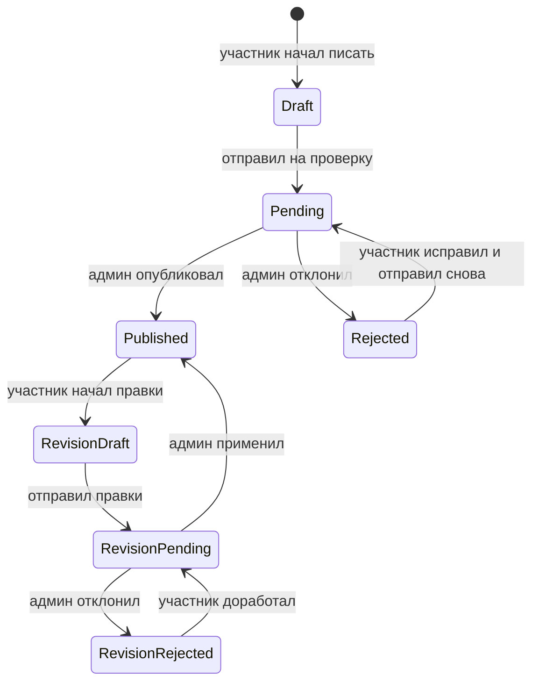

# Саммари книг от участников

Саммари — это короткие тексты участников по уже прочитанным книгам. Фича помогает показывать в каталоге не только описание книги, но и живую клубную оптику: что в книге оказалось важным для разных людей.

## Что видит участник

Участник может написать саммари только для книги, которую отметил как “Прочитал:а”.

Путь:

1. Участник открывает книгу в профиле или модалке.
2. Нажимает “Написать саммари”.
3. Пишет текст в Markdown-редакторе с toolbar, автосейвом и предпросмотром. Основное поле сделано как большая страница для длинного текста, а toolbar остаётся рядом при скролле.
4. Отправляет на проверку.

После отправки текст ждёт решения администратора. Если администратор отклонит саммари, участник увидит причину и сможет исправить текст.

После публикации участник может предложить правки. Для этого создаётся отдельный черновик изменений. Уже опубликованный текст остаётся видимым читателям, пока администратор не одобрит новую версию.

## Формат текста

Редактор использует Markdown. Для структуры длинного текста поддерживаются заголовки второго, третьего и четвёртого уровня: `##`, `###`, `####`. Одинарный `#` лучше не использовать внутри саммари, потому что главный заголовок уже занят названием текста.

Поддерживаются маркированные и нумерованные списки. В Markdown это пишется так:

```md
- Первый пункт
- Второй пункт

1. Первый шаг
2. Второй шаг
```

Для сворачиваемых разделов используется переносимый HTML-compatible формат, который адекватно выглядит во многих Markdown-редакторах:

```md
<details>
<summary>Заголовок раздела</summary>

Текст раздела
</details>
```

Если блок должен быть открыт сразу, можно написать `<details open>`. Сайт разрешает только этот безопасный формат `details/summary`; произвольный HTML в саммари не исполняется.

## Что делает администратор

В админке есть вкладка “Саммари”. Там видны черновики, тексты на проверке, опубликованные и отклонённые.

Администратор может:

- открыть саммари;
- поправить заголовок, короткое описание, имя автора для публикации и Markdown-текст;
- опубликовать;
- отклонить с причиной.

Для правок опубликованного текста администратор также видит текущую публичную версию. При одобрении правки заменяют её целиком; при отказе публикация не меняется.

## Где видны опубликованные саммари

Если у книги есть опубликованные саммари, каталог показывает ссылку на страницу саммари. На странице книги может быть несколько опубликованных текстов от разных участников.

У одного участника может быть только одно саммари на одну книгу.

## Жизненный цикл



## Что хранится в базе

Опубликованные данные живут в таблице `book_summaries`. Незавершённые правки хранятся отдельно в `book_summary_revisions` и не участвуют в публичном каталоге.

Важные связи:

- саммари привязано к книге;
- саммари привязано к автору-участнику;
- пара “книга + автор” уникальна;
- у саммари может быть только одна активная ревизия;
- изменения аудируются в общем audit log.

## Ограничения MVP

- Нет комментариев и реакций.
- Нет email-уведомлений о публикации или отказе.
- Нет отдельной страницы “Мои саммари”.
- Нет пользовательского архива и сравнения версий; история операций остаётся в audit log.
