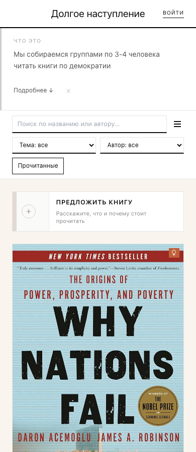
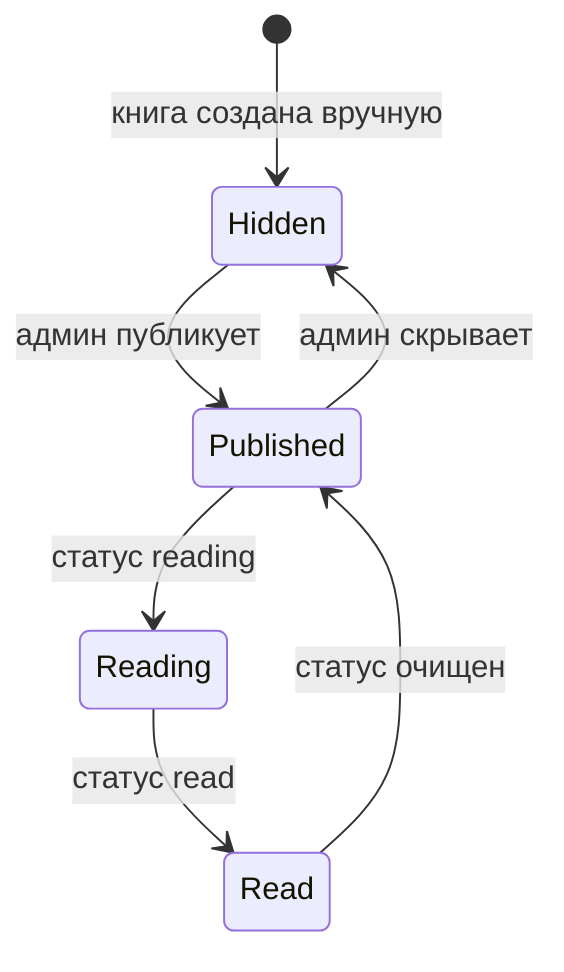
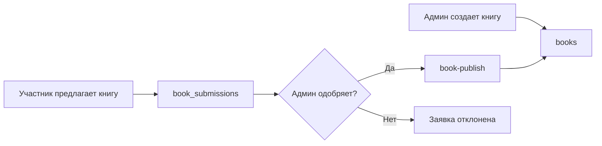

# Каталог книг

Каталог книг — центральная часть сайта. Сейчас он полностью управляется через Postgres и админку.

## Что видит пользователь

Пользователь видит список опубликованных книг:

- обложка;
- название;
- автор;
- теги;
- год или дата публикации;
- количество страниц;
- ссылка на текст;
- описание;
- блок “почему стоит прочитать”;
- статус чтения;
- кнопка записи.

## Источник данных

Актуальный источник каталога — таблица `books`.

Google Sheets больше не участвует в runtime-каталоге. Это важное отличие от старой документации.

## Жизненный цикл книги

## Поля, которые важны владельцу

| Поле | Что означает |
| --- | --- |
| `title` | Название книги. |
| `author` | Автор или авторы. |
| `tags` | Темы и фильтры. |
| `type` | Книга или статья. |
| `pages` | Объем. |
| `text_url` | Ссылка на текст или страницу книги. |
| `description` | Основное описание. |
| `cover_url` | URL обложки. |
| `why_read` | Объяснение, почему стоит читать в клубе. |
| `recommendation_link` | Ссылка на рекомендацию. |
| `reading_status` | Сейчас читают или уже прочитано. |
| `visibility` | Опубликована или скрыта. |
| `is_new` | Флаг новинки. |
| `sort_order` | Ручной порядок в каталоге. |
| `source` | Создана админом или из одобренной заявки. |

## Как книга попадает в каталог

Есть два пути:

1. Администратор создает книгу вручную во вкладке “Каталог”.
2. Участник предлагает книгу, администратор одобряет заявку, и система создает опубликованную книгу.

## Обложки

Обложка хранится прямо в `books.cover_url`. Внешнего кеша обложек и Google Books API больше нет. Если обложка не загружается, UI показывает fallback с инициалами автора.

## Поиск и фильтры

Поиск работает на стороне клиента по загруженному списку книг. Фильтры используют:

- темы;
- авторов;
- флаг “прочитанные”;
- новинки;
- книги пользователя.

Фильтр по теме сравнивает строки **точно**, поэтому набор тегов держится единым: в админке тег выбирается из выпадающего списка существующих, а не вводится вручную (см. «Панель администратора»). Это не даёт появиться визуально одинаковым, но разным тегам (например, с разным регистром первой буквы), которые иначе разъехались бы на две группы в фильтре.

## Что проверять при проблемах

| Симптом | Где искать |
| --- | --- |
| Книга не видна на главной | `books.visibility`, фильтры, `sort_order`. |
| Обложка не показывается | `cover_url`, доступность внешней картинки. |
| Книга видна в админке, но не на сайте | Скорее всего, `visibility='hidden'`. |
| Заявка одобрена, но книги нет | `book_submissions.book_id`, `books.source='submission'`. |
| Порядок странный | `sort_order` и дата публикации. |
