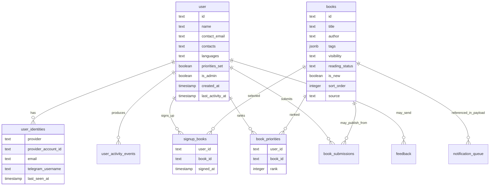

# Данные и база

База данных проекта находится в Neon Postgres. Код работает с ней через Drizzle ORM. Главный файл схемы: `lib/db/schema.ts`.

## Главная модель данных

## Основные таблицы

| Таблица | Что хранит | Почему важна |
| --- | --- | --- |
| `user` | Профиль пользователя: имя, контактный email, контакты, языки, флаг админа, активность. | Это внутренний человек в системе. |
| `user_identities` | Внешние способы входа: Google, email, Telegram. | Позволяет одному человеку иметь несколько способов входа. |
| `user_activity_events` | События активности: вход, профиль, записи, приоритеты, фидбек. | Помогает видеть, когда пользователь реально был активен. |
| `books` | Каталог книг и статусы публикации. | Главный источник публичного каталога. |
| `signup_books` | Связь пользователя с выбранными книгами. | Показывает, кто на что записался. |
| `book_priorities` | Порядок книг у пользователя. | Помогает понять, что человек хочет сильнее всего. |
| `book_submissions` | Предложенные пользователями книги. | Материал для модерации и пополнения каталога. |
| `feedback` | Сообщения обратной связи. | Канал связи с владельцем. |
| `notification_queue` | Очередь email-уведомлений. | Позволяет отправлять digest, а не письмо на каждое действие. |
| `intro_sections` | Редактируемые блоки intro на главной. | Позволяет менять объяснение сайта из админки. |
| `telegram_preauth_tokens` | Короткоживущие токены Telegram-входа. | Нужны для безопасного Telegram redirect flow. |

## Как связаны пользователь и способ входа

`user.id` — внутренний стабильный идентификатор. Внешние id Google, Telegram или email хранятся отдельно в `user_identities`.

Это важно: Telegram id или Google sub не должны становиться главным id пользователя. Такой подход снижает риск дублей и упрощает будущие изменения авторизации.

## Что каскадно удаляется

При удалении пользователя каскадом удаляются связанные записи в:

- `user_identities`
- `user_activity_events`
- `signup_books`
- `book_priorities`
- `book_submissions`
- `telegram_preauth_tokens`

Фидбек остается, но `feedback.user_id` становится пустым. Это сохраняет историю сообщений без привязки к удаленному пользователю.

## Миграции

Миграции лежат в папке `drizzle`. Важные этапы:

- `0012_user_activity_events.sql` — события активности.
- `0013_user_identities.sql` — таблица внешних идентичностей.
- `0018_contact_email_nullable_user_email.sql` и `0019_drop_user_email.sql` — переход от обязательного `users.email` к `contact_email`.
- `0021_books_catalog.sql` и последующие cleanup-миграции — перенос каталога в Postgres.
- `0028_unique_contact_email.sql` — уникальность контактного email без учета регистра.

## Практический вывод

Если нужно понять “почему пользователь видит вот это”, почти всегда надо смотреть связку:

`user` -> `signup_books` -> `book_priorities` -> `books`.

Если нужно понять “как пользователь вошел”, надо смотреть:

`user` -> `user_identities`.

Если нужно понять “когда он был активен”, надо смотреть:

`user.last_activity_at` и `user_activity_events`.
