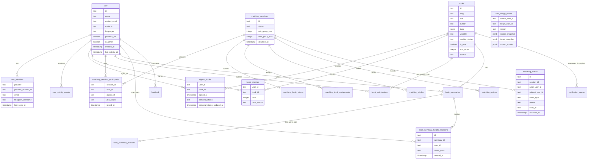

# Данные и база

## Книжный режим матчинга

Миграция `0053_matching_books.sql` добавляет четыре аудируемые таблицы:

| Таблица | Назначение |
| --- | --- |
| `matching_book_intents` | Условные и единственный твёрдый выбор участника в сессии. |
| `matching_session_book_states` | Факт, что книга когда-либо достигла порога формирования. |
| `matching_circles` | Актуальные группы по книге и их порядок. |
| `matching_book_assignments` | Единственный занятый книжный слот участника, источник назначения и круг. |

Книжная модель теперь единственная: новая сессия сразу имеет статус `open`. DB trigger не позволяет удалить из глобального `signup_books` книгу, на которой у пользователя стоит текущий твёрдый выбор или назначение. Шорт-лист остаётся глобальным, но уже зафиксированная договорённость не может исчезнуть обходным путём.

Новые таблицы включены в глобальный audit log. Удаление сессии каскадно удаляет книжные данные; ссылки на книги используют `RESTRICT`, чтобы результат не потерялся из-за удаления каталожной записи.

База данных проекта находится в Neon Postgres. Код работает с ней через Drizzle ORM. Главный файл схемы: `lib/db/schema.ts`.

## Главная модель данных

```mermaid
erDiagram
    user ||--o{ user_identities : has
    user ||--o{ user_activity_events : produces
    user ||--o{ signup_books : signs_up
    books ||--o{ signup_books : selected
    user ||--o{ book_priorities : ranks
    books ||--o{ book_priorities : ranked
    user ||--o{ matching_session_participants : joins
    matching_sessions ||--o{ matching_session_participants : contains
    matching_sessions ||--o{ matching_book_intents : collects
    matching_sessions ||--o{ matching_book_assignments : assigns
    matching_sessions ||--o{ matching_circles : forms
    matching_sessions ||--o{ matching_notices : notifies
    matching_sessions ||--o{ matching_events : records
    user ||--o{ book_submissions : submits
    books ||--o{ book_submissions : may_publish_from
    user ||--o{ book_summaries : writes
    books ||--o{ book_summaries : has
    book_summaries ||--o| book_summary_revisions : has_active_edit
    book_summaries ||--o{ book_summary_helpful_reactions : receives
    user ||--o{ book_summary_helpful_reactions : may_react
    user ||--o{ feedback : may_send
    books ||--o{ notification_queue : referenced_in_payload

    user {
      text id
      text name
      text contact_email
      text contacts
      text languages
      boolean priorities_set
      boolean is_admin
      timestamp created_at
      timestamp last_activity_at
    }

    user_identities {
      text provider
      text provider_account_id
      text email
      text telegram_username
      timestamp last_seen_at
    }

    books {
      text id
      text slug
      text title
      text author
      jsonb tags
      text visibility
      text reading_status
      boolean is_new
      integer sort_order
      text source
    }

    signup_books {
      text user_id
      text book_id
      timestamp signed_at
      text personal_status
      timestamp personal_status_updated_at
    }

    book_priorities {
      text user_id
      text book_id
      integer rank
      text rank_source
    }

    matching_sessions {
      text id
      text status
      integer min_group_size
      integer max_group_size
      timestamp deadline_at
    }

    matching_session_participants {
      text session_id
      text user_id
      text public_ref
      text join_source
      timestamp joined_at
    }

    matching_events {
      text id
      text session_id
      text actor_user_id
      text subject_user_id
      text event_type
      text source
      text book_id
      timestamp occurred_at
    }

    user_merge_events {
      text source_user_id
      text target_user_id
      text reason
      jsonb source_snapshot
      jsonb target_snapshot
      jsonb moved_counts
    }

    book_summary_helpful_reactions {
      text id
      text summary_id
      text user_id
      text visitor_hash
      timestamp created_at
    }
```

## Основные таблицы

| Таблица | Что хранит | Почему важна |
| --- | --- | --- |
| `user` | Профиль пользователя: имя, контактный email, контакты, языки, флаг админа, активность. | Это внутренний человек в системе. |
| `user_identities` | Внешние способы входа: Google, email, Telegram. | Позволяет одному человеку иметь несколько способов входа. |
| `user_activity_events` | События активности: вход, профиль, записи, приоритеты, фидбек. | Помогает видеть, когда пользователь реально был активен. |
| `books` | Каталог книг, статусы публикации и уникальный nullable `slug` для красивых URL саммари. | Главный источник публичного каталога и стабильных книжных адресов. |
| `signup_books` | Связь пользователя с выбранными книгами. | Показывает, кто на что записался. |
| `book_priorities` | Порядок книг у пользователя, `rank_source` (`auto`/`manual`) отмечает, назначен ли ранг системой или пользователем вручную. | Помогает понять, что человек хочет сильнее всего; инвариант — у каждой не отложенной записи на книгу всегда есть ранг (см. `docs/wiki/Submissions-Signups-and-Priorities.md`). |
| `book_submissions` | Предложенные пользователями книги. | Материал для модерации и пополнения каталога. |
| `book_summaries` | Markdown-саммари участников по прочитанным книгам. | Публичный клубный слой поверх каталога после админской модерации. |
| `book_summary_revisions` | Одна активная ревизия опубликованного саммари. | Позволяет повторно модерировать правки, не скрывая текущую публикацию. |
| `book_summary_helpful_reactions` | Одна реакция «Полезно» на саммари от аккаунта или SHA-256 гостевого браузера. | Даёт тёплый социальный сигнал без обязательной регистрации и без списка голосовавших. |
| `feedback` | Сообщения обратной связи. | Канал связи с владельцем. |
| `notification_queue` | Очередь email-уведомлений. | Позволяет отправлять digest, а не письмо на каждое действие. |
| `intro_sections` | Редактируемые блоки intro на главной. | Позволяет менять объяснение сайта из админки. |
| `telegram_preauth_tokens` | Короткоживущие токены Telegram-входа. | Нужны для безопасного Telegram redirect flow. |
| `matching_sessions` | Matching-сессии: `open | closed`, размеры групп и `state_version`. | Координирует транзакционные книжные изменения. |
| `matching_session_participants` | Участники, непрозрачный public ref, presence и источник self/admin. | Управляет доступом к книжной доске. |
| `matching_book_intents` / `matching_book_assignments` | Записи и итоговые назначения участников. | Хранит решения книжного режима. |
| `matching_circles` / `matching_session_book_states` | Актуальные круги и факт формирования книги. | Хранит состав результата книжного режима. |
| `matching_notices` | Durable-сообщения о переносе, сбросе и закреплении. | Уведомление переживает закрытую страницу. |
| `matching_events` | Смысловой журнал matching с actor/subject, before/after и снимками имён. | Источник админской аналитики изменений предпочтений. |
| `user_merge_events` | Summary-события admin merge дублей пользователей. | Даёт читаемую историю слияния поверх подробного row-level audit. |

## Как связаны пользователь и способ входа

`user.id` — внутренний стабильный идентификатор. Внешние id Google, Telegram или email хранятся отдельно в `user_identities`.

Это важно: Telegram id или Google sub не должны становиться главным id пользователя. Такой подход снижает риск дублей и упрощает будущие изменения авторизации.

Если дубль уже создан, администратор может слить source user в target user. Merge переносит `user_identities`, записи на книги, приоритеты, заявки, feedback, activity events, Telegram preauth tokens и matching-связи. `audit_log` не переписывается; summary попадает в `user_merge_events`.

## Что каскадно удаляется

При удалении пользователя каскадом удаляются связанные записи в:

- `user_identities`
- `user_activity_events`
- `signup_books`
- `book_priorities`
- `matching_session_participants`
- `matching_book_intents`
- `matching_book_assignments`
- `matching_notices`
- `matching_events`
- `book_submissions`
- `book_summary_helpful_reactions`
- `telegram_preauth_tokens`

Фидбек остается, но `feedback.user_id` становится пустым. Это сохраняет историю сообщений без привязки к удаленному пользователю.

## Миграции

Миграции лежат в папке `drizzle`. Важные этапы:

- `0012_user_activity_events.sql` — события активности.
- `0013_user_identities.sql` — таблица внешних идентичностей.
- `0018_contact_email_nullable_user_email.sql` и `0019_drop_user_email.sql` — переход от обязательного `users.email` к `contact_email`.
- `0021_books_catalog.sql` и последующие cleanup-миграции — перенос каталога в Postgres.
- `0028_unique_contact_email.sql` — уникальность контактного email без учета регистра.
- `0028_matching_tables.sql` — таблицы `matching_sessions`, `matching_session_participants`, `admin_views`.
- `0029_matching_signup_books.sql` — FK-связь `signup_books` с matching.
- `0030_matching_freeze_metrics.sql` — колонки метрик заморозки в `matching_sessions`.
- `0043_user_merge_events.sql` — summary-таблица для admin merge дублей и audit-триггер.
- `0044_book_summaries.sql` — саммари книг от участников и audit-триггер.
- `0045_book_summary_revisions.sql` — активные ревизии опубликованных саммари и audit-триггер.
- `0046_book_slugs.sql` — nullable slug книги и уникальный индекс для красивых URL саммари.
- `0047_summary_helpful_reactions.sql` — реакции, partial unique-индексы, audit trigger и masking `visitor_hash`.
- `0048_matching_simplified.sql` — public refs, confirmations, locked circles, notices, matching events, ограничения и audit triggers нового flow.
- `0049_restore_matching_presence_audit_filter.sql` — возвращает подавление чистых `last_seen_at` heartbeat-обновлений в глобальном audit log; старые шумовые записи сохраняются как история.
- `0050_drop_legacy_matching.sql` — удаляет режим coverage, псевдонимы, старые метрики и две legacy matching-таблицы после зелёного production smoke-check.
- `0059_remove_matching_scenarios.sql` — валидирует и переносит все зафиксированные круги в книжную модель, проверяет точное совпадение составов, переводит статусы в `open | closed` и удаляет сценарные таблицы/колонки вместе с audit-триггерами.
- `0051_book_priorities_rank_source.sql` и `0052_backfill_book_ranks.sql` — обязательные ранги книг: добавляют колонку `book_priorities.rank_source` и разово бэкфиллят её (существующие ранги → `manual`, недостающие ранги для активных записей на книги → `auto` в конец по `signed_at`). **Обе требуют ручного прогона оператором на production после деплоя, строго в порядке 0051 → 0052** — не входят в автодеплой Vercel/CI. После однократного прогона повторный запуск не нужен: дальше инвариант поддерживается кодом на лету.
- `0034_matching_pseudonym_reservations.sql` и `0035_matching_preference_events.sql` — исторические миграции; созданные ими legacy-таблицы удалены в `0050`.
- `0036_drop_admin_views.sql` — удаление аудит-лога `admin_views` (бесполезный лог impersonation-просмотров).

## Практический вывод

Если нужно понять “почему пользователь видит вот это”, почти всегда надо смотреть связку:

`user` -> `signup_books` -> `book_priorities` -> `books`.

Если нужно понять “как пользователь вошел”, надо смотреть:

`user` -> `user_identities`.

Если нужно понять “когда он был активен”, надо смотреть:

`user.last_activity_at` и `user_activity_events`.

Если нужно понять matching, смотреть связку `matching_session_participants` → `matching_book_intents` → `matching_book_assignments` → `matching_circles`, а историю решения — в `matching_events`. Сценарные таблицы и колонки удалены миграцией `0059`; прежний runtime доступен только по git-тегу.
