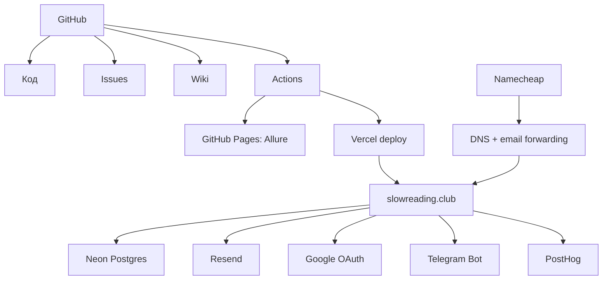

# Внешние сервисы и ресурсы

Эта страница перечисляет внешние ресурсы проекта и объясняет, зачем они нужны.

## Сводная таблица

| Сервис | Зачем нужен | Где проявляется |
| --- | --- | --- |
| GitHub | Код, Issues, Wiki, Actions, Pages. | Репозиторий, CI, Allure, документация. |
| GitHub Wiki | Документация владельца проекта. | Эта Wiki. |
| Vercel | Хостинг и деплой сайта. | Production и fallback домены. |
| Neon Postgres | База данных. | Все runtime-данные. |
| Resend | Отправка писем. | Magic link, digest, feedback emails. |
| Namecheap | Домен и email forwarding. | `slowreading.club`, входящая почта. |
| Google Cloud | OAuth credentials. | Google OAuth и One Tap. |
| Telegram BotFather | Telegram Login Widget. | Telegram auth. |
| Codecov | Coverage unit-тестов. | CI badge, PR coverage. |
| GitHub Pages | Публикация Allure. | `bon2362.github.io/book-club`. |
| PostHog | Аналитика. | Pageviews, events, admin usage widget. |
| Swagger UI | Чтение API-контрактов. | `/api-docs`. |

## Ресурсы по ссылкам

- Сайт: [www.slowreading.club](https://www.slowreading.club)
- Резервный сайт: [book-club-slow-rising.vercel.app](https://book-club-slow-rising.vercel.app)
- Репозиторий: [github.com/bon2362/book-club](https://github.com/bon2362/book-club)
- Issues: [github.com/bon2362/book-club/issues](https://github.com/bon2362/book-club/issues)
- Wiki: [github.com/bon2362/book-club/wiki](https://github.com/bon2362/book-club/wiki)
- Allure: [bon2362.github.io/book-club](https://bon2362.github.io/book-club/)
- Codecov: [codecov.io/gh/bon2362/book-club](https://codecov.io/gh/bon2362/book-club)
- Swagger: [www.slowreading.club/api-docs](https://www.slowreading.club/api-docs)

## Кто за что отвечает

## Важная операционная мысль

Если что-то ломается, не всегда виноват код. Часто проблема находится во внешнем ресурсе:

- истек или отсутствует секрет;
- домен не совпал с настройкой провайдера;
- внешний сервис недоступен;
- GitHub Actions прошел, но Vercel deploy упал;
- Vercel задеплоил, но доменный alias не обновился;
- PostHog или Resend ограничили запрос.
