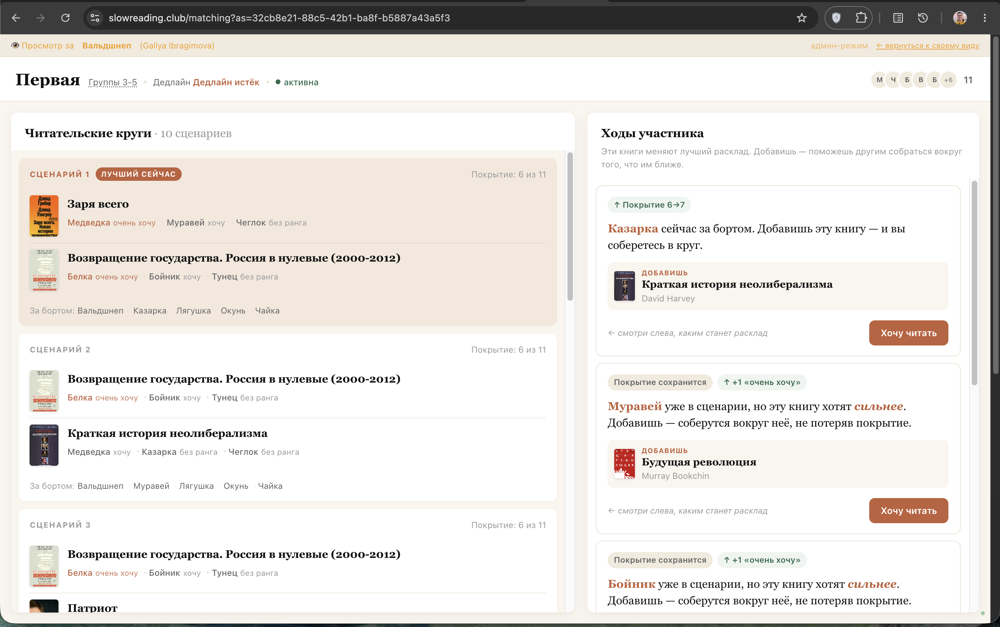
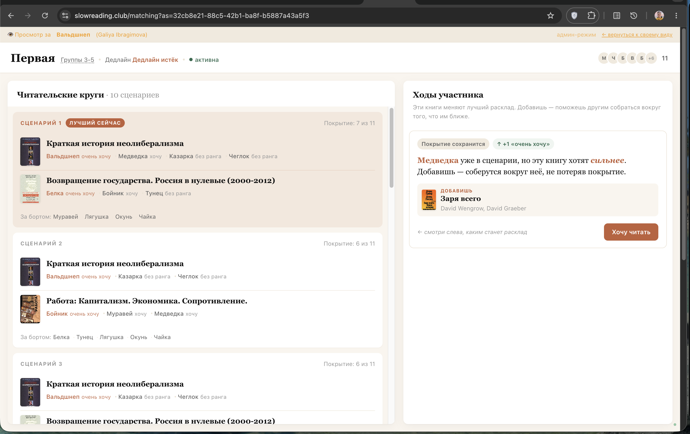
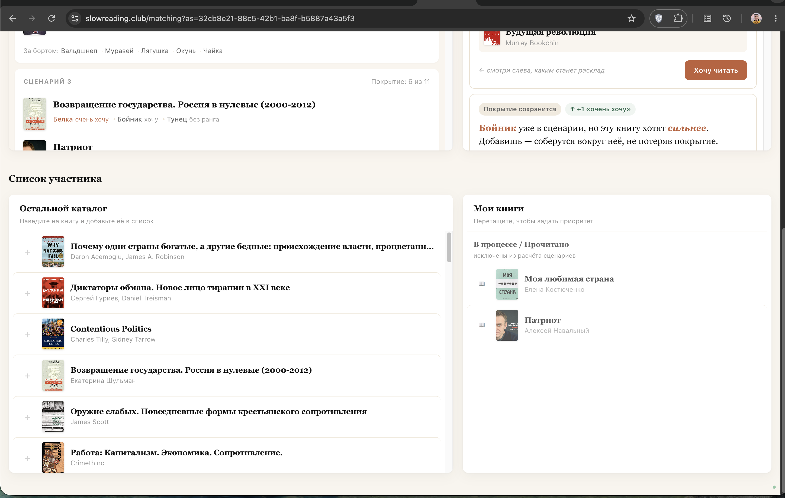

# Group Matching Mode

Matching — координационное пространство, в котором участники книжного клуба совместно выбирают читательские группы в реальном времени. Размер круга задаётся диапазоном: минимум участников, при котором круг считается собранным, и максимум участников в одном круге.

Страница: `/matching`

## Как это работает

1. Администратор создаёт **matching-сессию** (имя, опциональный дедлайн, минимальный и максимальный размер круга) и выбирает режим расчёта: `coverage` или `satisfaction`.
2. Авторизованный пользователь сначала видит приветственный экран с будущим животным псевдонимом. Только после кнопки **«Войти»** создаётся запись участника, и его предпочтения начинают влиять на сценарии.
3. Каждый участник **формирует личный список** книг (из каталога) и расставляет приоритеты (drag-and-drop).
4. Страница показывает **«Читательские круги»** / **«Сценарии»** — набор возможных сценариев распределения. Один сценарий может содержать несколько непересекающихся кругов и список участников без круга.
5. Секция **«Мои ходы»** показывает только значимые действия: книги, которые после добавления меняют лидер-сценарий на первом месте.
6. Администратор **фиксирует сессию** — захватывает текущий лидер-сценарий, денормализует метрики, UI переходит в read-only.
7. Изменения распространяются через **polling**: клиент каждые 3 секунды опрашивает версию сессии (`state_version` в Postgres) и при её росте перезапрашивает состояние. Учитываются не только действия внутри `/matching`, но и изменения участника из каталога, профиля или админки.

## БД-схема

### `matching_sessions`
| Поле | Тип | Описание |
| --- | --- | --- |
| `id` | text PK | UUID |
| `name` | text | Название сессии |
| `status` | text | `active` / `frozen` |
| `min_group_size` | integer | Минимум участников для собранного круга |
| `max_group_size` | integer | Максимум участников в одном круге |
| `optimization_mode` | text | Режим расчёта: `coverage` (по умолчанию) или `satisfaction`; выбирается при создании и может переключаться админом в активной сессии после полной расстановки приоритетов |
| `deadline_at` | timestamp? | Опциональный дедлайн |
| `frozen_at` | timestamp? | Когда была заморожена |
| `frozen_scenario_json` | jsonb? | Лидер-сценарий на момент заморозки |
| `metric_groups_count` | integer? | Кол-во групп (при заморозке) |
| `metric_coverage` | integer? | Охват участников (%) |
| `metric_time_to_freeze_seconds` | integer? | Время от создания до заморозки |
| `metric_top3_hit_rate` | real? | Доля участников, чья топ-3 книга попала в группу |

**Partial unique index**: только одна `active` сессия одновременно.

### `matching_session_participants`
| Поле | Тип | Описание |
| --- | --- | --- |
| `session_id` | text FK → matching_sessions | |
| `user_id` | text FK → user | |
| `pseudonym` | text | Животный псевдоним (стабильный в рамках сессии) |
| `joined_at` | timestamp | |

PK: `(session_id, user_id)`.

### `matching_pseudonym_reservations`
Временный резерв псевдонима для приветственного экрана. Резерв нужен, чтобы показать ник до входа, но не добавлять пользователя в `matching_session_participants` раньше кнопки «Войти».

| Поле | Тип | Описание |
| --- | --- | --- |
| `session_id` | text FK → matching_sessions | |
| `user_id` | text FK → user | |
| `pseudonym` | text | Предварительно выданный псевдоним |
| `reserved_at` | timestamp | Когда создан резерв |
| `expires_at` | timestamp | Когда резерв устаревает |

PK: `(session_id, user_id)`. Unique: `(session_id, pseudonym)`.

### `matching_preference_events`
Персистентная аналитика изменений предпочтений после входа участника в matching-сессию.

| Поле | Тип | Описание |
| --- | --- | --- |
| `id` | text PK | UUID |
| `session_id` | text FK → matching_sessions | Сессия |
| `user_id` | text FK → user | Чьи предпочтения изменились |
| `actor_user_id` | text FK → user | Кто сделал изменение; для админки может отличаться от `user_id` |
| `event_type` | text | `book_added`, `book_removed`, `status_changed`, `catalog_signup_updated`, `priorities_updated`, `participant_left` |
| `source` | text | `matching`, `catalog`, `profile`, `admin` |
| `book_id` | text FK → books? | Книга, если событие относится к одной книге |
| `before` / `after` | jsonb? | Лидер-сценарий до/после изменения |
| `metadata` | jsonb? | Snapshot деталей с уже разрешёнными названиями книг. Для одиночных действий — `bookTitle`. Для `catalog_signup_updated` — дельта набора: `addedBookIds`/`removedBookIds` + читаемые `addedBookTitles`/`removedBookTitles`. Для `priorities_updated` — упорядоченный `rankedBookIds` + `rankedBookTitles`. Названия дописываются в `finalizeMatchingMutationEffects` через `bookTitleById`, поэтому админка показывает «какие именно книги» без собственного резолва id→title. Статусные события несут `status`. Событие `participant_left` несёт `pseudonym` (снимок, т.к. строка участника удаляется при выходе). |
| `occurred_at` | timestamp | Когда произошло |

Событие пишется только если пользователь уже был участником этой сессии на момент изменения (`occurred_at >= joined_at`).

При выходе и удалении участника пишется событие `participant_left`, а псевдоним сохраняется в `metadata.pseudonym` (строка участника удаляется, поэтому псевдоним нужно снять заранее). Два пути:
- **Сам вышел** (`DELETE …/leave`, `source: matching`): до удаления снимается снапшот лидера, после удаления событие пишется через `finalizeMatchingMutationEffects` с `before`/`after` лидера и `skipMembershipGuard: true` (строки участника уже нет, обычный membership-guard её бы отверг). Благодаря снапшотам это событие **попадает в Ленту** — если выход изменил расклад, участники видят «… вышел из сессии → расклад пересчитался».
- **Удалил админ** (`DELETE …/participants/:userId`, `source: admin`): до удаления строки пишется через `recordParticipantLeftEvent` (без снапшота лидера) — попадает в админ-аналитику, но не в Ленту участников.

## API-эндпоинты

| Метод | Путь | Описание |
| --- | --- | --- |
| GET | `/api/matching/sessions` | Список всех сессий (только admin) |
| POST | `/api/matching/sessions` | Создать сессию (только admin). Принимает `optimizationMode: "coverage" | "satisfaction"`, default `coverage`. |
| PATCH | `/api/matching/sessions/:id` | Изменить диапазон размера группы активной сессии (только admin) |
| PATCH | `/api/matching/sessions/:id/mode` | Переключить режим расчёта активной сессии между `coverage` и `satisfaction` (только admin). Доступно только когда каждый участник сессии имеет хотя бы одну активную книгу и у всех активных книг выставлен rank. После переключения инкрементирует `state_version`, поэтому `/matching` обновляется через polling. |
| POST | `/api/matching/sessions/:id/join` | Присоединиться к сессии (участник получает псевдоним) |
| DELETE | `/api/matching/sessions/:id/leave` | Покинуть сессию (только активные сессии) |
| POST | `/api/matching/sessions/:id/freeze` | Заморозить сессию (только admin) |
| GET | `/api/admin/matching/preference-events` | Аналитика изменений предпочтений; фильтры `sessionId`, `userId`, `actorUserId`, `eventType`, `source`, `bookId`, `limit`. Работает для **любой** сессии (активной или зафиксированной) — админка позволяет выбрать сессию и смотреть её историю. Каждое событие обогащено именами: `userName`/`actorName` (из `users`, есть даже у вышедших) и `userPseudonym`/`actorPseudonym` (из участников, `null` после выхода — тогда псевдоним берётся из `metadata.pseudonym`). Админка рисует «Имя (Псевдоним)». |
| GET | `/api/admin/matching/sessions/:id/participants` | Список участников с именами (только admin) |
| POST | `/api/admin/matching/sessions/:id/participants` | Добавить участника из базы пользователей (только admin, только active) |
| DELETE | `/api/admin/matching/sessions/:id/participants/:userId` | Убрать участника из сессии (только admin, только active) |
| GET | `/api/matching/version?session=<id>` | Версия состояния сессии `{ version, status }` для polling (участник или admin) |
| GET | `/api/matching/feed?session=<id>` | Лента значимых событий сессии (`best`, `leftout`) из `matching_preference_events`; ответ содержит только псевдонимы и агрегаты без `userId` |
| GET | `/api/matching/state?session=<id>&as=<userId>` | Текущее состояние (personalBooks, myMoves, legacy `scenarios`/`scenarioOverview`, новый `scenarioSetOverview`) |
| POST | `/api/matching/books` | Добавить книгу в личный список и поставить её на первое место в персональном ранкинге |
| DELETE | `/api/matching/books/:bookId` | Удалить книгу из личного списка |
| PATCH | `/api/matching/priorities` | Обновить порядок книг (drag-and-drop в «Моих книгах»). Пишет событие аналитики `priorities_updated` (`source: matching`) с упорядоченным `rankedBookIds`. |
| PATCH | `/api/signup-books/:bookId/status` | Обновить personal_status книги (`reading` / `read` / `null`) |

Для admin impersonation мутационные endpoints личного списка (`/api/matching/books`, `/api/matching/books/:bookId`, `/api/matching/priorities`, `/api/signup-books/:bookId/status`) поддерживают query `?as=<userId>`. Параметр работает только для админов; обычным пользователям возвращается `403`.

## Realtime-архитектура

- **Сигнал обновления** (`lib/matching/realtime/version.ts`): каждая мутация сессии инкрементирует счётчик `matching_sessions.state_version` через `bumpSessionState`. Это единственный источник «состояние изменилось», и он живёт в Postgres — поэтому работает на любом числе serverless-инстансов. (Раньше использовался in-memory SSE-broadcast, который давал split-brain на Vercel: издатель и подписчик оказывались на разных инстансах, и событие терялось.)
- **Endpoint версии** (`GET /api/matching/version`): отдаёт `{ version, status }` участнику или админу. Клиент `MatchingRealtimeClient` опрашивает его каждые 3 секунды и при росте версии зовёт `router.refresh()`. Никакого payload с типом изменения нет — клиент просто перезапрашивает состояние.
- **Feed** (`lib/matching/realtime/feed.ts`): восстанавливает до 100 значимых событий из `matching_preference_events`; классифицирует только события, которые меняют расклад: `best` и `leftout` («…остался / осталась за бортом» — род глагола согласуется с псевдонимом-животным через `lib/matching/pseudonym-declension.ts`, без гендергепов «остал:ась»). Слово «лучший» в текстах не используется. DTO события `best` несёт `addedCircleBookIds`/`removedCircleBookIds` — по ним фронт (`FeedKeyChip`) разводит подтип чипа: **«Появился круг»** (добавился круг), **«Круг распался»** (исчез), **«Расклад изменился»** (одни круги сменились другими), **«Расклад укрепился»** (круги те же, вырос охват). Событие `participant_left` тоже проходит как `best`/`leftout` (его `kind` входит в `isMatchingMutationKind`); псевдоним актора берётся из `metadata.pseudonym`, т.к. строки участника уже нет. Участникам отдаётся публичный DTO: псевдонимы вместо `userId`, а summary сценария содержит только агрегаты (`coveredCount`, `totalCount`, `strongInterestCount`).
- **Adrift cause** (`lib/matching/adrift.ts`): причина, почему конкретный участник выпал из текущего leader-сценария. Читается из `matching_preference_events` в Postgres (находит последнее событие, выбившее участника из круга) — переживает рестарт инстанса и одинаково видна на всех serverless-инстансах. Если подходящего события нет, UI деградирует к мягкому состоянию «пока не собрался круг».
- **Индикатор связи**: `MatchingRealtimeClient` показывает маленький статус в углу (зелёная точка `●` при успешном опросе, `⟳ синхр.` при сетевой ошибке).

## Приветственный экран и участие

Открытие `/matching` больше не добавляет пользователя в сессию автоматически. Для пользователя, который авторизован, но ещё не в `matching_session_participants`, страница показывает welcome screen:

- объясняет, зачем нужна сессия;
- показывает псевдоним из `matching_pseudonym_reservations`;
- показывает иллюстрацию псевдонима: фотографию вида или букву-категорию как запасной вариант;
- даёт кнопку «Другой ник» — перевыбрать предварительный псевдоним на другой случайный свободный (до вступления). Перезаписывает бронь `matching_pseudonym_reservations`; после «Войти» ник фиксируется;
- даёт кнопку «Войти».

### Фотографии видов-псевдонимов

На приветственном экране `/matching` отображается фотография вида-псевдонима — широким баннером сверху карточки, целиком (без обрезки, `object-fit: contain`). Источник фотографий — Wikimedia Commons, свободные лицензии (PD, CC0, CC-BY, CC-BY-SA, GFDL, Attribution, Copyrighted free use, FAL). Под каждым фото выводится атрибуция автора и лицензии. Фото есть для всех 208 ников из пула; если бы для вида фото не нашлось, показывалась бы буква-категория (как и внутри самой сессии). Для ников, чья статья — страница неоднозначности или озаглавлена иначе, в скрипте `scripts/fetch-pseudonym-photos.ts` задана таблица соответствий `MANUAL_TITLES`.

Фото собираются вручную скриптом `scripts/fetch-pseudonym-photos.ts` и хранятся в `public/matching/species/`. Манифест с путями, авторами и лицензиями — `lib/matching/species-images.generated.ts`.

**Как поменять фото конкретного вида:**
- *Другое заглавное фото статьи Википедии* — добавить ник в таблицу `MANUAL_TITLES` (ник → название статьи).
- *Конкретный файл Commons* (не заглавное фото, например иллюстрация из середины статьи) — добавить ник в таблицу `MANUAL_FILES` (ник → имя файла без префикса `File:`).
- Обновить **один** ник, не перегоняя все: `npx ts-node --transpile-only -P tsconfig.scripts.json scripts/fetch-pseudonym-photos.ts «Ник»` — остальной манифест сохраняется.
- *Посмотреть все используемые фото разом* — на сайте есть страница **`/admin/gallery`** (только для админа, ссылка во вкладке «Матчинг» админки): сетка всех фото с ником, лицензией и ссылкой на Commons. Альтернатива офлайн — `npx ts-node --transpile-only -P tsconfig.scripts.json scripts/build-species-gallery.ts` → `species-gallery.html` (в `.gitignore`).

### Карта сайта (`/admin/sitemap`)

Страница `/admin/sitemap` (только для админа, ссылка в админке) — список всех страниц сайта. Генерируется из файловой структуры скриптом `scripts/build-routes.ts` (сканирует `app/**/page.tsx`) в `lib/site-routes.generated.ts`. Перегенерировать при добавлении/удалении страниц: `npx ts-node --transpile-only -P tsconfig.scripts.json scripts/build-routes.ts`.

Только `POST /api/matching/sessions/:id/join` создаёт участника. После этого список пользователя, ранги и статусы начинают влиять на сценарии, ленту и аналитику.

## Режим расчёта (`coverage` / `satisfaction`)

Режим выбирается администратором при создании сессии. Сама строка «Режим: …» в шапке `/matching` показывается **только админу** — обычным участникам тип расчёта не отображается (им он не нужен и сбивает с толку). В активной сессии админ также видит рядом переключатель: он меняет `coverage` ↔ `satisfaction` без перехода в админку. Кнопка доступна только когда все участники уже подготовили данные для обоих режимов: у каждого есть хотя бы одна активная книга, и все активные книги расставлены по приоритету. Это защищает переключение в `satisfaction` от внезапной пустой доски и делает обратное переключение симметричным.

Зафиксированная сессия режим не меняет: freeze должен сохранить тот же тип лидера, который был виден на странице `/matching` в момент фиксации.

### `coverage` — режим по умолчанию

Это историческое поведение. Система сначала максимизирует охват участников, затем использует качество интереса как tie-breaker:

- больше `coveredCount`;
- больше участников с книгой в топ-3 (`strongInterestCount`);
- ниже `avgRank`;
- ниже `worstRank`;
- меньше записей без rank.

UI использует привычную терминологию «Читательские круги», лидер подсвечивается как лучший сейчас, а состояние «за бортом» подаётся как проблема, которую можно попытаться исправить через «Мои ходы».

### `satisfaction` — качество интересов первым

В этом режиме сценарии сравниваются по качеству кругов, а охват становится вторичным следствием. Круг лучше, если у него ниже средний rank, затем ниже худший rank, затем больше размер при равном качестве. Сценарии сравниваются лексикографически по отсортированным лучшим кругам: один идеальный круг может быть выше более полного, но менее желанного расклада.

Для `satisfaction` действует дополнительный gate: в расчёт попадают только активные signup'ы, у которых есть rank для пары `(userId, bookId)`. Если участник вошёл в active-сессию, но у него нет активных книг или хотя бы одна активная книга ещё без rank, `/matching` показывает промежуточный экран **«Сначала расставьте приоритеты»**. На этом экране личный список сохраняется молча без `router.refresh()` после каждого действия; доска открывается только по кнопке **«Войти в подбор»**, когда все активные книги участника имеют приоритет. Admin impersonation (`?as=`) gate обходит и сразу показывает доску.

В UI satisfaction-режима:

- панель называется «Сценарии»;
- карточки равновесные: нет бейджа «лучший сейчас» и нет тревожного выделения лидера;
- основная метрика карточки — «средний ранг», охват показывается вторично;
- показываются все сгенерированные ранжированные сценарии, без дефолтного ограничения в 10 вариантов;
- не показываются Парето-доминируемые сценарии: если другой сценарий сохраняет все те же пары «участник → книга» и добавляет хотя бы одну новую (тот же круг с расширенным составом или дополнительные независимые круги), усечённый вариант скрывается;
- «за бортом» заменяется нейтральным «Пока без круга»;
- adrift-баннер смягчается до «Вы пока не в круге» и показывается только если участник не попал ни в один сценарий; отсутствие в сценарии с лучшим ранком само по себе не считается проблемой.

`POST /api/matching/sessions/:id/freeze`, `/matching`, `/api/matching/state` и `fetchScenarioContextForSession` используют один и тот же `optimization_mode` и один и тот же фильтр active/ranked signup'ов, чтобы зафиксированный сценарий не расходился с live-доской.

## Лента и «за бортом»

Лента событий доступна в шапке `/matching` и по умолчанию свёрнута. Она показывает только события, которые изменили расклад:

- `best` — лидер-сценарий изменился или укрепился. Чип разводит подтип по диффу кругов: «Появился круг» / «Круг распался» / «Расклад изменился» / «Расклад укрепился». Деталь описывает действие актора (с учётом рода: «Барсук добавил…», «Белка убрала…», «… вышел из сессии») и при необходимости суффикс охвата;
- `leftout` — в `leader.leftOut` появился участник, которого там раньше не было.

Источником `best`-события может быть не только правка книг/приоритетов, но и **выход участника** (`participant_left`): если самостоятельный выход изменил лидера, в Ленте появляется «… вышел из сессии → расклад пересчитался». Присоединение нового участника отдельным событием Ленты пока не отражается.

Если текущий пользователь находится в `leader.leftOut`, над блоком сценариев показывается баннер «Вы за бортом». В `satisfaction` это правило мягче: баннер показывается только когда пользователя нет ни в одном круге ни одного сценария. Есть два режима:

- `change` — есть свежая причина из ленты: кто и какую книгу добавил/убрал/изменил (род согласуется с псевдонимом через `pseudonym-declension.ts`, без гендергепов);
- `never` — причина неизвестна или пользователь не был в круге с самого начала.

В мягком (`satisfaction`) варианте баннер «Вы пока не в круге» можно закрыть кнопкой «Понятно». Факт закрытия запоминается в `localStorage` (ключ `matching:adrift-dismissed:<sessionId>`, значение — id лидер-сценария) и держится, **пока не изменится расклад**: при смене лидер-сценария баннер возвращается, а как только пользователь снова попадает в круг (`adrift == null`) — отметка о закрытии сбрасывается. Логика закрытия живёт в `MatchingImpactWorkspace`, презентация — в `MatchingAdriftBanner`.

В строке «За бортом» внутри scenario card свой псевдоним получает пометку `· вы`.

## Personal status (личный статус книги)

Каждый участник может отметить книгу из своего списка:

| Статус | Значение | Поведение |
| --- | --- | --- |
| `null` | «Записал:ась» | Активный кандидат для матчинга |
| `reading` | «Читаю сейчас» | Исключён из матчинга для новых групп |
| `read` | «Прочитал:а» | Исключён из матчинга для новых групп |

Хранится в `signup_books.personal_status`. Изменяется через дропдаун в книжном попапе. В интерфейсе `/matching` каталог находится ниже первого экрана и разделён на две колонки: слева остальной каталог, справа книги участника. Книги с установленным статусом отображаются в отдельной секции «В процессе / Прочитано» в правой колонке и не участвуют в новых сценариях.

В чипах других участников статус тоже отображается: «Читаю сейчас» / «Прочитал:а» / «очень хочу» / «хочу» / «без ранга». Ранги 1–3 считаются «очень хочу» и выделяются зелёным акцентом; остальные чипы нейтральные. Tooltip чипа показывает позицию: «книга на N месте» или «приоритет не задан».

## Книжный попап

Клик по книге в «Каталоге», «Читательских кругах» или «Моих ходах» открывает один общий попап с деталями книги: обложка, автор, год/страницы, теги, описание, «Почему предлагаю читать», ссылка на текст, recommendation link и список «Записались на книгу:». Закрывается крестиком в правом верхнем углу, кликом по затемнению или клавишей Escape.

В «Читательских кругах» и «Моих ходах» используются те же псевдонимы участников, что и в «Каталоге»; user id не показываются.

## Сценарий engine

`lib/matching/scenarios.ts` — pure function, без side-effects. Алгоритм:
1. Принимает только активные записи (`personal_status IS NULL`) — фильтрация происходит до вызова функции. В режиме `satisfaction` дополнительно остаются только записи с заданным rank.
2. Исключает книги без записей участников текущей сессии.
3. Строит кандидатные круги размером от `min_group_size` до `max_group_size`. Для небольших книг перебирает все комбинации, для больших — ограниченный набор сильных и разнообразных комбинаций, чтобы не потерять слабый, но полезный для покрытия круг.
4. Собирает сценарии как наборы непересекающихся кругов: участник и книга не повторяются внутри одного сценария.
5. Считает score сценария:
   - `coveredCount` — сколько уникальных участни:ц попали в круги внутри сценария. Если в сценарии два круга по 3 человека, `coveredCount = 6`. Это главный показатель: система сначала старается вовлечь максимум людей.
   - `coverageRatio` — доля покрытых участников от всех участников сессии. Например, всего 11 человек, в сценарии покрыто 6: `coverageRatio = 6 / 11 = 0.545`. Сейчас это скорее справочная метрика; в сортировке сценариев используется `coveredCount`.
   - число участников с книгой в топ-3 — участники, у которых книга в этом круге стоит на 1, 2 или 3 месте. В интерфейсе это категория `очень хочу`.
   - `strongInterestCount` — сколько всех участников во всех кругах сценария читают книгу, которая у них в топ-3. Например, два круга по 3 человека, и в каждом круге по 2 участника имеют книгу в топ-3: `strongInterestCount = 4`.
   - `wantsCount` — метрика на уровне отдельного круга, не всего сценария. Сколько участников этого круга имеют книгу в топ-3, то есть `rank <= 3`. По смыслу это локальный аналог `strongInterestCount` для одного круга.
   - `rankSum` — сумма точных рангов всех участников в сценарии, у кого rank задан. Чем меньше, тем лучше. Например, ранги `1, 2, 4` дают `rankSum = 7`. Сейчас в сортировке напрямую не используется, но из него считается `avgRank`.
   - `avgRank` — средний точный rank по участникам сценария, у кого rank задан. Чем меньше, тем лучше. Например: `1, 2, 4 → avgRank = 2.33`. Это позволяет отличить сценарий, где книги в среднем выше в списках.
   - `worstRank` — самый плохой точный rank среди участников сценария, у кого rank задан. Чем меньше, тем лучше. Например: `1, 2, 9 → worstRank = 9`. Используется как защита от сценария, где среднее нормальное, но одному человеку досталась книга очень низко в списке.
   - `unrankedCount` — сколько участников в сценарии записаны на книгу, но у них нет заданного rank для этой книги. Чем меньше, тем лучше. Такие участники отображаются как `без ранга`.
6. В режиме `coverage` сортирует сценарии так:
   - `coveredCount DESC`
   - `strongInterestCount DESC`
   - `avgRank ASC`
   - `worstRank ASC`
   - `unrankedCount ASC`
7. В режиме `coverage` по умолчанию возвращает до 10 сценариев. Это ограничение защищает исторический режим от слишком большого набора вариантов в UI и downstream-логике.
8. В режиме `satisfaction` сортирует сначала качество кругов: `avgRank ASC`, `worstRank ASC`, больший размер круга, затем стабильный id. Сценарии сравниваются лексикографически по лучшим кругам; coverage-тиры не применяются.
9. В режиме `satisfaction` дефолтный лимит 10 не применяется: UI получает все сгенерированные ранжированные сценарии, если caller явно не передал `maxResults`.
10. Возвращает `scenarioSetOverview`: `scenarios`, `leader`, `totalCount`, `minGroupSize`, `maxGroupSize`, `mode`. UI показывает каждый сценарий отдельной карточкой с вложенными кругами и участниками без круга.
11. Legacy-обёртки `generateScenarioOverview()` и `generateScenarios()` сохранены для переходного периода и freeze-логики. Они возвращают старую форму `ScenarioCard[]`/`scenarioOverview`, уважают `maxResults` и наследуют `mode`.
12. Tier сценариев: в `coverage` — `leader` = лучший сценарий, `full-coverage` = альтернативы со 100% покрытием, `best-achievable-partial` = лучшие частичные сценарии, `partial` = остальные. В `satisfaction` индекс 0 остаётся `leader` для совместимости, остальные — `partial`, но UI не подаёт leader как окончательный вердикт.

### Как работает `worstRank`

`worstRank` участвует как tie-breaker: он не перебивает покрытие, число `очень хочу` или средний rank, но помогает выбрать более ровный сценарий среди почти равных.

Пример:

| Показатель | Сценарий A | Сценарий B |
| --- | --- | --- |
| Ранги | `1, 2, 6` | `1, 4, 4` |
| `coveredCount` | `3` | `3` |
| `strongInterestCount` | `2` | `1` |
| `avgRank` | `3` | `3` |
| `worstRank` | `6` | `4` |

Здесь победит сценарий A, потому что у него больше `strongInterestCount`: двое участников читают книгу из топ-3, а в сценарии B только один. До `worstRank` дело не дойдёт.

Другой пример:

| Показатель | Сценарий A | Сценарий B |
| --- | --- | --- |
| Ранги | `1, 2, 6` | `1, 3, 5` |
| `strongInterestCount` | `2` | `2` |
| `avgRank` | `3` | `3` |
| `worstRank` | `6` | `5` |

Здесь покрытие, `strongInterestCount` и `avgRank` одинаковые. Победит сценарий B, потому что худший участник в нём всё-таки на 5 месте, а не на 6.

## UX влияния ходов

Первый экран `/matching` показывает только «Читательские круги» и «Мои ходы», у обеих секций есть внутренний скролл. В «Моих ходах» показываются не все книги, где участник может замкнуть круг, а только те действия, которые после симуляции делают другой сценарий лидером: новый сценарий занимает первое место или существующий сценарий поднимается на первое место. Если ход не увеличивает покрытие и никому не улучшает личный расклад, он скрывается.

Карточка хода объясняет **кому поможет действие**. Для каждого хода сервер передаёт `impact`: покрытие до/после, число участников с интересом «очень хочу» до/после и список бенефициаров. Бенефициар — не любой участник нового круга, а только тот, кому стало строго лучше: он был «за бортом» при одновременном росте общего покрытия или перешёл на книгу с более сильным интересом (`без ранга → хочу`, `хочу → очень хочу`). Zero-sum ход, где один участник выходит «из-за борта» только за счёт вытеснения другого, не показывается. В карточке показывается переход `было → стало`, например `за бортом → очень хочу` или `«Заря всего» · хочу → очень хочу`.

Ходы сортируются по силе влияния: в `coverage` — прирост покрытия, затем прирост «очень хочу», затем название книги. В `satisfaction` meaningful считается ход, где сам зритель попадает из состояния без круга в круг или получает строго лучший rank; сортировка идёт по личному улучшению rank (leftOut → placed считается самым сильным), затем по названию. В UI карточки равнозначны: порядок сохраняется, но первый ход не получает отдельный ярлык «лучший».

При hover/focus карточки хода левая секция «Читательские круги» временно показывает preview-сценарий: расклад, который стал бы лучшим, если участник добавит эту книгу. Preview появляется сверху списка с пунктирной рамкой «Нашёлся расклад лучше», а текущий лидер остаётся сразу под ним в приглушённом виде. Так пользователь видит сравнение «станет / сейчас» без отдельной таблицы объяснений. При уходе курсора preview плавно сворачивается; на touch-устройствах это остаётся ограничением desktop-эксперимента.

В самой карточке хода остаётся короткое текстовое объяснение. Например: «Муравей уже в сценарии, но эту книгу хочет сильнее. Добавишь — соберутся вокруг неё, не потеряв покрытие». Блок «Кому это поможет» больше не используется: состав нового сценария виден в preview слева.

### Пояснения к ходам в satisfaction-режиме

В режиме `satisfaction` карточки «Мои ходы» говорят на человеческом языке: вместо технического «↑ ранг 20→1» участник видит конкретные имена и что именно изменится для каждого.

**Пилюля на карточке** называет конкретного участника и говорит коротко: «Барсуку — интереснее» или «Вам — интереснее». Она отображает самого значимого бенефициара хода. Если ход помогает только другим, а не тебе лично — карточка всё равно показывается: это альтруистичный ход, который улучшает расклад для кого-то из участников круга.

**Why-text под пилюлей** раскрывает механику: «Барсук ставит твою книгу на 1-е место, а книгу нынешнего круга — на 20-е. Соберётесь вокруг неё — расклад станет интереснее для Барсука и ещё 2 участников». Если польза достаётся только одному человеку, число других участников не упоминается.

**Что считается улучшением.** Улучшение — строго более низкий rank (позиция), то есть книга поднялась в личном списке участника. Участник, у которого не было круга, а теперь есть — тоже считается бенефициаром. Нейтральные ситуации (rank не изменился, участник и так в круге) не считаются улучшением и не упоминаются.

**Псевдонимы склоняются.** Чтобы фраза «Барсуку — интереснее» звучала по-русски, имена животных-псевдонимов склоняются по падежам. Для всех 208 псевдонимов из пула заранее сгенерированы нужные падежные формы (через библиотеку `russian-nouns-js`). Статическая таблица склонений хранится в `lib/matching/pseudonym-declension.ts`.

При добавлении книги через matching-сессию (`POST /api/matching/books`) книга автоматически становится первым пунктом персонального ранкинга, а остальные ранги сдвигаются вниз. Это отражает UX-допущение: если участник нажал «Хочу читать» в «Моих ходах» или matching-каталоге, книга должна сразу считаться сильным предпочтением и реально влиять на сценарии.

У заголовка сценария есть tooltip с расчётом позиции: покрытие, число «очень хочу», средний rank, худший rank и число записей без rank.

### Примеры сценариев и ходов

#### Ход увеличивает покрытие

Исходный лидер-сценарий покрывает 6 из 11 участников. Например, Вальдшнеп сейчас за бортом, а «Краткая история неолиберализма» уже набирает достаточно людей, если Вальдшнеп добавит её в список. Такой ход показывается не потому, что Вальдшнеп сам входит в круг, а потому что вместе с ним из-за борта выходит другой участник — Казарка. После симуляции:

- новый лидер-сценарий покрывает 7 из 11 участников;
- Вальдшнеп входит в круг, но сам не считается бенефициаром своего хода;
- Казарка была «за бортом» и становится участником круга;
- поэтому ход проходит фильтр «улучшает положение других участни:ц».



#### Ход сохраняет покрытие, но улучшает интерес других

Другой тип хода не увеличивает число покрытых участников, но меняет лучший сценарий так, что кто-то из уже покрытых участников попадает на более желанную книгу. В карточке это видно как метрика `Покрытие сохранится` и прирост `+N «очень хочу»`.

Такой ход показывается, если хотя бы один другой участник получает строго более сильный интерес. Например, он был в сценарии на книге с интересом `хочу`, а после хода окажется в круге на книге `очень хочу`.

#### Почему ход может появиться только после другого хода

Неочевидный случай: ход «добавить Заря всего» может не показываться сначала, но появиться после того, как пользователь добавил другую книгу.

Пример с Вальдшнепом:

1. До первого действия Вальдшнепу предлагается добавить «Краткую историю неолиберализма». Этот ход увеличивает покрытие с 6 до 7.
2. «Заря всего» сначала не предлагается, потому что главный выигрыш от неё в текущем раскладе приходится на самого Вальдшнепа или не даёт строгого улучшения другим участникам. По текущему фильтру это не считается ходом влияния на других.
3. После добавления «Краткой истории неолиберализма» лидер-сценарий меняется: Вальдшнеп уже внутри лучшего расклада.
4. Теперь добавление «Зари всего» может улучшить положение другого участника — например, Медведка уже в сценарии, но эту книгу хочет сильнее. Поэтому ход появляется как `Покрытие сохранится` и `+1 «очень хочу»`.
5. После добавления «Зари всего» доступных ходов может не остаться: среди оставшихся книг больше нет действий, которые меняют лидер-сценарий и улучшают положение других участников.



Этот пример важен: «Мои ходы» зависят от текущего лидер-сценария. Это не статический список книг, которых кому-то не хватает, а список действий, которые полезны относительно текущего лучшего расклада.

#### Ход не показывается, хотя пользователь сам мог бы попасть в круг

Если добавление книги помогает только текущему пользователю, но не улучшает положение других участников, ход скрывается. Например:

- текущий пользователь был за бортом;
- после добавления он входит в круг;
- общий лидер-сценарий меняется;
- но другие участники не получают улучшения интереса, либо кто-то другой оказывается вытеснен.

Такой ход может быть полезен самому человеку, но не соответствует назначению секции «Мои ходы»: показывать возможности повлиять на общий расклад.

#### Zero-sum ход

Zero-sum ход — это действие, где один участник выходит «из-за борта», но другой вместо него оказывается «за бортом», а интересы остальных не улучшаются. Такой ход скрывается, даже если новый круг выглядит формально собранным. Иначе интерфейс показывал бы действия, которые создают ощущение прогресса, но не улучшают общий расклад.

#### Полное покрытие не значит, что ходов нет

Если текущий лидер-сценарий покрывает всех участников, ходы всё ещё могут быть доступны. Они показываются, если меняют лидер-сценарий и улучшают суммарное качество предпочтений: например, больше участников попадают на книги из топ-3. В таком случае метрика покрытия не растёт, но растёт число `«очень хочу»`.

#### Неполное покрытие может быть нормальным

Если 7 из 8 участников выбрали две пересекающиеся книги, а восьмой не хочет ни одну из них, лучший сценарий может честно оставить восьмого «за бортом». Engine не стремится любой ценой включить всех, если для этого нет валидного круга от `min_group_size` до `max_group_size`.

### Пограничные состояния

#### Недостаточно участников

Если участников меньше `min_group_size`, «Читательские круги» показывает пустое состояние: «Пока недостаточно участников или записей для формирования кругов. Нужно минимум N». `N` берётся из `min_group_size`.

#### Достаточно участников, но нет валидных кругов

Если участников достаточно, но ни одна книга не набрала минимум `min_group_size` активных записей, сценарии не строятся. Участники могут быть в сессии, но кругов нет.

#### Нет доступных ходов

«Мои ходы» показывает пустое состояние «Пока нет книг, где твоя заявка изменит лучший сценарий», если после симуляции ни одна книга не проходит фильтры:

- добавление не меняет лидер-сценарий;
- будущий лидер не содержит текущего пользователя в круге на добавляемой книге;
- ход меняет только положение текущего пользователя;
- ход является zero-sum;
- книга уже есть в списке пользователя;
- на книге недостаточно других активных участников;
- другие участники на книге имеют `personal_status = reading/read`, поэтому исключены из новых сценариев.

#### Книги в процессе или прочитанные

Книги со статусом `reading` или `read` остаются в личном списке, но исключаются из расчёта новых сценариев и ходов. На скриншоте ниже такие книги видны в секции «В процессе / Прочитано».



#### Изменение диапазона размера группы

Если администратор меняет `min_group_size` или `max_group_size` во время активной сессии, сценарии и ходы пересчитываются. Например, при диапазоне 3–5 один сценарий может включать круги 3+4, а не только ровные тройки. После сохранения настройки всем участникам отправляется realtime-обновление.


## Admin-режим `?as=`

Администратор может просматривать данные любого участника:

```
/matching?as=<userId>
```

- Показывает личный список и «Мои ходы» участника.
- Баннер «Просмотр за [псевдоним]».
- Админ может добавлять/удалять книги участника, менять порядок и статусы. Client вызывает мутационные endpoints с `?as=<userId>`.
- Просмотры `?as=` нигде не логируются (бывшая таблица `admin_views` удалена за ненадобностью).

## Управление участниками

### Пользователь покидает сессию

Кнопка «Покинуть» в шапке `/matching` видна только в активной сессии и только для своего аккаунта (скрыта при impersonation и frozen). При нажатии — confirm-диалог → `DELETE /api/matching/sessions/:id/leave` → редирект на `/`.

После выхода запись в `matching_session_participants` удаляется. При следующем визите на `/matching` auto-join добавит пользователя обратно с новым псевдонимом (старые сигнапы и приоритеты сохраняются).

### Администратор управляет составом

Вкладка «Матчинг» в Админ-панели → переключатель сессий (чипы) позволяет выбрать любую сессию — активную или зафиксированную — и посмотреть её состав, метрики заморозки и аналитику изменений предпочтений. Управление составом доступно только для активной сессии:
- Таблица участников: псевдоним, имя/id пользователя, время вступления; для активной — кнопка «Убрать»
- Форма добавления (только для активной): выпадающий список пользователей, не состоящих в сессии → «Добавить»

Зафиксированные сессии открываются в режиме только-чтения. Добавление работает по той же логике что и auto-join: присваивает уникальный животный псевдоним. Мутации работают только для `status = active` и инкрементируют `state_version` сессии, который участники подхватывают опросом `/api/matching/version`.

Состояние не раскрывает `userId` через сигнал обновления — клиент знает только, что версия выросла, и заново запрашивает `/api/matching/state`. `/api/matching/state` доступен только участникам текущей сессии или админу; для обычных участников внутренние `userId` в сценариях, «моих ходах» и left-out списках заменяются на псевдонимы. Админский `?as=<userId>` сохраняет реальные id, потому что это рабочий интерфейс владельца клуба.

## Заморозка сессии

Действие: Админ-панель → Матчинг → «Зафиксировать».

При заморозке:
- `status` → `frozen`, `frozen_at` = now.
- `frozen_scenario_json` = текущий лидер-сценарий.
- Денормализуются метрики: `metric_groups_count`, `metric_coverage`, `metric_time_to_freeze_seconds`, `metric_top3_hit_rate`.
- Заморозка инкрементирует `state_version`, как любая мутация, поэтому клиенты при следующем опросе перезапрашивают состояние и видят read-only; снимок сценария хранится в базе.
- UI на `/matching` переходит в read-only (drag-and-drop, кнопки добавления/удаления книг заблокированы).

## Ключевые файлы

| Файл | Назначение |
| --- | --- |
| `app/matching/page.tsx` | Главная страница матчинга (server component) |
| `lib/matching/personal-list.ts` | Личный список книг участника с рангами |
| `lib/matching/scenarios.ts` | Сценарий engine (pure function) |
| `lib/matching/my-moves.ts` | «Мои ходы» — книги, которых не хватает одного участника |
| `lib/matching/middleware.ts` | Shared guards: auth, `?as=`, session freeze check |
| `lib/matching/realtime/version.ts` | `bumpSessionState`/`getSessionState` — счётчик `state_version` в Postgres (сигнал обновления) |
| `lib/matching/realtime/feed.ts` | Persistent feed с классификацией событий и публичным DTO без внутренних userId |
| `components/nd/MatchingPersonalList.tsx` | Drag-and-drop список книг участника |
| `components/nd/MatchingScenarios.tsx` | Карточки сценариев с цветовым кодированием |
| `components/nd/MatchingMyMoves.tsx` | Секция «Мои ходы» |
| `components/nd/MatchingBookDetailModal.tsx` | Общий попап деталей книги для всех matching-секций |
| `components/nd/MatchingWelcome.tsx` | Приветственный экран с фото/буквой-глифом вида-псевдонима |
| `lib/matching/species-images.generated.ts` | Манифест фото видов (208 видов, пути + атрибуция) |
| `components/nd/matching-shared.ts` | Общие подписи статусов и палитра псевдонимов |
| `components/nd/MatchingRankNudge.tsx` | Баннер-нападка для участников без рангов |
| `components/nd/MatchingRealtimeClient.tsx` | Polling-клиент: опрашивает `/api/matching/version` каждые 3с, при росте версии → `router.refresh()` |
| `components/nd/MatchingRealtimeWrapper.tsx` | Server → Client bridge для router.refresh() |
| `components/nd/AdminMatchingSession.tsx` | Admin UI: переключатель сессий, создание/заморозка, состав, аналитика предпочтений (для любой сессии) |
| `lib/matching/preference-event-display.ts` | Чистые хелперы отображения аналитики: лейблы событий, `formatParticipant`, `eventDetail` |
| `app/api/matching/` | Все API-эндпоинты матчинга |
| `drizzle/0028_matching_tables.sql` | Миграция: matching_sessions, participants, admin_views |
| `drizzle/0029_matching_signup_books.sql` | Миграция: добавление matching FK в signup_books |
| `drizzle/0030_matching_freeze_metrics.sql` | Миграция: метрики заморозки |
| `drizzle/0031_signup_books_personal_status.sql` | Миграция: personal_status на signup_books |
| `drizzle/0036_drop_admin_views.sql` | Миграция: удаление таблицы `admin_views` |
| `app/api/signup-books/[bookId]/status/route.ts` | PATCH: обновить personal_status |
