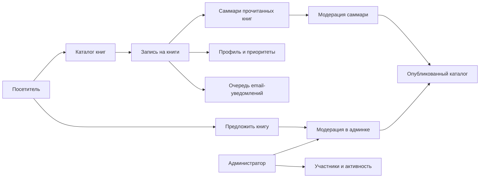

# Долгое наступление: документация владельца проекта

Эта Wiki описывает сайт книжного клуба с точки зрения владельца: какие части системы существуют, как они связаны между собой, где живут данные, какие внешние сервисы участвуют и что проверять, если что-то ломается.

Документация не заменяет код и не пытается объяснить каждую функцию. Ее задача другая: дать понятную карту проекта, чтобы можно было принимать продуктовые и операционные решения без погружения в детали реализации.

## Быстрые ссылки

- [Карта проекта](Project-Map)
- [Архитектура системы](System-Architecture)
- [Данные и база](Data-and-Database)
- [Авторизация и пользователи](Auth-and-Users)
- [Каталог книг](Books-Catalog)
- [Саммари книг от участников](Book-Summaries)
- [Панель администратора](Admin-Panel)
- [Заявки, записи и приоритеты](Submissions-Signups-and-Priorities)
- [Уведомления и письма](Notifications-and-Email)
- [Внешние сервисы и ресурсы](External-Services-and-Resources)
- [API и Swagger](API-and-Swagger)
- [Хостинг, деплой и домены](Hosting-Deployment-and-Domains)
- [Качество: CI, Allure, Codecov](Quality-CI-Allure-and-Codecov)
- [Аналитика и PostHog](Analytics-and-PostHog)
- [Приватность и данные пользователей](Privacy-and-User-Data)
- [Операционные сценарии](Operations-Runbook)
- [Глоссарий](Glossary)

## Главная идея системы

Сайт помогает собрать людей вокруг книг. Пользователь выбирает книги, оставляет контакт, может расставить приоритеты, предложить новую книгу и потом вернуться к своему профилю. Администратор видит участников, каталог, заявки, фидбеки, статусы деплоя, тестов и очереди уведомлений.

## Что важно помнить

- Runtime-источник каталога сейчас **Postgres**, а не Google Sheets.
- Опубликованные саммари участников хранятся в Postgres и проходят админскую модерацию.
- Основной домен: [www.slowreading.club](https://www.slowreading.club).
- Резервный Vercel-домен: [book-club-slow-rising.vercel.app](https://book-club-slow-rising.vercel.app).
- Репозиторий: [bon2362/book-club](https://github.com/bon2362/book-club).
- API-документация: [Swagger UI](https://www.slowreading.club/api-docs).
- E2E-отчеты: [Allure на GitHub Pages](https://bon2362.github.io/book-club/).
- Покрытие unit-тестов: [Codecov](https://codecov.io/gh/bon2362/book-club).

## Статус документации

Полная замена старой Wiki выполнена 2026-05-25. Старые страницы считались устаревшими и не переносились как источник истины.

Исходники этой Wiki живут в `docs/wiki/` основного репозитория. После push в `main` GitHub Actions синхронизирует их в GitHub Wiki.
