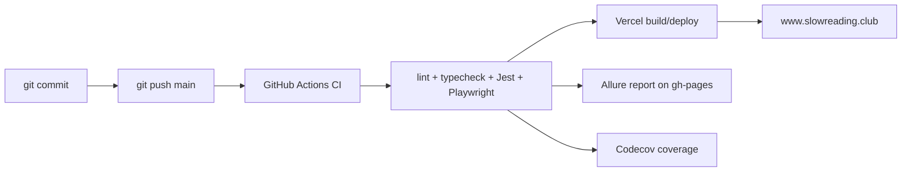

# Хостинг, деплой и домены

Проект хостится на Vercel. Код живет в GitHub. Push в `main` запускает проверки и production-деплой.

## Ресурсы

| Ресурс | Значение |
| --- | --- |
| Production | [www.slowreading.club](https://www.slowreading.club) |
| Резервный домен | [book-club-slow-rising.vercel.app](https://book-club-slow-rising.vercel.app) |
| Auto-alias | `book-club-lilac.vercel.app` |
| Vercel team | `bon2362-5067s-projects` |
| Vercel project id | `prj_ZwWgPCcLf8RyrxeMJDI5zCX08dEp` |
| GitHub repo | [bon2362/book-club](https://github.com/bon2362/book-club) |
| GitHub Wiki | [book-club Wiki](https://github.com/bon2362/book-club/wiki) |

## Деплой

## Домены и DNS

Основной домен `slowreading.club` куплен и настроен через Namecheap. На стороне Vercel домен привязан к проекту.

Для Telegram Login Widget важно, чтобы домен в BotFather совпадал точно. `www.slowreading.club` и `slowreading.club` считаются разными доменами.

## Переменные окружения

Главные переменные:

| Переменная | Назначение |
| --- | --- |
| `DATABASE_URL` | Neon Postgres. |
| `NEXTAUTH_SECRET` | Подпись сессий NextAuth. |
| `GOOGLE_CLIENT_ID` / `GOOGLE_CLIENT_SECRET` | Google OAuth. |
| `NEXT_PUBLIC_GOOGLE_CLIENT_ID` | Google One Tap на клиенте. |
| `TELEGRAM_BOT_TOKEN` | Проверка Telegram HMAC. |
| `NEXT_PUBLIC_TELEGRAM_BOT_NAME` | Имя Telegram bot для widget. |
| `ADMIN_EMAIL` | Email первого/главного администратора. |
| `RESEND_API_KEY` | Отправка писем. |
| `CRON_SECRET` | Защита cron endpoints. |
| `GH_TOKEN` | Админский виджет GitHub Actions. |
| `VERCEL_TOKEN` | Админский виджет Vercel deploy status. |
| `POSTHOG_PERSONAL_API_KEY` | Админский виджет PostHog и удаление профиля. |
| `POSTHOG_PROJECT_ID` | PostHog project для API. |
| `NEXT_PUBLIC_POSTHOG_PROJECT_TOKEN` | Клиентская аналитика PostHog. |
| `NEXT_PUBLIC_POSTHOG_HOST` | PostHog host, по умолчанию EU. |

## Что проверять при проблемах деплоя

| Симптом | Проверка |
| --- | --- |
| На сайте старая версия | Последний Vercel deploy, commit SHA в админском footer. |
| CI упал | GitHub Actions run и Allure/Playwright trace. |
| Vercel build упал | Vercel logs и env-переменные. |
| Домен не открывается | Vercel domains, Namecheap DNS, SSL. |
| Telegram auth сломался после домена | BotFather domain и bot profile photo. |
