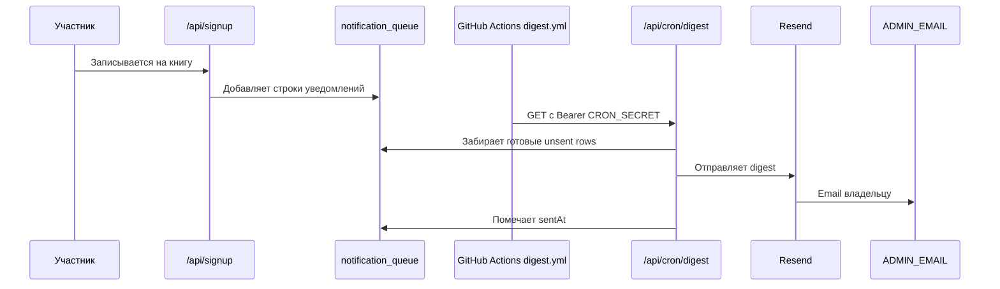

# Уведомления и письма

В проекте есть два основных email-сценария:

- magic link для входа;
- digest-уведомления о новых записях.

Оба используют Resend.

## Magic link

Когда пользователь входит по email, NextAuth через Resend отправляет ссылку для входа. Отправитель:

`Долгое наступление <noreply@slowreading.club>`

## Digest о новых записях

Digest нужен, чтобы не отправлять письмо на каждое действие сразу. Вместо этого сайт складывает события в очередь, а GitHub Actions **раз в сутки (03:00 UTC)** дергает cron-endpoint.

> **Почему раз в сутки, а не чаще (важно для расходов).** Endpoint при каждом вызове делает запись в Postgres — даже когда очередь пуста. Раньше крон стоял на `*/10` (каждые 10 минут) и не давал Neon-compute заснуть (scale-to-zero = 5 минут): база бодрствовала ~половину суток вхолостую и выжигала ~90 из 100 бесплатных CU-часов/мес. В июне 2026 это привело к **паузе БД** на Free-плане и падению сайта. Теперь крон совмещён по времени с `telegram-preauth-cleanup` (Vercel-крон, тоже 03:00 UTC) — обе задачи бьют в production-ветку Neon, поэтому compute просыпается один раз. Сам digest дебаунсит отправку (30 мин тишины / 2 ч принудительно), так что задержка письма из-за суточной частоты не страдает. **Не учащать без оглядки на лимит CU-часов Neon.**



## Защита cron

`/api/cron/digest` требует заголовок:

```text
Authorization: Bearer CRON_SECRET
```

Если `CRON_SECRET` в GitHub Secrets или Vercel env не совпадает с ожидаемым, digest не отправится.

## Telegram preauth cleanup

Есть отдельный Vercel Cron:

- путь: `/api/cron/telegram-preauth-cleanup`;
- расписание: каждый день в 03:00 UTC.

Он чистит старые Telegram pre-auth токены.

## Email-ресурсы

| Ресурс | Назначение |
| --- | --- |
| Resend API key | Отправка magic link и писем. |
| `noreply@slowreading.club` | Отправитель служебных писем. |
| `hello@slowreading.club` | Адрес для обратной связи и входящей почты. |
| Namecheap email forwarding | Пересылает входящие письма на личный Gmail. |

## Что проверять при проблемах

| Симптом | Что проверить |
| --- | --- |
| Magic link не приходит | `RESEND_API_KEY`, домен Resend, spam, email provider. |
| Digest не отправляется | GitHub Actions `Notification Digest`, `CRON_SECRET`, `notification_queue`. |
| Очередь растет | `/api/admin/digest-status`, Resend errors, debounce window. |
| Письма приходят не от того адреса | Resend domain settings и `FROM` в auth/email templates. |
