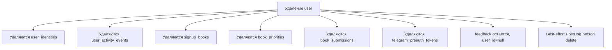

# Приватность и данные пользователей

Проект хранит персональные данные участников, поэтому важно понимать, какие данные есть и где они используются.

## Какие данные хранит сайт

| Данные | Где живут | Зачем |
| --- | --- | --- |
| Имя | `user.name` | Отображение в профиле и админке. |
| Контактный email | `user.contact_email` | Связь с пользователем и email identity. |
| Контакты | `user.contacts` | Telegram или другой контакт для клуба. |
| Языки чтения | `user.languages` | Профиль участника. |
| Способ входа | `user_identities` | Auth и связка внешних аккаунтов. |
| Выбранные книги | `signup_books` | Организация чтения. |
| Приоритеты | `book_priorities` | Понимание предпочтений. |
| Активность | `user_activity_events` | Админское понимание последней активности. |
| Фидбек | `feedback` | Обратная связь владельцу. |

## Публичные ответы

Публичная часть `/matching` показывает других участни:ц только через псевдонимы. Внутренние `user.id`, настоящие имена и Telegram identity остаются для серверной логики и админки.

Основные границы:

- `/matching` server payload для обычного участника передает `name=null` и использует псевдонимы вместо внутренних id там, где клиенту нужен стабильный ключ.
- `/api/matching/state` требует, чтобы пользователь был участником сессии; админ может смотреть через `?as=<userId>`.
- Matching-сигнал обновления не раскрывает `userId`; клиент узнаёт лишь, что версия сессии выросла (polling `/api/matching/version`), и перезапрашивает публичное состояние.
- Telegram callback не кладет `uid` или `username` в redirect URL, только одноразовый pre-auth token и `ts`.
- PostHog pageview вычищает чувствительные query-параметры перед отправкой.

## Удаление аккаунта

Пользователь или администратор может удалить аккаунт. В базе это приводит к каскадному удалению связанных строк, кроме feedback, где связь с пользователем обнуляется.

## Публичная политика

На сайте есть страница `/privacy`. Текст лежит в `content/privacy.md`.

## Особенность email

В актуальной модели `contact_email` может быть пустым. Это важно для Telegram-пользователей и для приватности: технический placeholder email больше не должен использоваться как реальный контакт.

## Что важно владельцу

- Не все пользователи обязаны иметь email.
- Telegram username из identity не обязательно равен контакту, который пользователь хочет показывать.
- Фидбек может быть анонимным или отвязанным от удаленного пользователя.
- PostHog cleanup best-effort: удаление на стороне сайта важнее, чем успешный ответ внешней аналитики.

## Где смотреть при запросе пользователя

| Запрос пользователя | Где искать |
| --- | --- |
| “Удалите мой аккаунт” | Admin delete user или пользовательское удаление профиля. |
| “Какие мои данные есть?” | `user`, `user_identities`, `signup_books`, `book_priorities`, `book_submissions`, `feedback`. |
| “Почему у меня старый Telegram?” | `user.contacts` и `user_identities.telegram_username` могут отличаться. |
