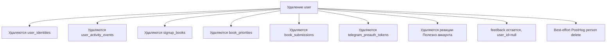

# Приватность и данные пользователей

Проект хранит персональные данные участников, поэтому важно понимать, какие данные есть и где они используются.

## Какие данные хранит сайт

| Данные | Где живут | Зачем |
| --- | --- | --- |
| Имя | `user.name` | Отображение в профиле, matching и админке. |
| Контактный email | `user.contact_email` | Связь с пользователем и email identity. |
| Контакты | `user.contacts` | Telegram или другой контакт для клуба. |
| Языки чтения | `user.languages` | Профиль участника. |
| Способ входа | `user_identities` | Auth и связка внешних аккаунтов. |
| Выбранные книги | `signup_books` | Организация чтения. |
| Приоритеты | `book_priorities` | Понимание предпочтений. |
| Активность | `user_activity_events` | Админское понимание последней активности. |
| Фидбек | `feedback` | Обратная связь владельцу. |
| Реакции на саммари | `book_summary_helpful_reactions` | Счётчик «Полезно»; `user_id` для аккаунта или SHA-256 гостевого UUID. |

## Публичные ответы

После Welcome страница `/matching` показывает настоящее глобальное имя всем пользователям с доступом к этой сессии. До вступления экран явно сообщает об этом и позволяет исправить имя. Это необходимо для формирования кругов и общения клуба; отдельные Telegram-данные matching не раскрывает.

Основные границы:

- `/matching` передаёт `displayName`, но не raw `userId`; для стабильных клиентских связей используются случайные `publicRef` и непрозрачные `circleKey`.
- `/api/matching/state` требует, чтобы пользователь был участником сессии; админ может смотреть через `?as=<userId>`.
- `/api/matching/version` возвращает только непрозрачные refs присутствующих участников; при росте версии клиент перезапрашивает публичное состояние.
- После единогласного закрепления имя и состав круга остаются видны участникам страницы в общем реестре, а сами участники переходят в observer-mode.
- Telegram callback не кладет `uid` или `username` в redirect URL, только одноразовый pre-auth token и `ts`.
- PostHog pageview вычищает чувствительные query-параметры перед отправкой.

## Удаление аккаунта

Пользователь или администратор может удалить аккаунт. В базе это приводит к каскадному удалению связанных строк, кроме feedback, где связь с пользователем обнуляется.

## Публичная политика

На сайте есть страница `/privacy`. Текст лежит в `content/privacy.md`.

## Особенность email

В актуальной модели `contact_email` может быть пустым. Это важно для Telegram-пользователей и для приватности: технический placeholder email больше не должен использоваться как реальный контакт.

Если пользователь привязывает почту из профиля, сайт создаёт одноразовый token для пары «текущий профиль + email» и отправляет ссылку через Resend. Callback требует активную сессию того же профиля, поэтому обычный email magic link не используется для привязки: он мог бы войти в другой email-профиль или создать дубль.

## Браузерная подсказка входа

Сайт может запоминать в `localStorage` только последний способ входа, чтобы показать в модалке reminder-строку и бейдж «Последний вход», а также раскрыть вторичные способы, если пользователь обычно входит через Google или email. Этот ключ хранит лишь нормализованный provider (`google`, `telegram` или `email`), не содержит email, имени, Telegram username или другого PII и не отправляется на сервер.

## Гостевая cookie реакции «Полезно»

После первого успешного гостевого нажатия сайт ставит first-party cookie `__Secure-summary-helpful`. Она `HttpOnly`, `Secure`, `SameSite=Lax`, host-only и отправляется только по пути `/api/summaries`. Срок — 12 месяцев с последнего успешного обращения к reaction API; посещение других страниц срок не продлевает.

Cookie хранит случайный UUID в браузере. Сервер валидирует его и хранит в Neon только SHA-256 `visitor_hash`; исходное значение не попадает в БД, audit log, приложение или PostHog. Пока cookie есть, гость может снять реакцию. После входа гостевые реакции браузера атомарно переносятся к аккаунту, cookie удаляется, а реакции затем удаляются вместе с аккаунтом. Очистка cookie или другой браузер создают новую гостевую идентичность — это осознанное приближение, без fingerprinting и IP-идентификации.

## Привязанные способы входа

Профиль показывает пользователю список его способов входа из `user_identities`: provider, email для Google/email и Telegram username для Telegram, если username есть. Если Telegram username отсутствует, интерфейс пишет «Telegram ID привязан», но не раскрывает внешний provider account id. Непривязанная почта раскрывает форму отправки письма подтверждения. Эти технические auth-данные нужны для предотвращения дублей и восстановления доступа. В списке не показывается `google sub` или Telegram numeric id.

Добавление нового способа входа всегда требует подтверждения у внешнего provider:

- Google — сервер проверяет Google credential.
- Telegram — сервер проверяет Telegram HMAC payload, требует активную сессию сайта и signed state, выданный для текущего внутреннего пользователя.

Если внешний аккаунт уже привязан к другому внутреннему пользователю, система не объединяет профили автоматически. Такое объединение должен делать администратор отдельным инструментом, чтобы не склеить двух разных людей по похожим публичным данным.

## Слияние дублей администратором

Админское слияние переносит данные source-профиля в target-профиль только после явного указания администратором ID аккаунта, который должен остаться. Причина слияния опциональна. Переносятся способы входа, записи на книги, приоритеты, заявки, feedback, activity и matching-связи; source user удаляется после переноса. В `user_merge_events` сохраняются source/target snapshots, причина если она указана, и счётчики переноса. Это операционная история для владельца проекта, не публичные данные.

`audit_log` не переписывается при merge: старые события остаются связанными с тем внутренним user id, который существовал на момент действия.

## Что важно владельцу

- Не все пользователи обязаны иметь email.
- Telegram username из identity не обязательно равен контакту, который пользователь хочет показывать.
- Фидбек может быть анонимным или отвязанным от удаленного пользователя.
- PostHog cleanup best-effort: удаление на стороне сайта важнее, чем успешный ответ внешней аналитики.

## Где смотреть при запросе пользователя

| Запрос пользователя | Где искать |
| --- | --- |
| “Удалите мой аккаунт” | Admin delete user или пользовательское удаление профиля. |
| “Какие мои данные есть?” | `user`, `user_identities`, `signup_books`, `book_priorities`, `book_submissions`, `feedback`. |
| “Почему у меня старый Telegram?” | `user.contacts` и `user_identities.telegram_username` могут отличаться. |
