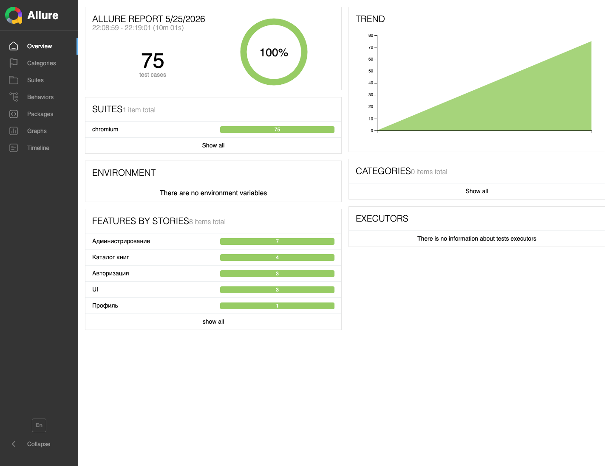

# Качество: CI, Allure, Codecov

Проект проверяется на нескольких уровнях: статический анализ, unit-тесты, e2e-тесты, coverage и визуальная отчетность.

## Что запускается в CI

GitHub Actions workflow `CI` делает:

Workflow состоит из трёх параллельных job (`quality`, `e2e`, `build`) и финального gate-job `ci`, который требует, чтобы все три прошли:

- **`quality`** — `npm ci`, ESLint, secret scan, TypeScript typecheck, Jest unit-тесты с coverage, загрузка coverage в Codecov.
- **`e2e`** — `npm ci`, установка Playwright Chromium (с кэшем), синхронизация схемы e2e-ветки (`drizzle-kit push`), **сборка production-билда** (`next build`), запуск Playwright против production-сервера, генерация и публикация Allure на GitHub Pages.
- **`build`** — отдельная проверка, что `next build` проходит с прод-секретами.

### Почему E2E гоняет production-сервер, а не `next dev`

На CI Playwright поднимает `next start` по уже собранному `.next` (см. `playwright.config.ts → webServer`), а не `next dev`. Причина: dev-сервер компилирует роут лениво при первом обращении — первый хит каждой страницы платил за webpack-компиляцию (секунды-десятки секунд), иногда React-контекст не успевал подняться (`useContext of null` → таймаут → ретрай). Это давало и медленный suite, и регулярный флак. Прекомпилированный билд отдаётся сразу. Локально по-прежнему используется `next dev` для быстрого hot-reload.

`next start` поднимает сервер под `NODE_ENV=production`. Чтобы тестовые endpoints при этом работали, в env сервера инжектятся `E2E_ALLOW_PRODUCTION_SERVER=true` и `AUTH_TRUST_HOST=true` (NextAuth v5 в production требует доверенный хост) — детерминированно через `playwright.config.ts`, единый источник правды.

## Allure

Allure показывает результаты e2e-тестов в удобном интерфейсе:

[bon2362.github.io/book-club](https://bon2362.github.io/book-club/)

Тесты размечены по областям:

- Авторизация;
- Каталог книг;
- Администрирование;
- Профиль;
- UI.

Если e2e падает, Allure и Playwright trace помогают понять, где именно сломался сценарий.

## Codecov

Codecov показывает покрытие unit-тестами:

[codecov.io/gh/bon2362/book-club](https://codecov.io/gh/bon2362/book-club)

Текущая конфигурация:

- project target: 80%;
- patch target: 70%;
- CI не падает, если сам Codecov временно недоступен.

## Playwright E2E

E2E работают в `NEXTAUTH_TEST_MODE=true`. Это включает тестовые endpoints, чтобы создавать пользователей и сессии без реального OAuth.

### Изоляция от прод-БД

E2E **никогда не пишут в продакшен Neon**. Изоляция держится на трёх слоях:

1. **Отдельная Neon-ветка `e2e`.** Создаётся как child branch от `production` в Neon Console. Connection string лежит в локальном `.env.test.local` (см. `.env.test.local.example`); файл в `.gitignore`, в репо не попадает.
2. **`playwright.config.ts`** грузит `.env.test.local` и пробрасывает `DATABASE_URL` + safety-маркеры (`PROD_DB_HOST_MARKER`, `E2E_REQUIRE_DB_MARKER`) в `webServer.env`, чтобы Next.js не использовал прод-БД из `.env.local`.
3. **Guard в `lib/test-mode.ts`**: `/api/test/*` возвращает 403, если `DATABASE_URL` содержит `PROD_DB_HOST_MARKER` или не содержит `E2E_REQUIRE_DB_MARKER`. Под production-рантаймом (`next start` на CI) guard по умолчанию выключен и включается только при одновременном выполнении трёх условий: `E2E_ALLOW_PRODUCTION_SERVER=true` **и** оба маркера (`E2E_REQUIRE_DB_MARKER`, `PROD_DB_HOST_MARKER`) заданы и корректны. Любое отсутствующее условие fail-closed. На реальном Vercel-проде ничего из этого не задано, поэтому тестовые endpoints там отключены несколькими независимыми проверками. Покрыто 14 unit-тестами в `lib/test-mode.test.ts` (включая 6 `[SEC]`-кейсов на production-рантайм).

### Фикстуры с автоматическим cleanup

Любая мутация — через фикстуру в `e2e/fixtures.ts` (`loginAsAdmin`, `createIntroSection`). Фикстура регистрирует cleanup в teardown — данные удаляются даже при падении ассерта. Тесты не редактируют существующие записи; вместо этого создают свою сущность, проверяют, фикстура удаляет.

Когда нужна новая сущность — добавь фикстуру, не пиши inline-cleanup в теле теста.

Ключевые сценарии:

- вход;
- Telegram auth;
- запись на книги;
- профиль;
- админка;
- каталог;
- темы;
- UI-состояния.

## Важное правило для будущих изменений

Если изменение затрагивает:

- форму;
- модалку;
- auth flow;
- сохранение состояния;
- условный рендер;
- CSS-позиционирование;
- админский workflow;

то нужен релевантный e2e-тест. Для сохранения состояния тест должен делать reload и проверять, что состояние осталось.

## Где смотреть результаты

| Что нужно | Где смотреть |
| --- | --- |
| Все проверки CI | GitHub Actions |
| E2E-отчет | GitHub Pages Allure |
| Unit coverage | Codecov |
| Последний deploy | Vercel или footer админки |
| Ошибка конкретного теста | Allure + Playwright trace |
