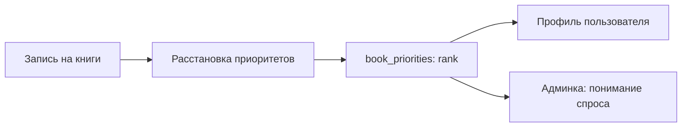

# Заявки, записи и приоритеты

Эта страница описывает продуктовую механику “человек хочет читать книгу”.

## Запись на книгу

Когда пользователь нажимает “Хочу читать”, сайт сохраняет связь:

`user` + `books` -> `signup_books`.

Эта таблица отвечает на вопрос: кто записался на какую книгу.

## Приоритеты

После записи пользователь может расставить книги по порядку. Это сохраняется в `book_priorities`.

Флаг `user.priorities_set` показывает, делал ли пользователь осознанную сортировку. Пока не делал, UI может показывать заглушки вместо чисел.

## Предложение книги

Пользователь может предложить книгу. Заявка попадает в `book_submissions`.

Статусы заявки:

- pending;
- approved;
- rejected.

После одобрения создается запись в `books`, а `book_submissions.book_id` связывает заявку с опубликованной книгой.

## Personal status (статус чтения)

После записи пользователь может обновить личный статус книги через страницу `/matching` либо через вкладку «Мои книги» в личном кабинете (Drawer на главной):

| Статус | Значение |
| --- | --- |
| `null` | «В списке» — участвует в матчинге |
| `reading` | «Читаю сейчас» — исключён из матчинга как кандидат |
| `read` | «Прочитал(а)» — исключён из матчинга как кандидат |

Хранится в `signup_books.personal_status`; время последнего изменения — в `signup_books.personal_status_updated_at` (используется для сортировки секций «Читаю» и «Прочитал:а» в личном кабинете, desc). Изменяется через `PATCH /api/signup-books/:bookId/status`. Позволяет движку матчинга не предлагать книгу повторно тем, кто уже её читает или прочитал.

Личный кабинет показывает три секции внутри вкладки «Мои книги»: «Читаю», «Записал:ась» (с drag-n-drop по приоритетам и кнопкой «×» отписаться), «Прочитал:а». Меню смены статуса открывается аккордеоном под строкой при тапе. При возврате книги в «Записал:ась» из любого другого статуса она кладётся в конец списка без приоритета — пока пользователь её не подвинет.

## Почему это важно для владельца

Есть четыре уровня интереса к книге:

1. Пользователь просто записался на книгу.
2. Пользователь поставил книгу высоко в приоритетах.
3. Несколько пользователей поставили одну книгу высоко.
4. Пользователь активно читает книгу сейчас (`reading`) или уже прочитал (`read`).

Для организации групп второй и третий уровень важнее обычного счетчика записавшихся.

## Где живут данные

| Сценарий | Таблица |
| --- | --- |
| Пользователь записался на книгу | `signup_books` |
| Пользователь отметил статус чтения | `signup_books.personal_status` |
| Пользователь отсортировал книги | `book_priorities` |
| Пользователь предложил книгу | `book_submissions` |
| Заявка стала книгой | `book_submissions.book_id` + `books.source='submission'` |
| Пользователь поменял профиль | `user` + `user_activity_events` |

## Типичные проверки

| Вопрос | Где смотреть |
| --- | --- |
| Кто записан на книгу? | `signup_books` join `user` и `books`. |
| Какая книга у человека на первом месте? | `book_priorities.rank = 1`. |
| Почему у человека нет чисел приоритета? | `user.priorities_set=false` или нет rows в `book_priorities`. |
| Куда делась предложенная книга после одобрения? | `book_submissions.book_id`. |
| Почему книга не появилась после заявки? | Статус заявки, publish flow, `books.visibility`. |
