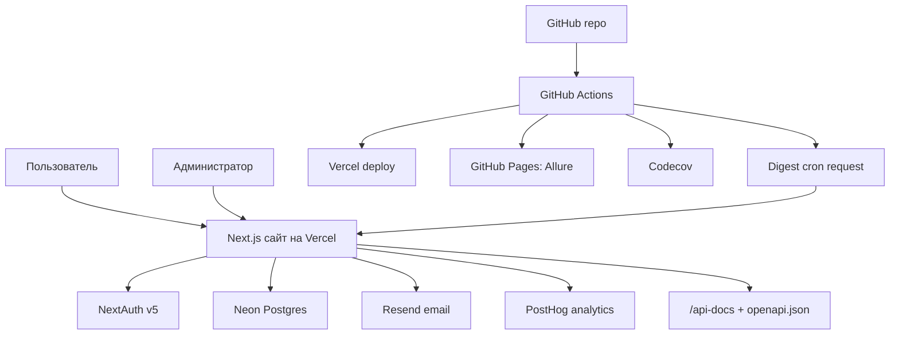
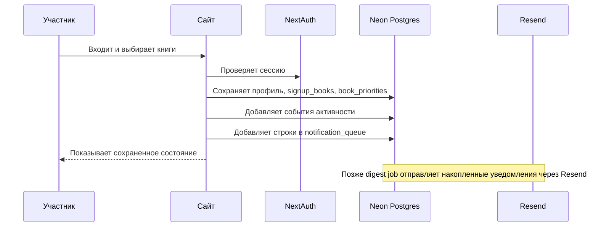

# Архитектура системы

Сайт устроен как единое Next.js-приложение: оно одновременно отдает страницы пользователям, обслуживает API и работает с базой данных.

## Общая схема

## Главные принципы

- **Один источник данных для runtime**: Postgres.
- **Админка не отдельное приложение**: это страница `/admin` внутри того же Next.js-проекта.
- **API живет рядом со страницами**: route handlers находятся в `app/api`.
- **Права администратора проверяются на сервере**: пользователь должен иметь `session.user.isAdmin`.
- **Деплой автоматический**: push в `main` запускает GitHub Actions и Vercel.
- **Проверки качества автоматические**: lint, typecheck, Jest, Playwright, Allure и Codecov.

## Основной поток данных

## Где проходят границы ответственности

| Часть | Ответственность |
| --- | --- |
| Next.js UI | Визуальный интерфейс, формы, каталоги, фильтры, drawer профиля, админка. |
| API routes | Безопасные операции: сохранить профиль, записаться, модерировать заявку, обновить каталог. |
| `lib/*` | Доменные правила: книги, auth identity, activity, signup aggregation, email templates. |
| Drizzle schema | Фактическая структура базы данных. |
| GitHub Actions | Проверки, отчеты, cron-вызовы. |
| Vercel | Хостинг production-сайта и доменов. |

## Что важно владельцу

Если ломается пользовательский сценарий, почти всегда нужно понять, где сбой:

- UI не отрисовал данные.
- API вернул ошибку.
- Сессия не дала нужных прав.
- База не содержит ожидаемых строк.
- Внешний сервис не принял запрос.
- CI или Vercel не задеплоили свежий код.

Для практических проверок см. [Операционные сценарии](Operations-Runbook).
